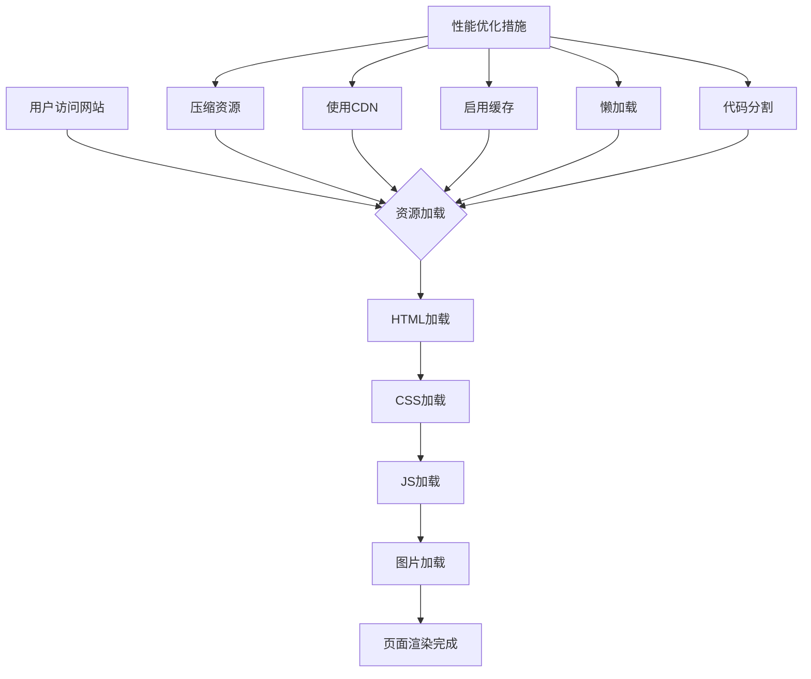
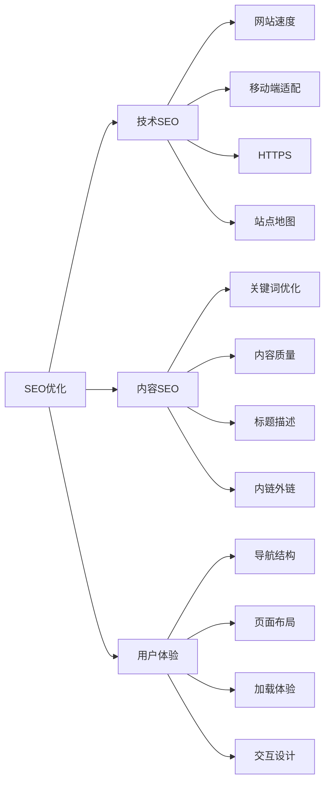

# 前端需要注意哪些SEO

## 什么是SEO

SEO（Search Engine Optimization，搜索引擎优化）是指通过优化网站结构、内容和技术，提高网站在搜索引擎中的排名，从而获得更多的自然流量。

## 前端SEO优化要点

### 1. 语义化HTML标签

使用正确的HTML5语义化标签，让搜索引擎更好地理解页面结构。

```html
<!-- 不好的写法 -->
<div class="header">...</div>
<div class="content">...</div>
<div class="footer">...</div>

<!-- 好的写法 -->
<header>...</header>
<main>...</main>
<footer>...</footer>
```

常用语义化标签：
- `<header>`：页面或区块的头部
- `<nav>`：导航链接
- `<main>`：主要内容区域
- `<article>`：独立的文章内容
- `<section>`：文档中的独立区块
- `<aside>`：侧边栏内容
- `<footer>`：页面或区块的底部

### 2. 合理的标题层级

使用`<h1>`到`<h6>`标签，保持标题层级的正确性和唯一性。

```html
<h1>页面主标题（每个页面只能有一个h1）</h1>
<h2>章节标题</h2>
<h3>小节标题</h3>
```

### 3. 图片优化

- 使用`alt`属性描述图片内容
- 使用合适的图片格式（WebP优先）
- 压缩图片大小
- 使用懒加载

```html

```

### 4. Meta标签优化

```html
<!-- 页面描述 -->
<meta name="description" content="页面描述，150-160字左右" />

<!-- 关键词（现在权重较低） -->
<meta name="keywords" content="关键词1,关键词2" />

<!-- 作者 -->
<meta name="author" content="作者名" />

<!-- 视口设置（移动端友好） -->
<meta name="viewport" content="width=device-width, initial-scale=1.0" />

<!-- Open Graph标签（社交媒体分享） -->
<meta property="og:title" content="页面标题" />
<meta property="og:description" content="页面描述" />
<meta property="og:image" content="分享图片URL" />
<meta property="og:url" content="页面URL" />
```

### 5. URL优化

- 使用简短、描述性的URL
- 使用连字符`-`分隔单词
- 避免使用特殊字符和参数
- 使用小写字母

```
好的URL：https://example.com/seo-best-practices
不好的URL：https://example.com/article?id=123&category=abc
```

### 6. 网站性能优化

#### 性能优化流程图



具体优化措施：
- 压缩HTML、CSS、JavaScript文件
- 使用CDN加速静态资源
- 启用浏览器缓存和服务器缓存
- 实现懒加载（图片、组件）
- 使用代码分割减少初始加载体积

### 7. 移动端优化

- 响应式设计适配不同屏幕
- 触摸友好的交互设计
- 避免使用Flash等不兼容技术
- 优化移动端加载速度

### 8. 站点地图

创建sitemap.xml文件，帮助搜索引擎更好地索引网站。

```xml
<?xml version="1.0" encoding="UTF-8"?>
<urlset xmlns="http://www.sitemaps.org/schemas/sitemap/0.9">
  <url>
    <loc>https://example.com/</loc>
    <lastmod>2024-01-01</lastmod>
    <changefreq>daily</changefreq>
    <priority>1.0</priority>
  </url>
</urlset>
```

### 9. robots.txt文件

控制搜索引擎爬虫的访问权限。

```
User-agent: *
Allow: /
Disallow: /admin/
Disallow: /private/
Sitemap: https://example.com/sitemap.xml
```

### 10. 内链和外链优化

- 建立合理的内部链接结构
- 使用描述性的锚文本
- 获取高质量的外部链接
- 避免死链和404错误

### 11. 结构化数据

使用Schema.org的结构化数据，帮助搜索引擎理解内容。

```html
<script type="application/ld+json">
{
  "@context": "https://schema.org",
  "@type": "Article",
  "headline": "文章标题",
  "author": {
    "@type": "Person",
    "name": "作者名"
  },
  "datePublished": "2024-01-01",
  "description": "文章描述"
}
</script>
```

### 12. HTTPS支持

使用HTTPS加密连接，提升安全性和搜索引擎排名。

### 13. 避免404错误

- 定期检查死链
- 设置自定义404页面
- 使用301重定向处理URL变更

## SEO优化检查清单



## 总结

前端SEO优化是一个系统工程，需要从技术、内容和用户体验多个维度综合考虑。通过合理的HTML结构、性能优化、内容优化等技术手段，可以有效提升网站在搜索引擎中的排名，获得更多的自然流量。
