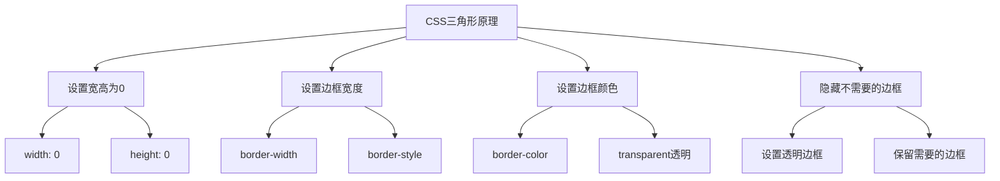

# 如何使用CSS实现一个三角形

## 基本原理

利用CSS的`border`属性，当元素的宽度和高度为0时，边框会形成三角形。



## 基本实现

### 1. 等边三角形

```css
.triangle {
  width: 0;
  height: 0;
  border-left: 50px solid transparent;
  border-right: 50px solid transparent;
  border-bottom: 86.6px solid #ff0000;
}
```

```html
<div class="triangle"></div>
```

### 2. 直角三角形

```css
.triangle-right {
  width: 0;
  height: 0;
  border-top: 50px solid transparent;
  border-bottom: 50px solid transparent;
  border-left: 86.6px solid #00ff00;
}

.triangle-left {
  width: 0;
  height: 0;
  border-top: 50px solid transparent;
  border-bottom: 50px solid transparent;
  border-right: 86.6px solid #0000ff;
}
```

### 3. 等腰三角形

```css
.triangle-up {
  width: 0;
  height: 0;
  border-left: 50px solid transparent;
  border-right: 50px solid transparent;
  border-bottom: 100px solid #ff00ff;
}

.triangle-down {
  width: 0;
  height: 0;
  border-left: 50px solid transparent;
  border-right: 50px solid transparent;
  border-top: 100px solid #ffff00;
}
```

## 各种方向的三角形

### 向上三角形

```css
.triangle-up {
  width: 0;
  height: 0;
  border-left: 50px solid transparent;
  border-right: 50px solid transparent;
  border-bottom: 100px solid #ff0000;
}
```

### 向下三角形

```css
.triangle-down {
  width: 0;
  height: 0;
  border-left: 50px solid transparent;
  border-right: 50px solid transparent;
  border-top: 100px solid #00ff00;
}
```

### 向左三角形

```css
.triangle-left {
  width: 0;
  height: 0;
  border-top: 50px solid transparent;
  border-bottom: 50px solid transparent;
  border-right: 100px solid #0000ff;
}
```

### 向右三角形

```css
.triangle-right {
  width: 0;
  height: 0;
  border-top: 50px solid transparent;
  border-bottom: 50px solid transparent;
  border-left: 100px solid #ff00ff;
}
```

### 左上三角形

```css
.triangle-top-left {
  width: 0;
  height: 0;
  border-top: 100px solid #ff0000;
  border-right: 100px solid transparent;
}
```

### 右上三角形

```css
.triangle-top-right {
  width: 0;
  height: 0;
  border-top: 100px solid #00ff00;
  border-left: 100px solid transparent;
}
```

### 左下三角形

```css
.triangle-bottom-left {
  width: 0;
  height: 0;
  border-bottom: 100px solid #0000ff;
  border-right: 100px solid transparent;
}
```

### 右下三角形

```css
.triangle-bottom-right {
  width: 0;
  height: 0;
  border-bottom: 100px solid #ff00ff;
  border-left: 100px solid transparent;
}
```

## 使用clip-path实现

### 基本语法

```css
.triangle {
  width: 100px;
  height: 100px;
  background-color: #ff0000;
  clip-path: polygon(50% 0%, 0% 100%, 100% 100%);
}
```

### 各种形状

```css
/* 向上三角形 */
.triangle-up {
  clip-path: polygon(50% 0%, 0% 100%, 100% 100%);
}

/* 向下三角形 */
.triangle-down {
  clip-path: polygon(50% 100%, 0% 0%, 100% 0%);
}

/* 向左三角形 */
.triangle-left {
  clip-path: polygon(0% 50%, 100% 0%, 100% 100%);
}

/* 向右三角形 */
.triangle-right {
  clip-path: polygon(100% 50%, 0% 0%, 0% 100%);
}

/* 菱形 */
.diamond {
  clip-path: polygon(50% 0%, 100% 50%, 50% 100%, 0% 50%);
}

/* 五边形 */
.pentagon {
  clip-path: polygon(50% 0%, 100% 38%, 82% 100%, 18% 100%, 0% 38%);
}

/* 六边形 */
.hexagon {
  clip-path: polygon(25% 0%, 75% 0%, 100% 50%, 75% 100%, 25% 100%, 0% 50%);
}
```

## 使用伪元素实现

### 带边框的三角形

```css
.triangle-with-border {
  position: relative;
  width: 0;
  height: 0;
}

.triangle-with-border::before {
  content: '';
  position: absolute;
  top: 0;
  left: 0;
  width: 0;
  height: 0;
  border-left: 50px solid transparent;
  border-right: 50px solid transparent;
  border-bottom: 100px solid #ff0000;
}

.triangle-with-border::after {
  content: '';
  position: absolute;
  top: 2px;
  left: 2px;
  width: 0;
  height: 0;
  border-left: 48px solid transparent;
  border-right: 48px solid transparent;
  border-bottom: 96px solid #ffffff;
}
```

### 工具提示三角形

```css
.tooltip {
  position: relative;
  background: #333;
  color: #fff;
  padding: 10px 20px;
  border-radius: 4px;
}

.tooltip::before {
  content: '';
  position: absolute;
  top: -10px;
  left: 50%;
  transform: translateX(-50%);
  width: 0;
  height: 0;
  border-left: 10px solid transparent;
  border-right: 10px solid transparent;
  border-bottom: 10px solid #333;
}
```

```html
<div class="tooltip">这是一个工具提示</div>
```

## 实际应用

### 1. 下拉菜单箭头

```css
.dropdown-arrow {
  display: inline-block;
  width: 0;
  height: 0;
  margin-left: 10px;
  vertical-align: middle;
  border-left: 5px solid transparent;
  border-right: 5px solid transparent;
  border-top: 5px solid #333;
}

.dropdown-arrow.open {
  border-top: none;
  border-bottom: 5px solid #333;
}
```

### 2. 分隔符

```css
.separator {
  position: relative;
  height: 1px;
  background: #e0e0e0;
  margin: 20px 0;
}

.separator::before {
  content: '';
  position: absolute;
  top: -5px;
  left: 50%;
  transform: translateX(-50%);
  width: 0;
  height: 0;
  border-left: 5px solid transparent;
  border-right: 5px solid transparent;
  border-bottom: 5px solid #e0e0e0;
}
```

### 3. 消息气泡

```css
.bubble {
  position: relative;
  background: #007bff;
  color: white;
  padding: 15px 20px;
  border-radius: 8px;
  max-width: 300px;
}

.bubble::before {
  content: '';
  position: absolute;
  bottom: -10px;
  left: 20px;
  width: 0;
  height: 0;
  border-left: 10px solid transparent;
  border-right: 10px solid transparent;
  border-top: 10px solid #007bff;
}
```

### 4. 进度指示器

```css
.progress-indicator {
  display: flex;
  align-items: center;
  gap: 10px;
}

.step {
  display: flex;
  align-items: center;
  gap: 5px;
}

.step::after {
  content: '';
  width: 0;
  height: 0;
  border-top: 5px solid transparent;
  border-bottom: 5px solid transparent;
  border-left: 10px solid #ccc;
}

.step:last-child::after {
  display: none;
}

.step.active::after {
  border-left-color: #007bff;
}
```

## 响应式三角形

```css
/* 使用百分比 */
.triangle-responsive {
  width: 0;
  height: 0;
  border-left: 10vw solid transparent;
  border-right: 10vw solid transparent;
  border-bottom: 17.32vw solid #ff0000;
}

/* 使用em/rem */
.triangle-em {
  width: 0;
  height: 0;
  border-left: 2em solid transparent;
  border-right: 2em solid transparent;
  border-bottom: 3.46em solid #00ff00;
}
```

## 动画效果

```css
@keyframes triangle-pulse {
  0%, 100% {
    transform: scale(1);
    opacity: 1;
  }
  50% {
    transform: scale(1.1);
    opacity: 0.8;
  }
}

.animated-triangle {
  width: 0;
  height: 0;
  border-left: 50px solid transparent;
  border-right: 50px solid transparent;
  border-bottom: 86.6px solid #ff0000;
  animation: triangle-pulse 2s ease-in-out infinite;
}
```

## 总结

| 方法 | 优点 | 缺点 |
|------|------|------|
| border方法 | 兼容性好 | 不能设置背景图片 |
| clip-path | 灵活，支持复杂形状 | 兼容性较差 |
| 伪元素 | 可实现复杂效果 | 代码较多 |

**核心要点：**
1. 使用border实现三角形的基本原理是设置宽高为0
2. 通过设置不同边框的颜色和透明度来控制三角形方向
3. clip-path方法更灵活，支持各种复杂形状
4. 伪元素可以用来创建带边框或背景的三角形
5. 三角形在实际开发中常用于工具提示、下拉菜单等场景
