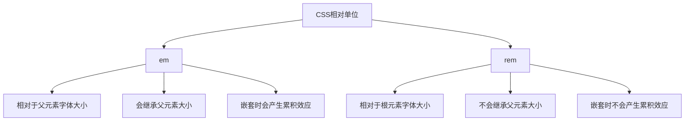

# em和rem的区别

## 基本概念

em和rem都是CSS中的相对长度单位，但它们的参考基准不同。



## em单位

### 定义

em是相对于父元素的字体大小的单位。

### 特点

- 1em等于父元素的字体大小
- 会继承父元素的字体大小
- 嵌套使用时会产生累积效应
- 在没有设置字体大小时，默认为16px

### 示例

```css
/* 父元素 */
.parent {
  font-size: 20px;
}

/* 子元素 */
.child {
  font-size: 1em; /* 20px */
  padding: 1em; /* 20px */
  margin: 2em; /* 40px */
}

/* 嵌套示例 */
.grandparent {
  font-size: 16px;
}

.parent {
  font-size: 1.5em; /* 24px */
}

.child {
  font-size: 1em; /* 24px */
}
```

### 实际应用

```html
<!DOCTYPE html>
<html>
<head>
  <style>
    body {
      font-size: 16px;
    }
    
    .container {
      font-size: 1.5em; /* 24px */
    }
    
    .title {
      font-size: 1.5em; /* 36px */
      margin-bottom: 0.5em; /* 18px */
    }
    
    .text {
      font-size: 1em; /* 24px */
      line-height: 1.5em; /* 36px */
    }
  </style>
</head>
<body>
  <div class="container">
    <h1 class="title">标题</h1>
    <p class="text">这是一段文本</p>
  </div>
</body>
</html>
```

## rem单位

### 定义

rem是相对于根元素（html）字体大小的单位。

### 特点

- 1rem等于根元素的字体大小
- 不会继承父元素的字体大小
- 嵌套使用时不会产生累积效应
- 默认根元素字体大小为16px

### 示例

```css
/* 设置根元素字体大小 */
html {
  font-size: 16px;
}

/* 使用rem单位 */
.container {
  font-size: 1rem; /* 16px */
  padding: 1rem; /* 16px */
  margin: 2rem; /* 32px */
}

/* 嵌套示例 */
.parent {
  font-size: 1.5rem; /* 24px */
}

.child {
  font-size: 1rem; /* 16px，不受父元素影响 */
}
```

### 实际应用

```html
<!DOCTYPE html>
<html>
<head>
  <style>
    html {
      font-size: 16px;
    }
    
    .container {
      font-size: 1.5rem; /* 24px */
    }
    
    .title {
      font-size: 1.5rem; /* 24px */
      margin-bottom: 0.5rem; /* 8px */
    }
    
    .text {
      font-size: 1rem; /* 16px */
      line-height: 1.5rem; /* 24px */
    }
  </style>
</head>
<body>
  <div class="container">
    <h1 class="title">标题</h1>
    <p class="text">这是一段文本</p>
  </div>
</body>
</html>
```

## em和rem的区别

| 特性 | em | rem |
|------|----|----|
| 参考基准 | 父元素字体大小 | 根元素字体大小 |
| 继承性 | 会继承父元素 | 不继承父元素 |
| 嵌套效应 | 会产生累积效应 | 不会产生累积效应 |
| 计算复杂度 | 复杂，需要考虑父元素 | 简单，只需考虑根元素 |
| 响应式设计 | 需要逐层调整 | 只需调整根元素 |
| 浏览器兼容性 | 完全兼容 | IE9+ |

## 实际应用场景

### 1. 使用rem实现响应式设计

```css
html {
  font-size: 16px;
}

@media screen and (max-width: 768px) {
  html {
    font-size: 14px;
  }
}

@media screen and (min-width: 769px) and (max-width: 1024px) {
  html {
    font-size: 15px;
  }
}

@media screen and (min-width: 1025px) {
  html {
    font-size: 16px;
  }
}

.container {
  width: 30rem; /* 根据屏幕大小自动调整 */
  padding: 1rem;
}
```

### 2. 使用em实现组件内部比例

```css
.button {
  font-size: 1em;
  padding: 0.5em 1em;
  border-radius: 0.25em;
}

.card {
  font-size: 1.2em;
}

.card .button {
  /* 按钮大小相对于卡片字体大小 */
  font-size: 1em;
}
```

### 3. 混合使用em和rem

```css
html {
  font-size: 16px;
}

.container {
  font-size: 1rem; /* 基于根元素 */
  padding: 1rem; /* 基于根元素 */
}

.title {
  font-size: 1.5em; /* 基于容器字体大小 */
  margin-bottom: 0.5em; /* 基于标题字体大小 */
}
```

## 最佳实践

### 1. 使用rem作为基础单位

```css
html {
  font-size: 16px;
}

body {
  font-size: 1rem;
  line-height: 1.5rem;
}

h1 {
  font-size: 2rem;
  margin-bottom: 1rem;
}

p {
  font-size: 1rem;
  margin-bottom: 1rem;
}
```

### 2. 使用em实现组件内部比例

```css
.card {
  font-size: 1rem;
}

.card__title {
  font-size: 1.5em;
  margin-bottom: 0.5em;
}

.card__content {
  font-size: 1em;
  line-height: 1.5em;
}
```

### 3. 使用rem实现响应式设计

```css
html {
  font-size: 16px;
}

@media screen and (max-width: 768px) {
  html {
    font-size: 14px;
  }
}

.container {
  width: 100%;
  max-width: 75rem;
  padding: 1rem;
}
```

## 总结

**核心要点：**
1. em相对于父元素的字体大小，rem相对于根元素的字体大小
2. em会继承父元素大小，rem不会继承父元素大小
3. em嵌套时会产生累积效应，rem不会
4. rem更适合用于响应式设计，em更适合用于组件内部比例
5. 推荐使用rem作为基础单位，em用于组件内部比例
6. 可以混合使用em和rem来达到最佳效果
