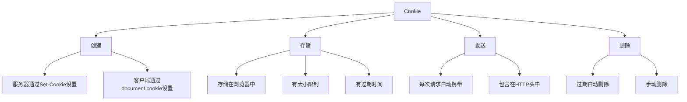

# 谈谈你对cookie的了解

## 基本概念

Cookie是服务器发送到用户浏览器并保存在本地的一小块数据，它会在浏览器下次向同一服务器再发起请求时被携带并发送到服务器上。



## Cookie的组成

### 基本属性

```javascript
// Cookie的基本格式
name=value; Expires=date; Path=path; Domain=domain; Secure; HttpOnly

// 示例
Set-Cookie: username=john; Expires=Wed, 21 Oct 2025 07:28:00 GMT; Path=/; Domain=.example.com; Secure; HttpOnly
```

### 属性说明

| 属性 | 说明 | 示例 |
|------|------|------|
| name=value | Cookie的名称和值 | username=john |
| Expires | 过期时间（GMT格式） | Expires=Wed, 21 Oct 2025 07:28:00 GMT |
| Max-Age | 有效期（秒） | Max-Age=3600 |
| Domain | 域名 | Domain=.example.com |
| Path | 路径 | Path=/ |
| Secure | 仅HTTPS传输 | Secure |
| HttpOnly | 禁止JavaScript访问 | HttpOnly |
| SameSite | 跨站请求控制 | SameSite=Strict |

## Cookie的操作

### 1. 设置Cookie

#### 服务器端设置

```javascript
// Node.js Express示例
app.get('/set-cookie', (req, res) => {
  res.cookie('username', 'john', {
    maxAge: 3600000, // 1小时
    httpOnly: true,
    secure: true,
    sameSite: 'strict'
  });
  res.send('Cookie已设置');
});
```

#### 客户端设置

```javascript
// 设置Cookie
document.cookie = 'username=john; expires=Wed, 21 Oct 2025 07:28:00 GMT; path=/';

// 设置多个Cookie
document.cookie = 'username=john; path=/';
document.cookie = 'age=25; path=/';
document.cookie = 'city=Beijing; path=/';
```

### 2. 读取Cookie

```javascript
// 读取所有Cookie
const cookies = document.cookie;
console.log(cookies); // "username=john; age=25; city=Beijing"

// 解析Cookie为对象
function parseCookies(cookieString) {
  const cookies = {};
  cookieString.split(';').forEach(cookie => {
    const [name, value] = cookie.trim().split('=');
    cookies[name] = value;
  });
  return cookies;
}

const cookieObj = parseCookies(document.cookie);
console.log(cookieObj.username); // "john"
```

### 3. 修改Cookie

```javascript
// 修改Cookie（重新设置）
document.cookie = 'username=jane; expires=Wed, 21 Oct 2025 07:28:00 GMT; path=/';

// 修改过期时间
document.cookie = 'username=jane; expires=Thu, 01 Jan 1970 00:00:00 GMT; path=/';
```

### 4. 删除Cookie

```javascript
// 删除Cookie（设置过期时间为过去的时间）
function deleteCookie(name) {
  document.cookie = `${name}=; expires=Thu, 01 Jan 1970 00:00:00 GMT; path=/`;
}

deleteCookie('username');
```

## Cookie的属性详解

### 1. Expires和Max-Age

```javascript
// Expires：具体的过期时间
document.cookie = 'username=john; Expires=Wed, 21 Oct 2025 07:28:00 GMT; path=/';

// Max-Age：有效期（秒）
document.cookie = 'username=john; Max-Age=3600; path=/'; // 1小时后过期

// 会话Cookie（关闭浏览器后删除）
document.cookie = 'username=john; path=/';
```

### 2. Domain

```javascript
// 当前域名
document.cookie = 'username=john; Domain=example.com; path=/';

// 子域名
document.cookie = 'username=john; Domain=.example.com; path=/';

// 默认为当前域名
document.cookie = 'username=john; path=/';
```

### 3. Path

```javascript
// 根路径
document.cookie = 'username=john; Path=/;';

// 特定路径
document.cookie = 'username=john; Path=/user;';

// 默认为当前路径
document.cookie = 'username=john;';
```

### 4. Secure

```javascript
// 仅HTTPS传输
document.cookie = 'username=john; Secure; path=/';

// HTTP和HTTPS都可以传输
document.cookie = 'username=john; path=/';
```

### 5. HttpOnly

```javascript
// 禁止JavaScript访问（只能通过HTTP传输）
// 服务器端设置
Set-Cookie: username=john; HttpOnly; path=/;

// 客户端无法通过JavaScript读取
console.log(document.cookie); // 不包含HttpOnly的Cookie
```

### 6. SameSite

```javascript
// Strict：严格模式，禁止跨站请求携带Cookie
Set-Cookie: username=john; SameSite=Strict; path=/;

// Lax：宽松模式，允许部分跨站请求携带Cookie
Set-Cookie: username=john; SameSite=Lax; path=/;

// None：允许跨站请求携带Cookie（需要Secure）
Set-Cookie: username=john; SameSite=None; Secure; path=/;
```

## Cookie的限制

### 1. 大小限制

```javascript
// 每个Cookie的大小限制为4KB
document.cookie = 'data=' + 'a'.repeat(4000); // 正常
document.cookie = 'data=' + 'a'.repeat(5000); // 可能被截断
```

### 2. 数量限制

```javascript
// 每个域名的Cookie数量限制为20-50个（不同浏览器不同）
for (let i = 0; i < 100; i++) {
  document.cookie = `cookie${i}=value${i}; path=/`;
}
// 可能只保留前20-50个Cookie
```

### 3. 性能影响

```javascript
// 每次请求都会携带所有Cookie
// 影响请求性能
fetch('https://api.example.com/data', {
  headers: {
    'Content-Type': 'application/json'
  }
});
// 请求头中会包含所有Cookie
```

## Cookie的应用场景

### 1. 用户认证

```javascript
// 登录后设置认证Cookie
function login(username, password) {
  fetch('/api/login', {
    method: 'POST',
    headers: {
      'Content-Type': 'application/json'
    },
    body: JSON.stringify({ username, password })
  })
  .then(response => response.json())
  .then(data => {
    // 服务器设置认证Cookie
    console.log('登录成功');
  });
}

// 后续请求自动携带认证Cookie
fetch('/api/user/profile')
  .then(response => response.json())
  .then(data => {
    console.log(data);
  });
```

### 2. 会话管理

```javascript
// 设置会话Cookie
document.cookie = 'sessionId=abc123; path=/';

// 检查会话
function checkSession() {
  const cookies = parseCookies(document.cookie);
  if (cookies.sessionId) {
    console.log('用户已登录');
  } else {
    console.log('用户未登录');
  }
}
```

### 3. 个性化设置

```javascript
// 保存用户偏好
function savePreferences(theme, language) {
  document.cookie = `theme=${theme}; path=/; Max-Age=31536000`;
  document.cookie = `language=${language}; path=/; Max-Age=31536000`;
}

// 读取用户偏好
function loadPreferences() {
  const cookies = parseCookies(document.cookie);
  return {
    theme: cookies.theme || 'light',
    language: cookies.language || 'zh-CN'
  };
}
```

### 4. 购物车

```javascript
// 添加商品到购物车
function addToCart(productId, quantity) {
  const cart = getCart();
  cart[productId] = (cart[productId] || 0) + quantity;
  document.cookie = `cart=${JSON.stringify(cart)}; path=/`;
}

// 获取购物车
function getCart() {
  const cookies = parseCookies(document.cookie);
  return cookies.cart ? JSON.parse(cookies.cart) : {};
}

// 清空购物车
function clearCart() {
  document.cookie = 'cart=; expires=Thu, 01 Jan 1970 00:00:00 GMT; path=/';
}
```

## Cookie的安全问题

### 1. XSS攻击

```javascript
// 不安全的做法
document.cookie = 'username=' + userInput; // 用户输入可能包含恶意脚本

// 安全的做法
const encodedValue = encodeURIComponent(userInput);
document.cookie = 'username=' + encodedValue;
```

### 2. CSRF攻击

```javascript
// 使用SameSite防止CSRF
Set-Cookie: sessionId=abc123; SameSite=Strict; path=/;

// 使用CSRF Token
function generateCSRFToken() {
  return Math.random().toString(36).substring(2);
}

const csrfToken = generateCSRFToken();
document.cookie = `csrfToken=${csrfToken}; path=/`;
```

### 3. Cookie劫持

```javascript
// 使用HttpOnly防止JavaScript访问
Set-Cookie: sessionId=abc123; HttpOnly; path=/;

// 使用Secure确保HTTPS传输
Set-Cookie: sessionId=abc123; Secure; path=/;
```

## Cookie的最佳实践

### 1. 设置合理的过期时间

```javascript
// 短期Cookie（会话）
document.cookie = 'sessionId=abc123; path=/';

// 中期Cookie（1天）
document.cookie = 'username=john; Max-Age=86400; path=/';

// 长期Cookie（1年）
document.cookie = 'theme=dark; Max-Age=31536000; path=/';
```

### 2. 使用HttpOnly和Secure

```javascript
// 敏感信息使用HttpOnly
Set-Cookie: sessionId=abc123; HttpOnly; Secure; path=/;

// 非敏感信息可以不使用HttpOnly
document.cookie = 'theme=dark; path=/';
```

### 3. 设置SameSite

```javascript
// 严格模式
Set-Cookie: sessionId=abc123; SameSite=Strict; path=/;

// 宽松模式
Set-Cookie: sessionId=abc123; SameSite=Lax; path=/;
```

### 4. 限制Cookie的大小和数量

```javascript
// 避免存储大量数据
document.cookie = 'data=' + JSON.stringify(largeData); // 不推荐

// 使用localStorage存储大量数据
localStorage.setItem('data', JSON.stringify(largeData));
```

## Cookie与其他存储方式的比较

| 特性 | Cookie | localStorage | sessionStorage |
|------|--------|--------------|----------------|
| 大小限制 | 4KB | 5-10MB | 5-10MB |
| 过期时间 | 可设置 | 永久 | 会话结束 |
| 请求携带 | 自动 | 不携带 | 不携带 |
| 访问方式 | document.cookie | localStorage | sessionStorage |
| 服务器访问 | 可以 | 不可以 | 不可以 |
| 安全性 | 可设置HttpOnly | 无 | 无 |

## 总结

**核心要点：**
1. Cookie是服务器发送到浏览器并保存在本地的一小块数据
2. Cookie会在每次请求时自动携带到服务器
3. Cookie有大小限制（4KB）和数量限制（20-50个）
4. Cookie可以设置过期时间、域名、路径等属性
5. 使用HttpOnly和Secure可以提高Cookie的安全性
6. 使用SameSite可以防止CSRF攻击
7. Cookie适合用于用户认证、会话管理等场景
8. 不适合存储大量数据，应使用localStorage或sessionStorage
