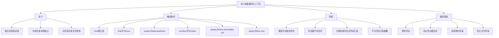

# 什么是BFC，怎么触发BFC，BFC的使用场景

## 一、BFC的定义

BFC（Block Formatting Context）即块级格式化上下文，是Web页面中一个独立的渲染区域，该区域的元素布局与外部元素互不影响。



## 二、触发BFC的条件

### 1. html根元素

html元素本身就是BFC。

### 2. float不为none

```css
.bfc {
  float: left;  /* 或 right */
}
```

### 3. position为absolute或fixed

```css
.bfc {
  position: absolute;  /* 或 fixed */
}
```

### 4. overflow不为visible

```css
.bfc {
  overflow: hidden;  /* 或 scroll、auto */
}
```

### 5. display为inline-block、table-cell、table-caption

```css
.bfc {
  display: inline-block;  /* 或 table-cell、table-caption */
}
```

### 6. display为flow-root（推荐方式）

```css
.bfc {
  display: flow-root;  /* 最干净的触发方式，无副作用 */
}
```

## 三、BFC的特性

### 1. 内部的Box会垂直方向依次排列

```html
<div class="bfc">
  <div class="box">盒子1</div>
  <div class="box">盒子2</div>
</div>

<style>
.bfc {
  overflow: hidden;
}
.box {
  margin: 10px 0;
  background: #f0f0f0;
}
</style>
```

### 2. BFC区域内的浮动元素会参与高度计算

```html
<div class="bfc">
  <div class="float">浮动元素</div>
</div>

<style>
.bfc {
  overflow: hidden;  /* 触发BFC，包含浮动元素 */
  border: 1px solid #000;
}
.float {
  float: left;
  width: 100px;
  height: 100px;
  background: #f0f0f0;
}
</style>
```

### 3. BFC不会与浮动元素重叠

```html
<div class="float">浮动元素</div>
<div class="bfc">BFC区域内容</div>

<style>
.float {
  float: left;
  width: 100px;
  height: 100px;
  background: #f0f0f0;
}
.bfc {
  overflow: hidden;  /* 触发BFC，不与浮动元素重叠 */
  background: #e0e0e0;
}
</style>
```

### 4. BFC区域内的元素外边距不会与外部元素合并

```html
<div class="outer">
  <div class="inner">内部元素</div>
</div>

<style>
.outer {
  overflow: hidden;  /* 触发BFC，防止外边距合并 */
  background: #f0f0f0;
}
.inner {
  margin: 20px;
  background: #e0e0e0;
}
</style>
```

## 四、BFC的使用场景

### 1. 清除浮动

当父元素没有设置高度，子元素浮动时，父元素高度会塌陷为0。

```html
<div class="container">
  <div class="float">浮动元素1</div>
  <div class="float">浮动元素2</div>
</div>

<style>
.container {
  overflow: hidden;  /* 触发BFC，清除浮动 */
  border: 1px solid #000;
}
.float {
  float: left;
  width: 100px;
  height: 100px;
  background: #f0f0f0;
  margin: 10px;
}
</style>
```

### 2. 防止外边距合并

相邻块级元素的外边距会合并，使用BFC可以防止合并。

```html
<div class="container">
  <div class="box">盒子1</div>
  <div class="wrapper">
    <div class="box">盒子2</div>
  </div>
</div>

<style>
.container {
  background: #f0f0f0;
}
.box {
  margin: 20px 0;
  background: #e0e0e0;
}
.wrapper {
  overflow: hidden;  /* 触发BFC，防止外边距合并 */
}
</style>
```

### 3. 实现两栏布局

利用BFC不与浮动元素重叠的特性，实现自适应两栏布局。

```html
<div class="container">
  <div class="left">左侧固定宽度</div>
  <div class="right">右侧自适应宽度</div>
</div>

<style>
.container {
  overflow: hidden;
}
.left {
  float: left;
  width: 200px;
  height: 200px;
  background: #f0f0f0;
}
.right {
  overflow: hidden;  /* 触发BFC，不与浮动元素重叠 */
  height: 200px;
  background: #e0e0e0;
}
</style>
```

### 4. 防止文字环绕

当浮动元素旁边有文字时，文字会环绕浮动元素，使用BFC可以防止环绕。

```html
<div class="container">
  <div class="float">浮动元素</div>
  <div class="content">这是一段很长的文字内容，使用BFC可以防止文字环绕浮动元素。</div>
</div>

<style>
.container {
  overflow: hidden;
}
.float {
  float: left;
  width: 100px;
  height: 100px;
  background: #f0f0f0;
}
.content {
  overflow: hidden;  /* 触发BFC，防止文字环绕 */
  background: #e0e0e0;
}
</style>
```

## 五、总结

| 触发条件 | 副作用 | 推荐指数 |
|---------|--------|---------|
| display: flow-root | 无 | ⭐⭐⭐⭐⭐ |
| overflow: hidden | 可能隐藏溢出内容 | ⭐⭐⭐⭐ |
| overflow: auto | 可能出现滚动条 | ⭐⭐⭐ |
| float: left/right | 脱离文档流 | ⭐⭐ |
| position: absolute/fixed | 脱离文档流 | ⭐⭐ |
| display: inline-block | 改变元素显示方式 | ⭐⭐⭐ |

**推荐使用 `display: flow-root` 来触发BFC，因为它是专门为创建BFC而设计的，没有任何副作用。**
