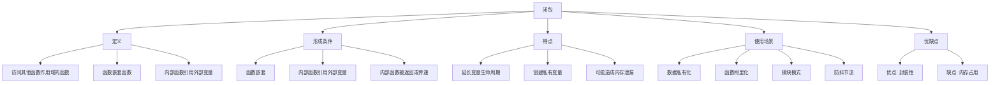

# 谈谈你对闭包的理解

## 一、闭包的定义

闭包（Closure）是指有权访问另一个函数作用域中变量的函数。简单来说，闭包就是能够读取其他函数内部变量的函数。



## 二、闭包的形成条件

### 1. 函数嵌套

```javascript
const outer = () => {
  const outerVar = '外部变量';
  
  const inner = () => {
    console.log(outerVar);  // 访问外部函数的变量
  };
  
  return inner;
};

const closure = outer();
closure();  // 输出: 外部变量
```

### 2. 内部函数引用外部变量

```javascript
const createCounter = () => {
  let count = 0;
  
  return {
    increment: () => {
      count++;
      return count;
    },
    decrement: () => {
      count--;
      return count;
    },
    getCount: () => count
  };
};

const counter = createCounter();
console.log(counter.increment());  // 1
console.log(counter.increment());  // 2
console.log(counter.getCount());   // 2
```

## 三、闭包的特点

### 1. 延长变量的生命周期

正常情况下，函数执行完毕后，其内部变量会被销毁。但闭包会延长变量的生命周期。

```javascript
const createTimer = () => {
  let seconds = 0;
  
  const timer = setInterval(() => {
    seconds++;
    console.log(`已经运行 ${seconds} 秒`);
  }, 1000);
  
  return () => {
    clearInterval(timer);
    console.log(`总共运行了 ${seconds} 秒`);
  };
};

const stopTimer = createTimer();
// 5秒后停止
setTimeout(stopTimer, 5000);
```

### 2. 创建私有变量

JavaScript没有私有变量的概念，但可以通过闭包模拟。

```javascript
const createPerson = (name) => {
  let _age = 0;  // 私有变量
  
  return {
    getName: () => name,
    getAge: () => _age,
    setAge: (age) => {
      if (age > 0 && age < 150) {
        _age = age;
      }
    }
  };
};

const person = createPerson('张三');
console.log(person.getName());  // 张三
console.log(person.getAge());   // 0
person.setAge(25);
console.log(person.getAge());   // 25
```

## 四、闭包的使用场景

### 1. 数据私有化

```javascript
const createWallet = (initialBalance) => {
  let balance = initialBalance;
  
  return {
    deposit: (amount) => {
      balance += amount;
      console.log(`存入 ${amount}，余额 ${balance}`);
    },
    withdraw: (amount) => {
      if (amount > balance) {
        console.log('余额不足');
        return;
      }
      balance -= amount;
      console.log(`取出 ${amount}，余额 ${balance}`);
    },
    getBalance: () => balance
  };
};

const wallet = createWallet(100);
wallet.deposit(50);   // 存入 50，余额 150
wallet.withdraw(30);  // 取出 30，余额 120
console.log(wallet.getBalance());  // 120
```

### 2. 函数柯里化

```javascript
const curry = (fn) => {
  const args = [];
  
  const curried = (...newArgs) => {
    args.push(...newArgs);
    
    if (args.length >= fn.length) {
      return fn(...args);
    }
    
    return curried;
  };
  
  return curried;
};

const add = (a, b, c) => a + b + c;
const curriedAdd = curry(add);

console.log(curriedAdd(1)(2)(3));    // 6
console.log(curriedAdd(1, 2)(3));    // 6
console.log(curriedAdd(1)(2, 3));    // 6
```

### 3. 防抖函数

```javascript
const debounce = (fn, delay) => {
  let timer = null;
  
  return (...args) => {
    clearTimeout(timer);
    timer = setTimeout(() => {
      fn.apply(this, args);
    }, delay);
  };
};

const handleInput = debounce((value) => {
  console.log('搜索:', value);
}, 500);

handleInput('h');
handleInput('he');
handleInput('hello');  // 只有这次会执行
```

### 4. 节流函数

```javascript
const throttle = (fn, delay) => {
  let lastTime = 0;
  
  return (...args) => {
    const now = Date.now();
    
    if (now - lastTime >= delay) {
      lastTime = now;
      fn.apply(this, args);
    }
  };
};

const handleScroll = throttle(() => {
  console.log('滚动事件触发');
}, 1000);

window.addEventListener('scroll', handleScroll);
```

### 5. 模块模式

```javascript
const module = (() => {
  let privateVar = '私有变量';
  
  const privateMethod = () => {
    console.log('私有方法');
  };
  
  return {
    publicVar: '公共变量',
    publicMethod: () => {
      console.log(privateVar);
      privateMethod();
    }
  };
})();

module.publicMethod();  // 私有变量 私有方法
console.log(module.publicVar);  // 公共变量
```

### 6. 循环中的闭包问题

#### 问题示例

```javascript
for (var i = 1; i <= 5; i++) {
  setTimeout(() => {
    console.log(i);  // 输出 5 次 6
  }, 1000);
}
```

#### 解决方案1：使用let

```javascript
for (let i = 1; i <= 5; i++) {
  setTimeout(() => {
    console.log(i);  // 输出 1 2 3 4 5
  }, 1000);
}
```

#### 解决方案2：使用IIFE

```javascript
for (var i = 1; i <= 5; i++) {
  ((j) => {
    setTimeout(() => {
      console.log(j);  // 输出 1 2 3 4 5
    }, 1000);
  })(i);
}
```

## 五、闭包的内存管理

### 内存泄漏问题

闭包会引用外部函数的变量，导致变量无法被垃圾回收，可能造成内存泄漏。

```javascript
const createClosure = () => {
  const largeData = new Array(1000000).fill('x');
  
  return () => {
    console.log(largeData.length);  // largeData 无法被回收
  };
};

const closure = createClosure();
closure();

// 使用完毕后，手动释放引用
closure = null;  // 现在 largeData 可以被回收
```

### 避免内存泄漏

```javascript
const createHandler = () => {
  const element = document.getElementById('button');
  let clicked = false;
  
  const handler = () => {
    clicked = true;
    element.innerHTML = '已点击';
  };
  
  element.addEventListener('click', handler);
  
  // 返回一个清理函数
  return () => {
    element.removeEventListener('click', handler);
  };
};

const cleanup = createHandler();
// 不需要时调用清理函数
// cleanup();
```

## 六、闭包的优缺点

### 优点

1. **封装性**：可以创建私有变量和方法
2. **数据持久化**：延长变量的生命周期
3. **模块化**：实现模块模式
4. **函数式编程**：支持柯里化、高阶函数等

### 缺点

1. **内存占用**：闭包会占用更多内存
2. **内存泄漏**：不当使用可能导致内存泄漏
3. **性能影响**：查找变量时需要跨作用域

## 七、总结

| 方面 | 说明 |
|-----|------|
| 定义 | 访问其他函数作用域中变量的函数 |
| 形成条件 | 函数嵌套 + 内部函数引用外部变量 |
| 核心特点 | 延长变量生命周期，创建私有作用域 |
| 常见场景 | 数据私有化、防抖节流、柯里化、模块模式 |
| 注意事项 | 及时释放不再使用的闭包，避免内存泄漏 |
