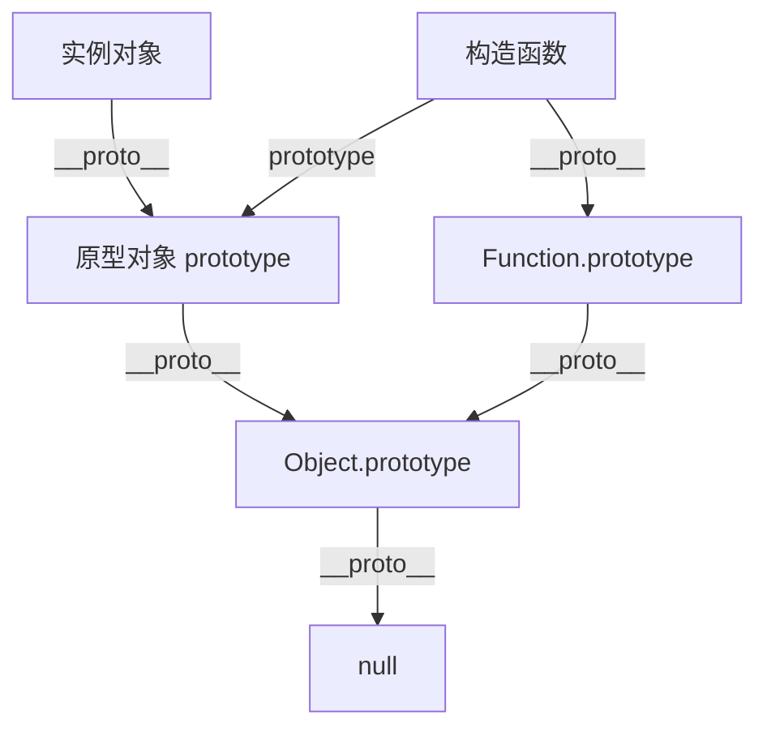
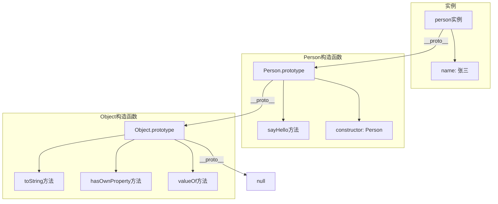

# 谈谈你对原型链的理解

## 一、原型链的定义

原型链是JavaScript实现继承的主要方式。每个对象都有一个原型对象，原型对象又有自己的原型，这样层层向上直到一个对象的原型为null，形成了原型链。



## 二、原型链的核心概念

### 1. prototype（原型对象）

每个函数都有一个prototype属性，指向一个对象，这个对象就是原型对象。

```javascript
const Person = (name) => {
  this.name = name;
};

Person.prototype.sayHello = () => {
  console.log(`Hello, I'm ${this.name}`);
};

const person = new Person('张三');
person.sayHello();  // Hello, I'm 张三
```

### 2. __proto__（原型指针）

每个对象都有一个__proto__属性，指向其构造函数的prototype。

```javascript
const Person = (name) => {
  this.name = name;
};

const person = new Person('张三');

console.log(person.__proto__ === Person.prototype);  // true
console.log(Person.prototype.__proto__ === Object.prototype);  // true
console.log(Object.prototype.__proto__);  // null
```

### 3. constructor（构造函数）

原型对象有一个constructor属性，指向构造函数本身。

```javascript
const Person = (name) => {
  this.name = name;
};

console.log(Person.prototype.constructor === Person);  // true

const person = new Person('张三');
console.log(person.constructor === Person);  // true
```

## 三、原型链的查找机制

当访问一个对象的属性时，JavaScript会按照以下顺序查找：

1. 先在对象自身查找
2. 如果没有，去对象的原型（__proto__）查找
3. 如果还没有，继续向上查找原型的原型
4. 直到找到或到达原型链顶端（null）

```javascript
const Person = (name) => {
  this.name = name;
};

Person.prototype.sayHello = () => {
  console.log('Hello from prototype');
};

const person = new Person('张三');

person.sayHello();  // 先在自身找，没有，去原型找，找到了
person.toString();  // 自身没有，原型没有，Object.prototype有

console.log(person.hasOwnProperty('name'));  // true
console.log(person.hasOwnProperty('sayHello'));  // false
```

## 四、原型链图解



## 五、原型链继承

### 1. 原型链继承

```javascript
const Animal = (name) => {
  this.name = name;
};

Animal.prototype.sayName = () => {
  console.log(`My name is ${this.name}`);
};

const Dog = (name, breed) => {
  Animal.call(this, name);
  this.breed = breed;
};

Dog.prototype = Object.create(Animal.prototype);
Dog.prototype.constructor = Dog;

Dog.prototype.bark = () => {
  console.log('汪汪汪');
};

const dog = new Dog('旺财', '柴犬');
dog.sayName();  // My name is 旺财
dog.bark();     // 汪汪汪
```

### 2. ES6 class继承

```javascript
class Animal {
  constructor(name) {
    this.name = name;
  }
  
  sayName() {
    console.log(`My name is ${this.name}`);
  }
}

class Dog extends Animal {
  constructor(name, breed) {
    super(name);
    this.breed = breed;
  }
  
  bark() {
    console.log('汪汪汪');
  }
}

const dog = new Dog('旺财', '柴犬');
dog.sayName();  // My name is 旺财
dog.bark();     // 汪汪汪
```

## 六、原型链相关方法

### 1. instanceof

检查对象是否是某个构造函数的实例。

```javascript
const Person = (name) => {
  this.name = name;
};

const person = new Person('张三');

console.log(person instanceof Person);   // true
console.log(person instanceof Object);   // true
console.log(person instanceof Array);    // false

const instanceofCustom = (obj, constructor) => {
  let proto = Object.getPrototypeOf(obj);
  
  while (proto) {
    if (proto === constructor.prototype) {
      return true;
    }
    proto = Object.getPrototypeOf(proto);
  }
  
  return false;
};

console.log(instanceofCustom(person, Person));  // true
```

### 2. isPrototypeOf

检查一个对象是否在另一个对象的原型链上。

```javascript
const Person = (name) => {
  this.name = name;
};

const person = new Person('张三');

console.log(Person.prototype.isPrototypeOf(person));  // true
console.log(Object.prototype.isPrototypeOf(person));  // true
```

### 3. Object.getPrototypeOf

获取对象的原型。

```javascript
const Person = (name) => {
  this.name = name;
};

const person = new Person('张三');

console.log(Object.getPrototypeOf(person) === Person.prototype);  // true
console.log(Object.getPrototypeOf(person) === person.__proto__);  // true
```

### 4. Object.setPrototypeOf

设置对象的原型。

```javascript
const Person = (name) => {
  this.name = name;
};

Person.prototype.sayHello = () => {
  console.log('Hello');
};

const person = {};
Object.setPrototypeOf(person, Person.prototype);

person.sayHello();  // Hello
```

### 5. Object.create

创建一个新对象，使用现有对象作为新对象的原型。

```javascript
const person = {
  name: '张三',
  sayHello() {
    console.log(`Hello, I'm ${this.name}`);
  }
};

const student = Object.create(person);
student.name = '李四';
student.sayHello();  // Hello, I'm 李四

const teacher = Object.create(person, {
  name: { value: '王老师' }
});
teacher.sayHello();  // Hello, I'm 王老师
```

## 七、原型链与this指向

原型链中的方法，this指向调用它的对象。

```javascript
const Person = (name) => {
  this.name = name;
};

Person.prototype.sayHello = () => {
  console.log(`Hello, I'm ${this.name}`);
};

const person1 = new Person('张三');
const person2 = new Person('李四');

person1.sayHello();  // Hello, I'm 张三
person2.sayHello();  // Hello, I'm 李四

const sayHello = person1.sayHello;
sayHello();  // Hello, I'm undefined (this指向全局对象或undefined)
```

## 八、原型链的终点

原型链的终点是null，通过Object.prototype.__proto__可以访问到。

```javascript
console.log(Object.prototype.__proto__);  // null

const getPrototypeChain = (obj) => {
  const chain = [];
  let current = obj;
  
  while (current) {
    chain.push(current);
    current = Object.getPrototypeOf(current);
  }
  
  chain.push(null);
  return chain;
};

const Person = (name) => {
  this.name = name;
};

const person = new Person('张三');
console.log(getPrototypeChain(person));
// [person实例, Person.prototype, Object.prototype, null]
```

## 九、总结

| 概念 | 说明 |
|-----|------|
| prototype | 函数的原型对象，用于共享属性和方法 |
| __proto__ | 对象的原型指针，指向构造函数的prototype |
| constructor | 原型对象的构造函数引用 |
| 原型链 | 对象属性查找的链式路径 |
| 终点 | null（Object.prototype.__proto__） |

**核心要点：**
1. 每个对象都有__proto__属性，指向其原型
2. 每个函数都有prototype属性，指向原型对象
3. 原型对象的constructor指向构造函数
4. 原型链的终点是null
5. 属性查找沿原型链向上进行
