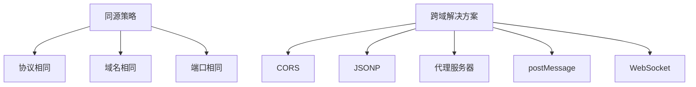

# 什么是跨域？如何解决跨域

## 一、跨域的定义

跨域是指浏览器出于安全考虑，实施的同源策略限制。当一个请求的URL的协议、域名、端口三者之间任意一个与当前页面URL不同时，就会产生跨域问题。



## 二、同源策略

### 1. 同源的定义

协议、域名、端口完全相同即为同源。

| URL1 | URL2 | 是否同源 | 原因 |
|------|------|---------|------|
| http://example.com/page | http://example.com/other | ✅ 同源 | 协议、域名、端口相同 |
| http://example.com/page | https://example.com/other | ❌ 跨域 | 协议不同 |
| http://example.com/page | http://www.example.com/other | ❌ 跨域 | 域名不同 |
| http://example.com/page | http://example.com:8080/other | ❌ 跨域 | 端口不同 |

### 2. 同源策略的限制

- 无法读取非同源网页的Cookie、LocalStorage、IndexedDB
- 无法接触非同源网页的DOM
- 无法向非同源地址发送AJAX请求

## 三、跨域解决方案

### 1. CORS（跨域资源共享）

CORS是目前最主流的跨域解决方案，需要服务器设置响应头。

#### 简单请求

满足以下条件的请求为简单请求：
- 请求方法：GET、POST、HEAD
- 请求头：Accept、Accept-Language、Content-Language、Content-Type（仅限application/x-www-form-urlencoded、multipart/form-data、text/plain）

```javascript
const express = require('express');
const app = express();

app.use((req, res, next) => {
  res.header('Access-Control-Allow-Origin', '*');
  res.header('Access-Control-Allow-Methods', 'GET, POST, PUT, DELETE');
  res.header('Access-Control-Allow-Headers', 'Content-Type, Authorization');
  next();
});

app.get('/api/data', (req, res) => {
  res.json({ message: 'Hello CORS' });
});

app.listen(3000);
```

#### 非简单请求（预检请求）

非简单请求会在正式请求前发送一个OPTIONS预检请求。

```javascript
const express = require('express');
const app = express();

app.use((req, res, next) => {
  res.header('Access-Control-Allow-Origin', 'http://localhost:8080');
  res.header('Access-Control-Allow-Methods', 'GET, POST, PUT, DELETE');
  res.header('Access-Control-Allow-Headers', 'Content-Type, Authorization');
  res.header('Access-Control-Allow-Credentials', 'true');
  res.header('Access-Control-Max-Age', '86400');
  
  if (req.method === 'OPTIONS') {
    res.sendStatus(204);
    return;
  }
  
  next();
});

app.listen(3000);
```

#### CORS相关响应头

| 响应头 | 说明 |
|-------|------|
| Access-Control-Allow-Origin | 允许的源 |
| Access-Control-Allow-Methods | 允许的请求方法 |
| Access-Control-Allow-Headers | 允许的请求头 |
| Access-Control-Allow-Credentials | 是否允许携带Cookie |
| Access-Control-Max-Age | 预检请求缓存时间 |

### 2. JSONP

JSONP利用script标签不受同源策略限制的特点实现跨域。

```javascript
const jsonp = (url, params, callbackName) => {
  const generateCallback = () => {
    return `jsonp_${Date.now()}_${Math.random().toString(36).substr(2)}`;
  };
  
  const callback = callbackName || generateCallback();
  
  return new Promise((resolve, reject) => {
    window[callback] = (data) => {
      resolve(data);
      delete window[callback];
      document.body.removeChild(script);
    };
    
    const query = Object.keys(params)
      .map(key => `${key}=${params[key]}`)
      .join('&');
    
    const script = document.createElement('script');
    script.src = `${url}?${query}&callback=${callback}`;
    script.onerror = reject;
    
    document.body.appendChild(script);
  });
};

jsonp('http://example.com/api', { id: 1 })
  .then(data => console.log(data));
```

#### JSONP的优缺点

| 优点 | 缺点 |
|-----|------|
| 兼容性好 | 只支持GET请求 |
| 实现简单 | 存在安全风险（XSS） |
| | 无法获取状态码 |

### 3. 代理服务器

通过服务器代理请求，绕过浏览器的同源策略。

#### Nginx反向代理

```nginx
server {
  listen 80;
  server_name localhost;
  
  location /api/ {
    proxy_pass http://target-server.com/;
    proxy_set_header Host $host;
    proxy_set_header X-Real-IP $remote_addr;
  }
}
```

#### Node.js代理

```javascript
const express = require('express');
const { createProxyMiddleware } = require('http-proxy-middleware');

const app = express();

app.use('/api', createProxyMiddleware({
  target: 'http://target-server.com',
  changeOrigin: true,
  pathRewrite: { '^/api': '' }
}));

app.listen(3000);
```

### 4. postMessage

postMessage用于跨窗口通信，适用于iframe、window.open等场景。

```javascript
const sendMessage = () => {
  const iframe = document.getElementById('iframe');
  const targetOrigin = 'http://target.com';
  
  iframe.contentWindow.postMessage(
    { type: 'getData', data: 'hello' },
    targetOrigin
  );
};

window.addEventListener('message', (event) => {
  if (event.origin !== 'http://target.com') {
    return;
  }
  
  console.log('Received:', event.data);
});
```

```html
<iframe id="iframe" src="http://target.com/page.html"></iframe>
```

### 5. WebSocket

WebSocket不受同源策略限制，可以进行跨域通信。

```javascript
const socket = new WebSocket('ws://example.com/ws');

socket.onopen = () => {
  socket.send('Hello Server');
};

socket.onmessage = (event) => {
  console.log('Received:', event.data);
};

socket.onerror = (error) => {
  console.error('WebSocket Error:', error);
};

socket.onclose = () => {
  console.log('WebSocket Closed');
};
```

### 6. document.domain

适用于子域之间的跨域，需要设置相同的document.domain。

```javascript
document.domain = 'example.com';
```

### 7. window.name

window.name在同一窗口的生命周期内保持不变，可用于跨域。

```javascript
const getData = (url, callback) => {
  let iframe = document.createElement('iframe');
  iframe.style.display = 'none';
  
  let state = 0;
  
  iframe.onload = () => {
    if (state === 0) {
      state = 1;
      iframe.contentWindow.location = 'about:blank';
    } else {
      callback(iframe.contentWindow.name);
      document.body.removeChild(iframe);
    }
  };
  
  iframe.src = url;
  document.body.appendChild(iframe);
};
```

## 四、各方案对比

| 方案 | 优点 | 缺点 | 适用场景 |
|-----|------|------|---------|
| CORS | 标准方案、支持所有请求方法 | 需要服务器配置 | 现代Web应用 |
| JSONP | 兼容性好、实现简单 | 只支持GET | 老旧系统 |
| 代理服务器 | 前端无感知 | 需要服务器资源 | 开发环境 |
| postMessage | 跨窗口通信 | 需要双方配合 | iframe通信 |
| WebSocket | 实时双向通信 | 需要服务器支持 | 实时应用 |

## 五、总结

1. **CORS**是现代Web应用的首选方案，需要服务器配合设置响应头
2. **JSONP**兼容性好但只支持GET请求，适用于老旧系统
3. **代理服务器**适合开发环境，生产环境需要考虑安全性
4. **postMessage**适用于跨窗口通信场景
5. **WebSocket**适用于实时通信场景，不受同源策略限制
