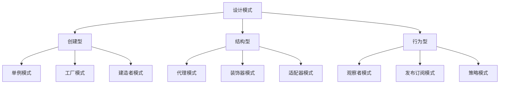

# 常见设计模式

## 一、设计模式概述

设计模式是软件开发中经过验证的解决方案，用于解决常见的设计问题。在JavaScript中，常用的设计模式主要分为三大类：创建型、结构型和行为型。



## 二、创建型模式

### 1. 单例模式

确保一个类只有一个实例，并提供全局访问点。

```javascript
const Singleton = (() => {
  let instance = null;
  
  const createInstance = () => {
    return {
      name: 'Singleton Instance',
      getData() {
        return this.name;
      }
    };
  };
  
  return {
    getInstance() {
      if (!instance) {
        instance = createInstance();
      }
      return instance;
    }
  };
})();

const instance1 = Singleton.getInstance();
const instance2 = Singleton.getInstance();

console.log(instance1 === instance2);  // true
```

#### ES6 class实现

```javascript
class Singleton {
  static instance = null;
  
  constructor() {
    if (Singleton.instance) {
      return Singleton.instance;
    }
    Singleton.instance = this;
  }
  
  getData() {
    return 'Singleton Data';
  }
}

const a = new Singleton();
const b = new Singleton();

console.log(a === b);  // true
```

### 2. 工厂模式

创建对象时不指定具体类，由工厂决定创建哪种对象。

#### 简单工厂

```javascript
const createButton = (type) => {
  const button = document.createElement('button');
  
  switch (type) {
    case 'primary':
      button.className = 'btn-primary';
      button.textContent = '主要按钮';
      break;
    case 'danger':
      button.className = 'btn-danger';
      button.textContent = '危险按钮';
      break;
    default:
      button.className = 'btn-default';
      button.textContent = '默认按钮';
  }
  
  return button;
};

const primaryBtn = createButton('primary');
const dangerBtn = createButton('danger');
```

#### 工厂方法

```javascript
class ButtonFactory {
  createButton() {
    throw new Error('子类必须实现此方法');
  }
}

class PrimaryButtonFactory extends ButtonFactory {
  createButton() {
    const button = document.createElement('button');
    button.className = 'btn-primary';
    button.textContent = '主要按钮';
    return button;
  }
}

class DangerButtonFactory extends ButtonFactory {
  createButton() {
    const button = document.createElement('button');
    button.className = 'btn-danger';
    button.textContent = '危险按钮';
    return button;
  }
}

const primaryFactory = new PrimaryButtonFactory();
const primaryBtn = primaryFactory.createButton();
```

### 3. 建造者模式

将复杂对象的构建与表示分离，使得同样的构建过程可以创建不同的表示。

```javascript
class PersonBuilder {
  constructor() {
    this.person = {};
  }
  
  setName(name) {
    this.person.name = name;
    return this;
  }
  
  setAge(age) {
    this.person.age = age;
    return this;
  }
  
  setJob(job) {
    this.person.job = job;
    return this;
  }
  
  build() {
    return this.person;
  }
}

const person = new PersonBuilder()
  .setName('张三')
  .setAge(25)
  .setJob('前端工程师')
  .build();

console.log(person);
```

## 三、结构型模式

### 1. 代理模式

为其他对象提供代理，控制对原对象的访问。

```javascript
const createProxy = (target) => {
  return new Proxy(target, {
    get(obj, prop) {
      console.log(`访问属性: ${prop}`);
      return obj[prop];
    },
    set(obj, prop, value) {
      console.log(`设置属性: ${prop} = ${value}`);
      obj[prop] = value;
      return true;
    }
  });
};

const person = { name: '张三', age: 25 };
const proxy = createProxy(person);

console.log(proxy.name);  // 访问属性: name 张三
proxy.age = 26;           // 设置属性: age = 26
```

#### 图片懒加载代理

```javascript
const createImageProxy = () => {
  const img = new Image();
  
  return {
    setSrc(src) {
      img.src = 'loading.gif';
      
      const realImg = new Image();
      realImg.onload = () => {
        img.src = src;
      };
      realImg.src = src;
    }
  };
};

const proxyImage = createImageProxy();
proxyImage.setSrc('real-image.jpg');
```

### 2. 装饰器模式

动态地给对象添加额外的职责。

```javascript
const decorator = (fn) => {
  return (...args) => {
    console.log('函数执行前');
    const result = fn.apply(this, args);
    console.log('函数执行后');
    return result;
  };
};

const sayHello = (name) => {
  console.log(`Hello, ${name}`);
  return 'done';
};

const decoratedSayHello = decorator(sayHello);
decoratedSayHello('张三');
```

#### ES7装饰器

```javascript
const readonly = (target, key, descriptor) => {
  descriptor.writable = false;
  return descriptor;
};

class Person {
  @readonly
  name = '张三';
}

const person = new Person();
person.name = '李四';
```

### 3. 适配器模式

将一个类的接口转换成客户期望的另一个接口。

```javascript
const oldInterface = {
  request() {
    return '旧接口数据';
  }
};

const newInterface = {
  specificRequest() {
    return '新接口数据';
  }
};

const adapter = {
  request() {
    return newInterface.specificRequest();
  }
};

console.log(adapter.request());
```

## 四、行为型模式

### 1. 观察者模式

定义对象间的一对多依赖关系，当一个对象状态改变时，所有依赖它的对象都会收到通知。

```javascript
class Subject {
  constructor() {
    this.observers = [];
  }
  
  addObserver(observer) {
    this.observers.push(observer);
  }
  
  removeObserver(observer) {
    const index = this.observers.indexOf(observer);
    if (index > -1) {
      this.observers.splice(index, 1);
    }
  }
  
  notify(data) {
    this.observers.forEach(observer => observer.update(data));
  }
}

class Observer {
  constructor(name) {
    this.name = name;
  }
  
  update(data) {
    console.log(`${this.name} 收到通知: ${data}`);
  }
}

const subject = new Subject();
const observer1 = new Observer('观察者1');
const observer2 = new Observer('观察者2');

subject.addObserver(observer1);
subject.addObserver(observer2);

subject.notify('数据更新了');
```

### 2. 发布订阅模式

与观察者模式类似，但引入了事件通道，发布者和订阅者不直接通信。

```javascript
class EventEmitter {
  constructor() {
    this.events = {};
  }
  
  on(event, callback) {
    if (!this.events[event]) {
      this.events[event] = [];
    }
    this.events[event].push(callback);
    return this;
  }
  
  off(event, callback) {
    if (!this.events[event]) return this;
    
    if (!callback) {
      delete this.events[event];
    } else {
      this.events[event] = this.events[event].filter(cb => cb !== callback);
    }
    return this;
  }
  
  emit(event, ...args) {
    if (!this.events[event]) return this;
    this.events[event].forEach(callback => callback.apply(this, args));
    return this;
  }
  
  once(event, callback) {
    const wrapper = (...args) => {
      callback.apply(this, args);
      this.off(event, wrapper);
    };
    this.on(event, wrapper);
    return this;
  }
}

const emitter = new EventEmitter();

emitter.on('login', (user) => {
  console.log(`${user} 登录成功`);
});

emitter.emit('login', '张三');
```

### 3. 策略模式

定义一系列算法，把它们封装起来，并使它们可以相互替换。

```javascript
const strategies = {
  S: (salary) => salary * 4,
  A: (salary) => salary * 3,
  B: (salary) => salary * 2
};

const calculateBonus = (level, salary) => {
  return strategies[level](salary);
};

console.log(calculateBonus('S', 10000));  // 40000
console.log(calculateBonus('A', 10000));  // 30000
console.log(calculateBonus('B', 10000));  // 20000
```

#### 表单验证策略

```javascript
const validators = {
  required: (value) => value !== '' || '不能为空',
  minLength: (value, length) => value.length >= length || `长度不能小于${length}`,
  maxLength: (value, length) => value.length <= length || `长度不能大于${length}`,
  isEmail: (value) => /^[^\s@]+@[^\s@]+\.[^\s@]+$/.test(value) || '邮箱格式不正确'
};

const validate = (value, rules) => {
  for (const rule of rules) {
    const [validatorName, ...args] = rule.split(':');
    const result = validators[validatorName](value, ...args);
    
    if (result !== true) {
      return result;
    }
  }
  return true;
};

console.log(validate('', ['required']));                    // 不能为空
console.log(validate('ab', ['minLength:3']));              // 长度不能小于3
console.log(validate('test', ['isEmail']));                // 邮箱格式不正确
```

## 五、总结

| 模式 | 类型 | 应用场景 |
|-----|------|---------|
| 单例模式 | 创建型 | 全局状态管理、弹窗 |
| 工厂模式 | 创建型 | 创建复杂对象 |
| 建造者模式 | 创建型 | 链式调用构建对象 |
| 代理模式 | 结构型 | 数据劫持、懒加载 |
| 装饰器模式 | 结构型 | 动态扩展功能 |
| 适配器模式 | 结构型 | 接口兼容 |
| 观察者模式 | 行为型 | 双向绑定、事件监听 |
| 发布订阅模式 | 行为型 | 消息通信、事件总线 |
| 策略模式 | 行为型 | 表单验证、计算规则 |
