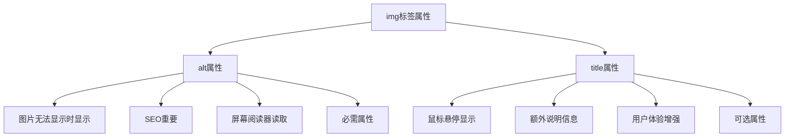
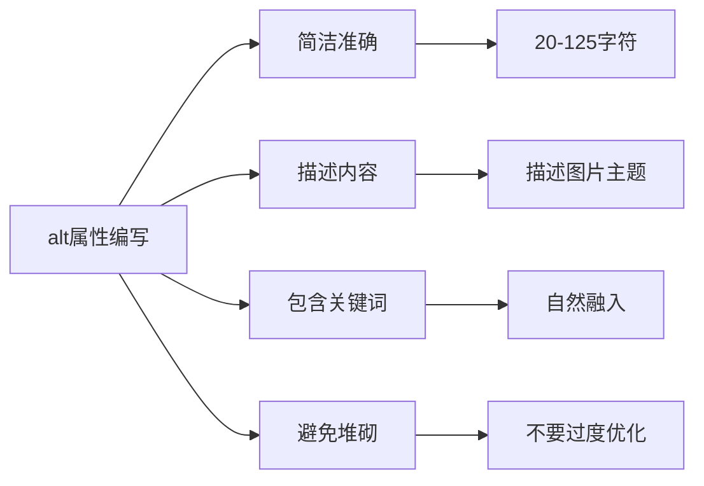

# img标签的title和alt有什么区别

## 基本概念

### alt属性
`alt`（alternative text）是图片的替代文本，当图片无法显示时，会显示这段文字。同时，它也是搜索引擎理解图片内容的重要依据，对SEO非常重要。

### title属性
`title`是图片的提示文本，当鼠标悬停在图片上时，会显示这段文字。它主要用于提供额外的说明信息。

## 主要区别



### 1. 显示时机不同

**alt属性：**
- 图片加载失败或无法显示时显示
- 图片被禁用时显示
- 屏幕阅读器读取时使用

```html

```

当图片无法加载时，浏览器会显示"这是一张产品展示图"。

**title属性：**
- 鼠标悬停在图片上时显示
- 作为工具提示（tooltip）

```html

```

当鼠标悬停在图片上时，会显示"点击查看详情"。

### 2. SEO作用不同

**alt属性：**
- 搜索引擎通过alt文本理解图片内容
- 对图片搜索排名有重要影响
- 是图片SEO的核心要素

**title属性：**
- 对SEO影响较小
- 主要用于用户体验

### 3. 可访问性不同

**alt属性：**
- 屏幕阅读器会读取alt文本
- 帮助视障用户理解图片内容
- 是无障碍访问的重要部分

**title属性：**
- 屏幕阅读器可能不读取title
- 对可访问性帮助有限

### 4. 必需性不同

**alt属性：**
- HTML规范中是必需属性
- 不写alt会导致HTML验证警告
- 不写alt会影响可访问性和SEO

**title属性：**
- 是可选属性
- 根据需要添加

## 使用场景

### 适合使用alt的场景

```html
<!-- 产品图片 -->


<!-- 文章插图 -->


<!-- 用户头像 -->


<!-- 图标 -->

```

### 适合使用title的场景

```html
<!-- 需要额外说明的图片 -->


<!-- 交互提示 -->


<!-- 版权信息 -->

```

## 最佳实践

### 1. alt属性编写原则



**好的alt示例：**
```html

```

**不好的alt示例：**
```html
<!-- 太简单 -->


<!-- 太长 -->


<!-- 关键词堆砌 -->

```

### 2. 装饰性图片的处理

对于纯装饰性的图片，可以使用空的alt属性：

```html
<!-- 装饰性分割线 -->


<!-- 背景装饰 -->

```

### 3. 复杂图片的alt处理

对于复杂的图片（如图表、地图），alt可能不够用，可以结合其他方式：

```html

<div class="chart-description">
  <p>详细数据：</p>
  <table>
    <tr><td>一月</td><td>100万</td></tr>
    <tr><td>二月</td><td>120万</td></tr>
    <tr><td>三月</td><td>150万</td></tr>
  </table>
</div>
```

或者使用`longdesc`属性（虽然已废弃，但可作为参考）：

```html

```

### 4. 链接图片的处理

当图片作为链接时，alt应该描述链接的目的，而不是图片本身：

```html
<!-- 好的做法 -->
<a href="/products/iphone">
  
</a>

<!-- 不好的做法 -->
<a href="/products/iphone">
  
</a>
```

## 实际应用示例

### 电商网站

```html
<!-- 商品列表 -->
<div class="product-card">
  <a href="/product/123">
    
  </a>
  <h3>Nike Air Max 270</h3>
  <p class="price">¥899</p>
</div>
```

### 博客文章

```html
<!-- 文章配图 -->
<article>
  <h1>如何优化前端性能</h1>
  
  <p>文章内容...</p>
</article>
```

### 用户头像

```html
<!-- 用户信息 -->
<div class="user-profile">
  
  <div class="user-info">
    <h3>张三</h3>
    <p>前端开发工程师</p>
  </div>
</div>
```

## 总结

| 特性 | alt属性 | title属性 |
|------|---------|-----------|
| 主要用途 | 图片替代文本 | 鼠标悬停提示 |
| 显示时机 | 图片无法显示时 | 鼠标悬停时 |
| SEO重要性 | 高 | 低 |
| 可访问性 | 重要 | 一般 |
| 是否必需 | 是 | 否 |
| 长度建议 | 20-125字符 | 适度即可 |

**核心要点：**
1. `alt`是必需属性，用于图片无法显示时的替代文本和SEO
2. `title`是可选属性，用于提供额外的说明信息
3. 装饰性图片使用空的alt属性
4. alt应该简洁准确地描述图片内容
5. 合理使用alt和title可以提升用户体验和SEO效果
