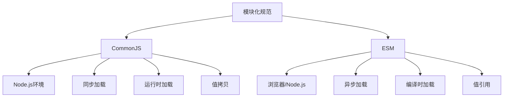

# commonjs和esm的区别

## 一、概述

CommonJS和ESM（ES Modules）是JavaScript的两种模块化规范。CommonJS主要用于Node.js环境，ESM是ES6引入的官方模块化规范。



## 二、语法差异

### 1. 导出语法

#### CommonJS

```javascript
module.exports = {
  name: '张三',
  sayHello() {
    console.log('Hello');
  }
};

exports.name = '张三';
exports.sayHello = () => {
  console.log('Hello');
};
```

#### ESM

```javascript
export const name = '张三';

export const sayHello = () => {
  console.log('Hello');
};

export default {
  name: '张三',
  sayHello() {
    console.log('Hello');
  }
};
```

### 2. 导入语法

#### CommonJS

```javascript
const module = require('./module');

const { name, sayHello } = require('./module');

const name = require('./module').name;
```

#### ESM

```javascript
import module from './module';

import { name, sayHello } from './module';

import { name as userName } from './module';

import * as module from './module';

import './module';
```

## 三、核心区别

### 1. 加载时机

#### CommonJS：运行时加载

```javascript
const path = './module';
const module = require(path);

if (condition) {
  const another = require('./another');
}
```

#### ESM：编译时加载（静态分析）

```javascript
import module from './module';

if (condition) {
  import('./another').then(another => {
    
  });
}
```

### 2. 输出方式

#### CommonJS：值拷贝

```javascript
let count = 0;

const increment = () => {
  count++;
};

module.exports = {
  get count() {
    return count;
  },
  increment
};

const counter = require('./counter');
console.log(counter.count);  // 0
counter.increment();
console.log(counter.count);  // 0 (值拷贝，不会更新)
```

#### ESM：值引用

```javascript
export let count = 0;

export const increment = () => {
  count++;
};

import { count, increment } from './counter.mjs';
console.log(count);  // 0
increment();
console.log(count);  // 1 (值引用，实时更新)
```

### 3. this指向

#### CommonJS

```javascript
console.log(this === module.exports);  // true
console.log(this === exports);         // true
```

#### ESM

```javascript
console.log(this);  // undefined
```

### 4. 变量提升

#### CommonJS

```javascript
console.log(name);  // 报错：name is not defined
const name = require('./module').name;
```

#### ESM

```javascript
console.log(name);  // 可以正常访问（变量提升）
import { name } from './module.mjs';
```

## 四、循环依赖处理

### CommonJS

CommonJS只输出已执行的部分，未执行的部分不会输出。

```javascript
const a = require('./a');
const b = require('./b');

module.exports = { a, b };
```

```javascript
const main = require('./main');
const b = require('./b');

console.log('a.js中b:', b);

module.exports = 'a';
```

```javascript
const main = require('./main');
const a = require('./a');

console.log('b.js中a:', a);

module.exports = 'b';
```

### ESM

ESM使用动态引用，需要时再去取值。

```javascript
import { b } from './b.mjs';

console.log('a.mjs中b:', b);

export const a = 'a';
```

```javascript
import { a } from './a.mjs';

console.log('b.mjs中a:', a);

export const b = 'b';
```

## 五、异步加载

### CommonJS

CommonJS是同步加载，适合服务端。

```javascript
const fs = require('fs');
const path = require('path');
```

### ESM

ESM支持异步加载，适合浏览器。

```javascript
import('./module.mjs').then(module => {
  console.log(module);
});

const module = await import('./module.mjs');
```

## 六、相互引用

### ESM引用CommonJS

```javascript
import module from './commonjs-module.cjs';

import { name } from './commonjs-module.cjs';
```

### CommonJS引用ESM

```javascript
const module = require('./esm-module.mjs');
```

```javascript
(async () => {
  const module = await import('./esm-module.mjs');
})();
```

## 七、Node.js中的使用

### 启用ESM的方式

1. 使用.mjs扩展名
2. package.json中设置"type": "module"
3. 使用--input-type=module参数

```json
{
  "type": "module"
}
```

### CommonJS变量在ESM中的替代

| CommonJS | ESM |
|----------|-----|
| __filename | import.meta.url |
| __dirname | new URL('.', import.meta.url).pathname |
| require | import() |

```javascript
import { fileURLToPath } from 'url';
import { dirname } from 'path';

const __filename = fileURLToPath(import.meta.url);
const __dirname = dirname(__filename);
```

## 八、对比总结

| 特性 | CommonJS | ESM |
|-----|----------|-----|
| 加载方式 | 同步 | 异步 |
| 加载时机 | 运行时 | 编译时 |
| 输出方式 | 值拷贝 | 值引用 |
| this指向 | module.exports | undefined |
| 变量提升 | 不支持 | 支持 |
| 循环依赖 | 只输出已执行部分 | 动态引用 |
| 适用环境 | Node.js | 浏览器/Node.js |
| 静态分析 | 不支持 | 支持 |
| Tree Shaking | 不支持 | 支持 |

## 九、最佳实践

1. **新项目优先使用ESM**：ESM是官方标准，支持Tree Shaking
2. **Node.js项目**：可以使用CommonJS或ESM，推荐ESM
3. **浏览器项目**：必须使用ESM
4. **库开发**：同时提供两种格式的导出

```javascript
{
  "name": "my-library",
  "main": "dist/index.cjs",
  "module": "dist/index.mjs",
  "exports": {
    ".": {
      "import": "./dist/index.mjs",
      "require": "./dist/index.cjs"
    }
  }
}
```
