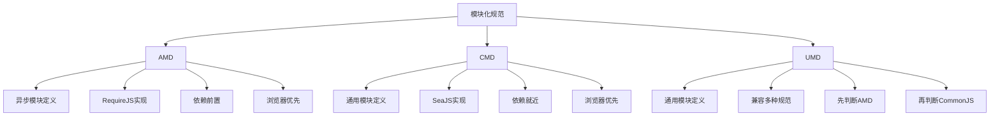

# 谈谈你对AMD、CMD、UMD三种模块化的理解

## 一、概述

AMD、CMD、UMD是JavaScript早期的模块化规范，在ES6模块化出现之前，它们解决了不同环境下的模块化需求。



## 二、AMD（Asynchronous Module Definition）

### 1. 特点

- 异步加载模块，不阻塞页面渲染
- 依赖前置：所有依赖必须提前声明
- 代表库：RequireJS

### 2. 语法

#### 定义模块

```javascript
define('module', ['dependency1', 'dependency2'], (dep1, dep2) => {
  return {
    name: 'module',
    doSomething() {
      dep1.method();
      dep2.method();
    }
  };
});
```

#### 无依赖模块

```javascript
define('simpleModule', () => {
  return {
    name: 'simpleModule',
    sayHello() {
      console.log('Hello');
    }
  };
});
```

#### 加载模块

```javascript
require(['module1', 'module2'], (module1, module2) => {
  module1.doSomething();
  module2.doSomething();
});
```

### 3. RequireJS配置

```javascript
require.config({
  baseUrl: './js',
  paths: {
    jquery: 'lib/jquery.min',
    underscore: 'lib/underscore.min'
  },
  shim: {
    'nonAMDModule': {
      deps: ['jquery'],
      exports: 'nonAMDModule'
    }
  }
});
```

### 4. 完整示例

```javascript
define('userService', ['jquery', 'config'], ($, config) => {
  return {
    getUsers() {
      return $.get(`${config.apiUrl}/users`);
    },
    getUser(id) {
      return $.get(`${config.apiUrl}/users/${id}`);
    }
  };
});

define('userController', ['userService'], (userService) => {
  return {
    async renderUserList() {
      const users = await userService.getUsers();
      console.log(users);
    }
  };
});

require(['userController'], (userController) => {
  userController.renderUserList();
});
```

## 三、CMD（Common Module Definition）

### 1. 特点

- 异步加载模块
- 依赖就近：按需加载，用到时才加载
- 代表库：SeaJS

### 2. 语法

#### 定义模块

```javascript
define((require, exports, module) => {
  const dep1 = require('dependency1');
  
  exports.doSomething = () => {
    dep1.method();
  };
  
  const dep2 = require('dependency2');
  exports.doAnother = () => {
    dep2.method();
  };
});
```

#### 异步加载

```javascript
define((require, exports, module) => {
  exports.loadModule = () => {
    require.async('asyncModule', (asyncModule) => {
      asyncModule.doSomething();
    });
  };
});
```

### 3. SeaJS配置

```javascript
seajs.config({
  base: './js/',
  alias: {
    jquery: 'lib/jquery.min.js',
    underscore: 'lib/underscore.min.js'
  }
});
```

### 4. 完整示例

```javascript
define((require, exports, module) => {
  const $ = require('jquery');
  
  const userService = {
    getUsers() {
      return $.get('/api/users');
    }
  };
  
  exports.renderUserList = async () => {
    const users = await userService.getUsers();
    console.log(users);
  };
  
  if (needDetail) {
    const detailService = require('detailService');
    exports.renderDetail = (id) => {
      detailService.render(id);
    };
  }
});

seajs.use('userController', (userController) => {
  userController.renderUserList();
});
```

## 四、UMD（Universal Module Definition）

### 1. 特点

- 通用模块定义，兼容多种环境
- 先判断AMD，再判断CommonJS，最后使用全局变量
- 适用于库开发

### 2. 基本结构

```javascript
((root, factory) => {
  if (typeof define === 'function' && define.amd) {
    define(['dependency'], factory);
  } else if (typeof module === 'object' && module.exports) {
    module.exports = factory(require('dependency'));
  } else {
    root.MyModule = factory(root.dependency);
  }
})(typeof self !== 'undefined' ? self : this, (dependency) => {
  return {
    name: 'MyModule',
    doSomething() {
      console.log('Doing something');
    }
  };
});
```

### 3. 完整示例

```javascript
((root, factory) => {
  if (typeof define === 'function' && define.amd) {
    define(['jquery'], factory);
  } else if (typeof module === 'object' && module.exports) {
    module.exports = factory(require('jquery'));
  } else {
    root.MyLibrary = factory(root.jQuery);
  }
})(typeof self !== 'undefined' ? self : this, ($) => {
  const MyLibrary = {
    version: '1.0.0',
    
    init(selector) {
      this.element = $(selector);
      return this;
    },
    
    show() {
      this.element.show();
      return this;
    },
    
    hide() {
      this.element.hide();
      return this;
    },
    
    toggle() {
      this.element.toggle();
      return this;
    }
  };
  
  return MyLibrary;
});
```

### 4. 使用方式

```javascript
// AMD环境
define(['myLibrary'], (MyLibrary) => {
  MyLibrary.init('#element').show();
});

// CommonJS环境
const MyLibrary = require('myLibrary');
MyLibrary.init('#element').show();

// 浏览器全局变量
MyLibrary.init('#element').show();
```

## 五、AMD vs CMD 对比

| 特性 | AMD | CMD |
|-----|-----|-----|
| 代表库 | RequireJS | SeaJS |
| 加载方式 | 异步 | 异步 |
| 依赖声明 | 依赖前置 | 依赖就近 |
| 执行时机 | 依赖加载后立即执行 | 依赖使用时才执行 |
| 加载性能 | 一次性加载所有依赖 | 按需加载 |
| 开发体验 | 依赖清晰 | 书写方便 |

### AMD依赖前置

```javascript
define(['dep1', 'dep2', 'dep3'], (dep1, dep2, dep3) => {
  if (false) {
    dep1.method();
  }
});
```

### CMD依赖就近

```javascript
define((require, exports, module) => {
  if (true) {
    const dep1 = require('dep1');
    dep1.method();
  }
});
```

## 六、三种规范对比

| 特性 | AMD | CMD | UMD |
|-----|-----|-----|-----|
| 加载方式 | 异步 | 异步 | 同步/异步 |
| 适用环境 | 浏览器 | 浏览器 | 所有环境 |
| 依赖声明 | 前置 | 就近 | 兼容处理 |
| 代表库 | RequireJS | SeaJS | 无 |
| 现状 | 较少使用 | 较少使用 | 库开发常用 |

## 七、总结

1. **AMD**：异步加载，依赖前置，适合浏览器环境
2. **CMD**：异步加载，依赖就近，更符合直觉
3. **UMD**：通用规范，兼容AMD、CommonJS和全局变量
4. **现代开发**：推荐使用ES Modules，这些规范主要用于理解历史代码
