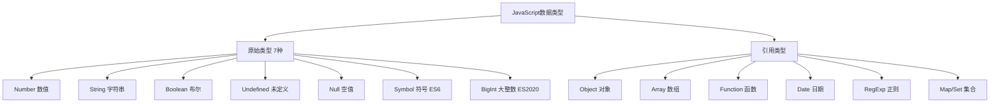

# js有哪些数据类型？基础类型有哪些？引用类型有哪些？

## 一、JavaScript数据类型概述

JavaScript共有8种数据类型，分为两大类：原始类型（基础类型）和引用类型。



## 二、原始类型（基础类型）

原始类型的值是不可变的，直接存储在栈内存中。

### 1. Number（数值）

```javascript
const integer = 42;
const float = 3.14;
const negative = -10;
const infinity = Infinity;
const negInfinity = -Infinity;
const notANumber = NaN;

console.log(typeof integer);      // 'number'
console.log(typeof infinity);     // 'number'
console.log(typeof notANumber);   // 'number'

console.log(Number.MAX_VALUE);    // 1.7976931348623157e+308
console.log(Number.MIN_VALUE);    // 5e-324
console.log(Number.MAX_SAFE_INTEGER);  // 9007199254740991
```

### 2. String（字符串）

```javascript
const singleQuote = 'Hello';
const doubleQuote = "World";
const templateLiteral = `Hello ${singleQuote}`;

console.log(typeof singleQuote);  // 'string'

const multiline = `
  第一行
  第二行
  第三行
`;
```

### 3. Boolean（布尔）

```javascript
const isTrue = true;
const isFalse = false;

console.log(typeof isTrue);  // 'string'

const truthyValues = [true, 1, 'text', [], {}];
const falsyValues = [false, 0, '', null, undefined, NaN];
```

### 4. Undefined（未定义）

```javascript
let undefinedVar;
console.log(undefinedVar);  // undefined
console.log(typeof undefinedVar);  // 'undefined'

const obj = {};
console.log(obj.nonExistent);  // undefined
```

### 5. Null（空值）

```javascript
const nullValue = null;
console.log(nullValue);  // null
console.log(typeof nullValue);  // 'object' (历史遗留bug)

console.log(null === undefined);  // false
console.log(null == undefined);   // true
```

### 6. Symbol（符号）ES6

```javascript
const sym1 = Symbol('description');
const sym2 = Symbol('description');

console.log(sym1 === sym2);  // false (每个Symbol都是唯一的)

const obj = {
  [sym1]: 'value1',
  [sym2]: 'value2'
};

console.log(obj[sym1]);  // 'value1'

const globalSym = Symbol.for('key');
const sameGlobalSym = Symbol.for('key');
console.log(globalSym === sameGlobalSym);  // true
```

### 7. BigInt（大整数）ES2020

```javascript
const bigInt = 9007199254740993n;
const bigInt2 = BigInt('9007199254740993');

console.log(typeof bigInt);  // 'bigint'

console.log(9007199254740993n + 1n);  // 9007199254740994n

console.log(10n === 10);  // false
console.log(10n == 10);   // true
```

## 三、引用类型

引用类型的值是可变的，存储在堆内存中，变量保存的是指向堆内存的引用。

### 1. Object（对象）

```javascript
const obj = {
  name: '张三',
  age: 25,
  sayHello() {
    console.log(`Hello, I'm ${this.name}`);
  }
};

console.log(typeof obj);  // 'object'

const obj2 = new Object();
obj2.name = '李四';
```

### 2. Array（数组）

```javascript
const arr = [1, 2, 3, 4, 5];
const arr2 = new Array(1, 2, 3);

console.log(typeof arr);  // 'object'
console.log(Array.isArray(arr));  // true

arr.push(6);
arr.forEach(item => console.log(item));
```

### 3. Function（函数）

```javascript
const func = () => {
  console.log('Hello');
};

function namedFunc() {
  console.log('Named Function');
}

console.log(typeof func);  // 'function'
console.log(typeof namedFunc);  // 'function'
```

### 4. Date（日期）

```javascript
const now = new Date();
const specific = new Date('2024-01-01');

console.log(typeof now);  // 'object'
console.log(now.getFullYear());
console.log(now.getMonth());
console.log(now.getDate());
```

### 5. RegExp（正则）

```javascript
const regex = /hello/gi;
const regex2 = new RegExp('hello', 'gi');

console.log(typeof regex);  // 'object'
console.log(regex.test('Hello World'));  // true
```

### 6. Map 和 Set

```javascript
const map = new Map();
map.set('name', '张三');
map.set('age', 25);
console.log(map.get('name'));  // '张三'

const set = new Set([1, 2, 3, 3, 3]);
console.log(set);  // Set {1, 2, 3}
```

## 四、类型检测

### 1. typeof

```javascript
console.log(typeof 42);           // 'number'
console.log(typeof 'hello');      // 'string'
console.log(typeof true);         // 'boolean'
console.log(typeof undefined);    // 'undefined'
console.log(typeof null);         // 'object' (bug)
console.log(typeof {});           // 'object'
console.log(typeof []);           // 'object'
console.log(typeof (() => {}));   // 'function'
console.log(typeof Symbol());     // 'symbol'
console.log(typeof 10n);          // 'bigint'
```

### 2. instanceof

```javascript
console.log([] instanceof Array);     // true
console.log([] instanceof Object);    // true
console.log({} instanceof Object);    // true
console.log((() => {}) instanceof Function);  // true
```

### 3. Object.prototype.toString

```javascript
const getType = (value) => {
  return Object.prototype.toString.call(value).slice(8, -1);
};

console.log(getType(42));        // 'Number'
console.log(getType('hello'));   // 'String'
console.log(getType(true));      // 'Boolean'
console.log(getType(null));      // 'Null'
console.log(getType(undefined)); // 'Undefined'
console.log(getType([]));        // 'Array'
console.log(getType({}));        // 'Object'
console.log(getType(() => {}));  // 'Function'
```

### 4. Array.isArray

```javascript
console.log(Array.isArray([]));       // true
console.log(Array.isArray({}));       // false
console.log(Array.isArray('array'));  // false
```

## 五、类型转换

### 1. 显式转换

```javascript
const num = Number('42');
const str = String(42);
const bool = Boolean(1);

const num2 = parseInt('42px');
const num3 = parseFloat('3.14');

const num4 = +'42';
const str2 = 42 + '';
const bool2 = !!1;
```

### 2. 隐式转换

```javascript
console.log('1' + 2);      // '12' (字符串拼接)
console.log('1' - 2);      // -1 (数值运算)
console.log('1' * 2);      // 2
console.log('1' / 2);      // 0.5

console.log(1 == '1');     // true (类型转换后比较)
console.log(1 === '1');    // false (严格比较，不转换)

console.log(Boolean(0));   // false
console.log(Boolean(''));  // false
console.log(Boolean(null)); // false
console.log(Boolean([]));  // true
console.log(Boolean({}));  // true
```

## 六、值传递 vs 引用传递

### 原始类型：值传递

```javascript
let a = 1;
let b = a;
b = 2;

console.log(a);  // 1 (a不受影响)
console.log(b);  // 2
```

### 引用类型：引用传递

```javascript
const obj1 = { name: '张三' };
const obj2 = obj1;
obj2.name = '李四';

console.log(obj1.name);  // '李四' (obj1被影响)
console.log(obj2.name);  // '李四'

const arr1 = [1, 2, 3];
const arr2 = arr1;
arr2.push(4);

console.log(arr1);  // [1, 2, 3, 4]
console.log(arr2);  // [1, 2, 3, 4]
```

### 深拷贝 vs 浅拷贝

```javascript
const shallowCopy = { ...obj };
const shallowCopy2 = Object.assign({}, obj);

const deepCopy = JSON.parse(JSON.stringify(obj));
const deepCopy2 = structuredClone(obj);
```

## 七、总结

| 类型 | 分类 | 特点 | 存储位置 |
|-----|------|------|---------|
| Number | 原始类型 | 不可变 | 栈内存 |
| String | 原始类型 | 不可变 | 栈内存 |
| Boolean | 原始类型 | 不可变 | 栈内存 |
| Undefined | 原始类型 | 不可变 | 栈内存 |
| Null | 原始类型 | 不可变 | 栈内存 |
| Symbol | 原始类型 | 不可变、唯一 | 栈内存 |
| BigInt | 原始类型 | 不可变 | 栈内存 |
| Object | 引用类型 | 可变 | 堆内存 |
| Array | 引用类型 | 可变 | 堆内存 |
| Function | 引用类型 | 可变 | 堆内存 |

**核心要点：**
1. 原始类型值不可变，引用类型值可变
2. 原始类型存储在栈内存，引用类型存储在堆内存
3. typeof可以检测原始类型（除null），instanceof检测引用类型
4. 使用===进行严格比较，避免隐式类型转换
