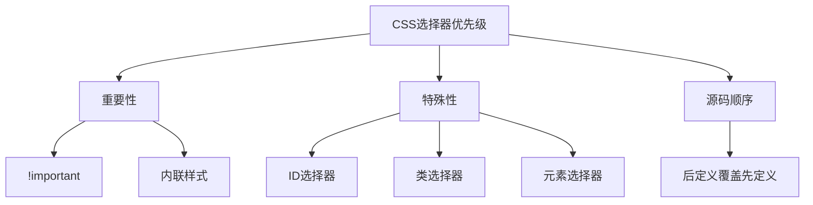

# CSS选择器优先级

## 基本概念

CSS选择器优先级决定了当多个选择器应用到同一个元素时，哪个样式会被应用。



## 优先级计算

### 权重值

| 选择器类型 | 权重值 | 示例 |
|-----------|--------|------|
| !important | ∞ | color: red !important |
| 内联样式 | 1000 | style="color: red" |
| ID选择器 | 100 | #header |
| 类选择器、伪类、属性选择器 | 10 | .class, :hover, [type="text"] |
| 元素选择器、伪元素 | 1 | div, ::before |
| 通配符选择器 | 0 | * |

### 计算示例

```css
/* 优先级: 0,0,1 */
div {
  color: red;
}

/* 优先级: 0,1,0 */
.class {
  color: blue;
}

/* 优先级: 1,0,0 */
#id {
  color: green;
}

/* 优先级: 0,2,0 */
.class1.class2 {
  color: yellow;
}

/* 优先级: 0,1,1 */
div.class {
  color: purple;
}

/* 优先级: 1,1,1 */
#id div.class {
  color: orange;
}
```

## 优先级规则

### 1. !important优先级最高

```css
/* 即使ID选择器权重更高，!important也会覆盖 */
#element {
  color: red;
}

.element {
  color: blue !important;
}
```

### 2. 内联样式优先级很高

```html
<div style="color: red" class="element">
  这个文字是红色的
</div>

<style>
.element {
  color: blue;
}
</style>
```

### 3. ID选择器 > 类选择器 > 元素选择器

```css
/* 优先级: 1,0,0 */
#header {
  color: red;
}

/* 优先级: 0,1,0 */
.header {
  color: blue;
}

/* 优先级: 0,0,1 */
div {
  color: green;
}
```

### 4. 选择器越多，优先级越高

```css
/* 优先级: 0,1,1 */
div.class {
  color: red;
}

/* 优先级: 0,2,1 */
div.class1.class2 {
  color: blue;
}

/* 优先级: 0,1,2 */
div.class span {
  color: green;
}
```

### 5. 后定义的覆盖先定义的

```css
/* 优先级相同，后定义的生效 */
div {
  color: red;
}

div {
  color: blue;
}
```

## 实际应用

### 1. 避免使用!important

```css
/* 不推荐 */
.button {
  color: red !important;
}

/* 推荐 */
.button.primary {
  color: red;
}
```

### 2. 使用更具体的选择器

```css
/* 不够具体 */
.button {
  background: blue;
}

/* 更具体 */
.form .button.primary {
  background: blue;
}
```

### 3. 使用CSS变量

```css
:root {
  --primary-color: #007bff;
}

.button {
  background: var(--primary-color);
}

.button:hover {
  background: var(--primary-color);
  filter: brightness(1.1);
}
```

### 4. 使用BEM命名规范

```css
/* Block */
.card {
  padding: 20px;
}

/* Element */
.card__title {
  font-size: 24px;
}

/* Modifier */
.card--primary {
  background: #007bff;
}

.card__title--large {
  font-size: 32px;
}
```

## 常见陷阱

### 1. 过度使用ID选择器

```css
/* 不推荐：ID选择器优先级太高，难以覆盖 */
#header {
  background: red;
}

/* 推荐：使用类选择器 */
.header {
  background: red;
}
```

### 2. 选择器过长

```css
/* 不推荐：选择器过长，难以维护 */
body div.container div.content div.article div.title h1 {
  font-size: 32px;
}

/* 推荐：使用类选择器 */
.article-title {
  font-size: 32px;
}
```

### 3. 使用!important覆盖

```css
/* 不推荐 */
.button {
  color: red !important;
}

/* 推荐：提高选择器优先级 */
.form .button.primary {
  color: red;
}
```

## 工具和技巧

### 1. 使用浏览器开发者工具

```javascript
// 在浏览器控制台中查看计算后的样式
const element = document.querySelector('.element');
const computedStyle = window.getComputedStyle(element);
console.log(computedStyle.color);
```

### 2. 使用CSS预处理器

```scss
// 使用Sass嵌套
.card {
  padding: 20px;
  
  &__title {
    font-size: 24px;
  }
  
  &--primary {
    background: #007bff;
  }
}
```

### 3. 使用CSS模块

```css
/* 使用CSS Modules避免冲突 */
.button {
  background: blue;
}

/* 编译后会生成唯一的类名 */
.button__hash123 {
  background: blue;
}
```

## 总结

| 优先级 | 选择器类型 | 权重值 |
|--------|-----------|--------|
| 1 | !important | ∞ |
| 2 | 内联样式 | 1000 |
| 3 | ID选择器 | 100 |
| 4 | 类选择器、伪类、属性选择器 | 10 |
| 5 | 元素选择器、伪元素 | 1 |
| 6 | 通配符选择器 | 0 |

**核心要点：**
1. !important优先级最高，但应避免使用
2. 内联样式优先级很高，但难以维护
3. ID选择器优先级高于类选择器
4. 选择器越多，优先级越高
5. 优先级相同时，后定义的覆盖先定义的
6. 使用类选择器而不是ID选择器
7. 避免选择器过长
8. 使用BEM等命名规范提高可维护性
