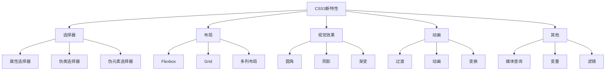

# CSS3新特性

## 概述

CSS3是CSS的最新版本，引入了许多新特性，使得网页设计更加灵活和强大。



## 新增选择器

### 1. 属性选择器

```css
/* 选择有title属性的元素 */
[title] {
  color: red;
}

/* 选择title属性值为"example"的元素 */
[title="example"] {
  color: blue;
}

/* 选择title属性值以"ex"开头的元素 */
[title^="ex"] {
  color: green;
}

/* 选择title属性值以"ple"结尾的元素 */
[title$="ple"] {
  color: yellow;
}

/* 选择title属性值包含"amp"的元素 */
[title*="amp"] {
  color: purple;
}

/* 选择title属性值包含"ex"的元素（用空格分隔） */
[title~="ex"] {
  color: orange;
}

/* 选择lang属性值为"en"或以"en-"开头的元素 */
[lang|="en"] {
  color: pink;
}
```

### 2. 伪类选择器

```css
/* 结构伪类 */
:first-child {
  color: red;
}

:last-child {
  color: blue;
}

:nth-child(odd) {
  color: green;
}

:nth-child(even) {
  color: yellow;
}

:nth-child(3n) {
  color: purple;
}

:nth-child(3n+1) {
  color: orange;
}

:first-of-type {
  color: pink;
}

:last-of-type {
  color: cyan;
}

:nth-of-type(2) {
  color: magenta;
}

:only-child {
  color: lime;
}

:only-of-type {
  color: maroon;
}

/* 目标伪类 */
:target {
  background: yellow;
}

/* 表单伪类 */
:checked {
  background: green;
}

:disabled {
  background: gray;
}

:enabled {
  background: white;
}

:focus {
  outline: 2px solid blue;
}

:required {
  border: 2px solid red;
}

:optional {
  border: 2px solid green;
}

:valid {
  border: 2px solid green;
}

:invalid {
  border: 2px solid red;
}

:in-range {
  background: green;
}

:out-of-range {
  background: red;
}

:not(:checked) {
  opacity: 0.5;
}
```

### 3. 伪元素选择器

```css
::before {
  content: "前缀";
  color: red;
}

::after {
  content: "后缀";
  color: blue;
}

::first-letter {
  font-size: 2em;
  color: red;
}

::first-line {
  font-weight: bold;
  color: blue;
}

::selection {
  background: yellow;
  color: black;
}

::placeholder {
  color: gray;
}

::marker {
  color: red;
}
```

## 布局

### 1. Flexbox

```css
.container {
  display: flex;
  flex-direction: row;
  flex-wrap: wrap;
  justify-content: center;
  align-items: center;
  align-content: center;
  gap: 10px;
}

.item {
  flex: 1;
  flex-grow: 1;
  flex-shrink: 1;
  flex-basis: auto;
  align-self: center;
  order: 1;
}
```

### 2. Grid

```css
.container {
  display: grid;
  grid-template-columns: 1fr 1fr 1fr;
  grid-template-rows: 100px 200px;
  grid-template-areas: 
    "header header header"
    "sidebar content content";
  gap: 10px;
  justify-items: center;
  align-items: center;
}

.item {
  grid-column: 1 / 3;
  grid-row: 1 / 2;
  grid-area: header;
  justify-self: center;
  align-self: center;
}
```

### 3. 多列布局

```css
.container {
  column-count: 3;
  column-width: 200px;
  column-gap: 20px;
  column-rule: 1px solid #ccc;
  column-fill: balance;
}
```

## 视觉效果

### 1. 圆角

```css
.border-radius {
  border-radius: 10px;
  border-radius: 10px 20px 30px 40px;
  border-radius: 50%;
  border-top-left-radius: 10px;
  border-top-right-radius: 20px;
  border-bottom-right-radius: 30px;
  border-bottom-left-radius: 40px;
}
```

### 2. 阴影

```css
.box-shadow {
  box-shadow: 10px 10px 5px #888888;
  box-shadow: 10px 10px 5px 2px #888888;
  box-shadow: inset 10px 10px 5px #888888;
  box-shadow: 0 0 10px rgba(0, 0, 0, 0.5);
}

.text-shadow {
  text-shadow: 2px 2px 4px #000000;
  text-shadow: 2px 2px 4px #000000, -2px -2px 4px #ffffff;
}
```

### 3. 渐变

```css
/* 线性渐变 */
.linear-gradient {
  background: linear-gradient(to right, red, blue);
  background: linear-gradient(45deg, red, blue);
  background: linear-gradient(to right, red, yellow, blue);
  background: linear-gradient(to right, red 0%, blue 100%);
  background: linear-gradient(to right, rgba(255, 0, 0, 0.5), rgba(0, 0, 255, 0.5));
}

/* 径向渐变 */
.radial-gradient {
  background: radial-gradient(circle, red, blue);
  background: radial-gradient(circle at center, red, blue);
  background: radial-gradient(circle at 30% 30%, red, blue);
  background: radial-gradient(circle, red 0%, blue 100%);
  background: radial-gradient(ellipse, red, blue);
}

/* 重复渐变 */
.repeating-linear-gradient {
  background: repeating-linear-gradient(to right, red, blue 20px);
}

.repeating-radial-gradient {
  background: repeating-radial-gradient(circle, red, blue 20px);
}
```

### 4. 透明度

```css
.opacity {
  opacity: 0.5;
}

.rgba {
  background: rgba(255, 0, 0, 0.5);
}

.hsla {
  background: hsla(0, 100%, 50%, 0.5);
}
```

## 动画

### 1. 过渡

```css
.transition {
  transition: all 0.3s ease;
  transition: background 0.3s ease;
  transition: background 0.3s ease, color 0.3s ease;
  transition: background 0.3s ease-in-out;
  transition: background 0.3s ease-in-out 0.1s;
}

.transition:hover {
  background: blue;
  color: white;
}
```

### 2. 动画

```css
@keyframes slideIn {
  from {
    transform: translateX(-100%);
  }
  to {
    transform: translateX(0);
  }
}

.animation {
  animation: slideIn 0.5s ease-in-out;
  animation: slideIn 0.5s ease-in-out infinite;
  animation: slideIn 0.5s ease-in-out infinite alternate;
  animation: slideIn 0.5s ease-in-out 0.1s;
  animation: slideIn 0.5s ease-in-out 0.1s 2;
  animation: slideIn 0.5s ease-in-out 0.1s 2 forwards;
  animation: slideIn 0.5s ease-in-out 0.1s 2 backwards;
  animation: slideIn 0.5s ease-in-out 0.1s 2 both;
}
```

### 3. 变换

```css
.transform {
  transform: translate(10px, 20px);
  transform: translateX(10px);
  transform: translateY(20px);
  transform: scale(1.5);
  transform: scaleX(1.5);
  transform: scaleY(1.5);
  transform: rotate(45deg);
  transform: skew(10deg, 20deg);
  transform: skewX(10deg);
  transform: skewY(20deg);
  transform: translate(10px, 20px) scale(1.5) rotate(45deg);
  transform-origin: center;
  transform-origin: top left;
  transform-origin: 50% 50%;
  transform-style: preserve-3d;
  perspective: 1000px;
}
```

## 其他特性

### 1. 媒体查询

```css
@media screen and (max-width: 768px) {
  body {
    font-size: 14px;
  }
}

@media screen and (min-width: 769px) and (max-width: 1024px) {
  body {
    font-size: 16px;
  }
}

@media screen and (min-width: 1025px) {
  body {
    font-size: 18px;
  }
}

@media print {
  body {
    font-size: 12px;
  }
}
```

### 2. CSS变量

```css
:root {
  --primary-color: #007bff;
  --secondary-color: #6c757d;
  --font-size: 16px;
  --spacing: 10px;
}

.button {
  background: var(--primary-color);
  color: white;
  padding: var(--spacing);
  font-size: var(--font-size);
}

.button:hover {
  background: var(--secondary-color);
}
```

### 3. 滤镜

```css
.filter {
  filter: blur(5px);
  filter: brightness(1.5);
  filter: contrast(1.5);
  filter: grayscale(1);
  filter: hue-rotate(90deg);
  filter: invert(1);
  filter: opacity(0.5);
  filter: saturate(2);
  filter: sepia(1);
  filter: drop-shadow(10px 10px 5px #888888);
  filter: blur(5px) brightness(1.5);
}
```

### 4. 混合模式

```css
.blend-mode {
  mix-blend-mode: normal;
  mix-blend-mode: multiply;
  mix-blend-mode: screen;
  mix-blend-mode: overlay;
  mix-blend-mode: darken;
  mix-blend-mode: lighten;
  mix-blend-mode: color-dodge;
  mix-blend-mode: color-burn;
  mix-blend-mode: hard-light;
  mix-blend-mode: soft-light;
  mix-blend-mode: difference;
  mix-blend-mode: exclusion;
  mix-blend-mode: hue;
  mix-blend-mode: saturation;
  mix-blend-mode: color;
  mix-blend-mode: luminosity;
}
```

### 5. 背景新特性

```css
.background {
  background-size: cover;
  background-size: contain;
  background-size: 100px 100px;
  background-origin: padding-box;
  background-origin: border-box;
  background-origin: content-box;
  background-clip: padding-box;
  background-clip: border-box;
  background-clip: content-box;
  background-clip: text;
  background-attachment: fixed;
  background-attachment: local;
  background-attachment: scroll;
}
```

### 6. 文字新特性

```css
.text {
  text-overflow: ellipsis;
  text-overflow: clip;
  white-space: nowrap;
  white-space: pre;
  white-space: pre-wrap;
  white-space: pre-line;
  word-wrap: break-word;
  word-break: break-all;
  word-break: break-word;
  hyphens: auto;
  text-align-last: center;
  text-decoration-line: underline;
  text-decoration-style: solid;
  text-decoration-color: red;
  text-shadow: 2px 2px 4px #000000;
}
```

### 7. 用户界面

```css
.ui {
  resize: both;
  resize: horizontal;
  resize: vertical;
  resize: none;
  outline: none;
  outline: 2px solid blue;
  outline-offset: 5px;
  box-sizing: border-box;
  box-sizing: content-box;
  cursor: pointer;
  cursor: move;
  cursor: text;
  cursor: wait;
  cursor: help;
  cursor: crosshair;
  cursor: not-allowed;
}
```

## 总结

| 特性 | 描述 | 示例 |
|------|------|------|
| 新增选择器 | 更灵活的选择元素 | :nth-child, :not, ::before |
| Flexbox | 一维布局 | display: flex |
| Grid | 二维布局 | display: grid |
| 圆角 | 创建圆角元素 | border-radius: 50% |
| 阴影 | 添加阴影效果 | box-shadow, text-shadow |
| 渐变 | 创建渐变背景 | linear-gradient, radial-gradient |
| 过渡 | 平滑过渡效果 | transition |
| 动画 | 创建动画效果 | @keyframes, animation |
| 变换 | 元素变换 | transform |
| 媒体查询 | 响应式设计 | @media |
| CSS变量 | 自定义变量 | var(--variable) |
| 滤镜 | 图像滤镜 | filter: blur() |

**核心要点：**
1. CSS3引入了许多新选择器，使得选择元素更加灵活
2. Flexbox和Grid提供了强大的布局能力
3. 圆角、阴影、渐变等视觉效果使设计更加丰富
4. 过渡和动画使得交互更加流畅
5. 媒体查询实现了响应式设计
6. CSS变量提高了代码的可维护性
7. 滤镜和混合模式提供了更多的视觉效果
