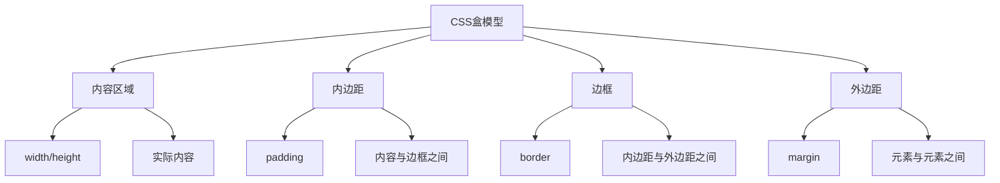

# CSS盒模型

## 基本概念

CSS盒模型是CSS布局的基础，每个元素都被表示为一个矩形的盒子。



## 盒模型组成

### 1. 内容区域

```css
.content {
  width: 200px;
  height: 100px;
  background: #f0f0f0;
}
```

### 2. 内边距

```css
.padding {
  padding: 10px;
  padding: 10px 20px;
  padding: 10px 20px 30px;
  padding: 10px 20px 30px 40px;
  padding-top: 10px;
  padding-right: 20px;
  padding-bottom: 30px;
  padding-left: 40px;
}
```

### 3. 边框

```css
.border {
  border: 1px solid #000;
  border-width: 1px;
  border-style: solid;
  border-color: #000;
  border-top: 1px solid #000;
  border-right: 1px solid #000;
  border-bottom: 1px solid #000;
  border-left: 1px solid #000;
  border-radius: 5px;
}
```

### 4. 外边距

```css
.margin {
  margin: 10px;
  margin: 10px 20px;
  margin: 10px 20px 30px;
  margin: 10px 20px 30px 40px;
  margin-top: 10px;
  margin-right: 20px;
  margin-bottom: 30px;
  margin-left: 40px;
  margin: auto;
}
```

## 盒模型类型

### 1. 标准盒模型

```css
.box {
  box-sizing: content-box;
  width: 200px;
  padding: 20px;
  border: 5px solid #000;
  margin: 10px;
}
```

在标准盒模型中：
- width只包含内容区域的宽度
- 总宽度 = width + padding + border + margin
- 实际宽度 = 200 + 20*2 + 5*2 = 250px

### 2. IE盒模型

```css
.box {
  box-sizing: border-box;
  width: 200px;
  padding: 20px;
  border: 5px solid #000;
  margin: 10px;
}
```

在IE盒模型中：
- width包含内容区域、内边距和边框
- 总宽度 = width + margin
- 内容区域宽度 = width - padding - border
- 实际内容宽度 = 200 - 20*2 - 5*2 = 150px

## 盒模型计算

### 标准盒模型计算

```css
.box {
  box-sizing: content-box;
  width: 200px;
  padding: 10px 20px 30px 40px;
  border: 5px solid #000;
  margin: 10px 20px 30px 40px;
}
```

计算结果：
- 内容宽度：200px
- 内容高度：100px
- 内边距：上10px，右20px，下30px，左40px
- 边框：5px
- 外边距：上10px，右20px，下30px，左40px
- 总宽度：200 + 40 + 20 + 5*2 + 40 + 20 = 330px
- 总高度：100 + 10 + 30 + 5*2 + 10 + 30 = 190px

### IE盒模型计算

```css
.box {
  box-sizing: border-box;
  width: 200px;
  padding: 10px 20px 30px 40px;
  border: 5px solid #000;
  margin: 10px 20px 30px 40px;
}
```

计算结果：
- 总宽度：200px
- 总高度：100px
- 内边距：上10px，右20px，下30px，左40px
- 边框：5px
- 外边距：上10px，右20px，下30px，左40px
- 内容宽度：200 - 40 - 20 - 5*2 = 130px
- 内容高度：100 - 10 - 30 - 5*2 = 50px

## 外边距合并

### 1. 相邻元素的外边距合并

```css
.box1 {
  margin-bottom: 20px;
}

.box2 {
  margin-top: 30px;
}
```

两个相邻元素的外边距会合并为较大的值：30px

### 2. 父子元素的外边距合并

```css
.parent {
  margin-top: 20px;
}

.child {
  margin-top: 30px;
}
```

父子元素的外边距会合并为较大的值：30px

### 3. 防止外边距合并

```css
.parent {
  padding-top: 1px;
  border-top: 1px solid transparent;
  overflow: hidden;
  display: flex;
}

.child {
  margin-top: 30px;
}
```

## 实际应用

### 1. 居中元素

```css
.center {
  width: 200px;
  margin: 0 auto;
}
```

### 2. 清除浮动

```css
.clearfix::after {
  content: "";
  display: table;
  clear: both;
}

.clearfix {
  *zoom: 1;
}
```

### 3. 响应式布局

```css
.container {
  width: 100%;
  max-width: 1200px;
  margin: 0 auto;
  padding: 0 20px;
  box-sizing: border-box;
}
```

### 4. 卡片布局

```css
.card {
  width: 300px;
  padding: 20px;
  border: 1px solid #ddd;
  border-radius: 8px;
  margin: 20px;
  box-shadow: 0 2px 8px rgba(0, 0, 0, 0.1);
  box-sizing: border-box;
}
```

## 总结

| 属性 | 描述 | 示例 |
|------|------|------|
| width | 内容宽度 | width: 200px |
| height | 内容高度 | height: 100px |
| padding | 内边距 | padding: 10px |
| border | 边框 | border: 1px solid #000 |
| margin | 外边距 | margin: 10px |
| box-sizing | 盒模型类型 | box-sizing: border-box |

**核心要点：**
1. CSS盒模型由内容、内边距、边框和外边距组成
2. 标准盒模型中，width只包含内容区域
3. IE盒模型中，width包含内容、内边距和边框
4. 外边距会合并，取较大的值
5. 使用box-sizing: border-box更符合直觉
6. 外边距可以为负值，实现特殊布局效果
7. 内边距和边框不能为负值
