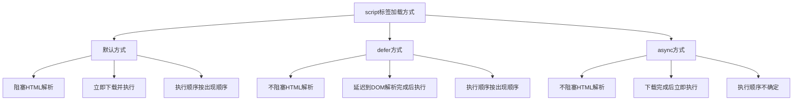
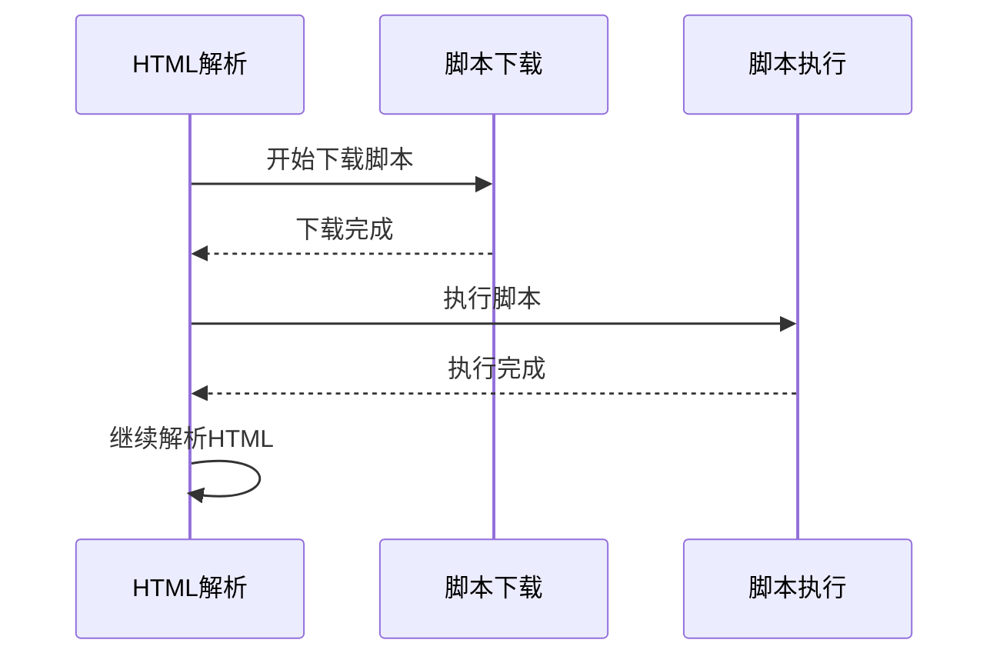
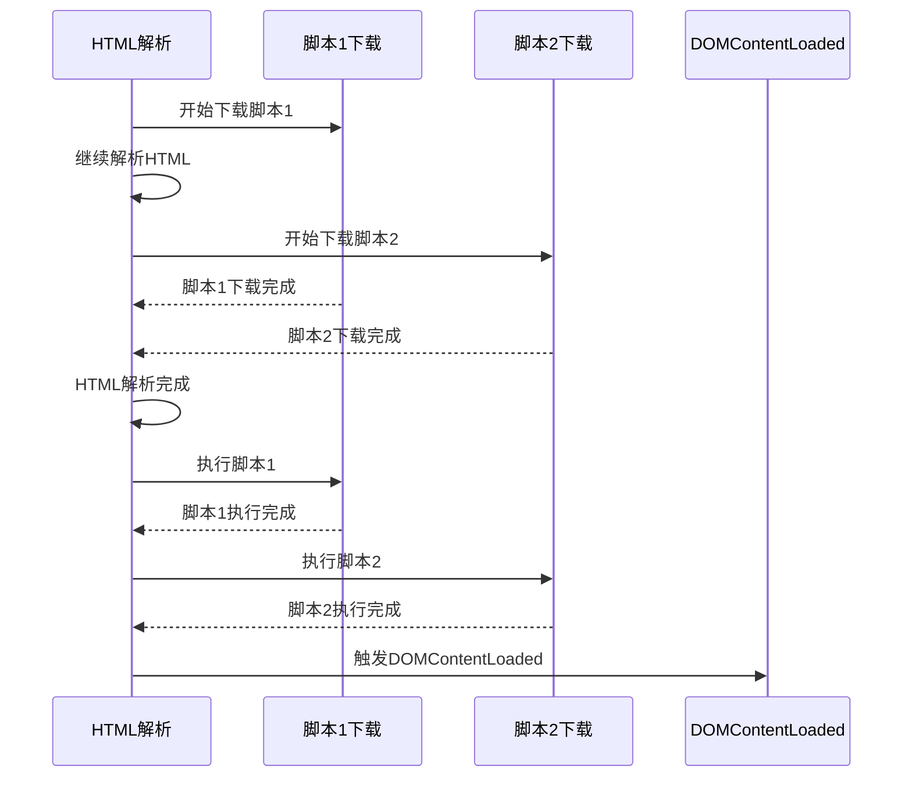
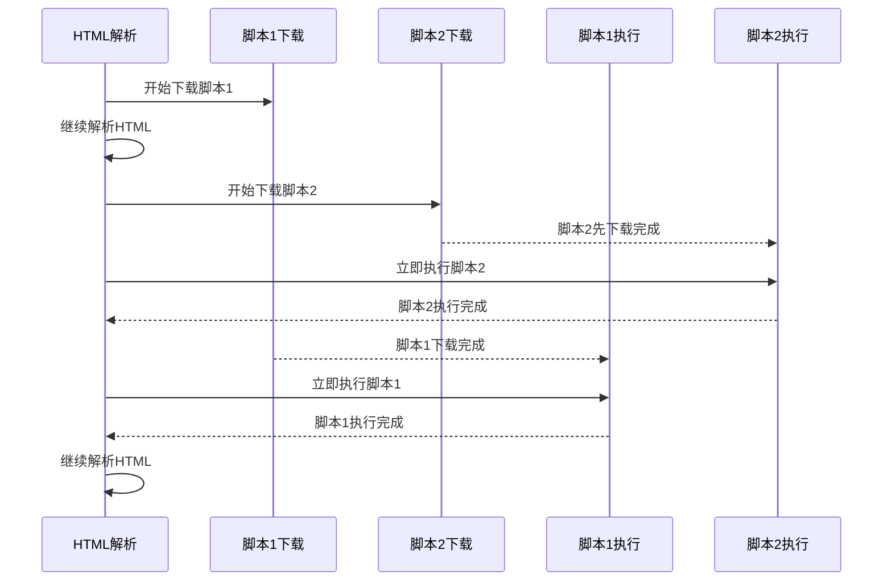
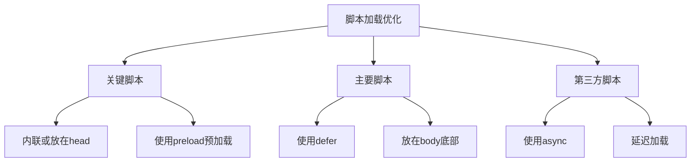

# script标签的defer和async有什么区别

## 基本概念

在HTML中，`<script>`标签用于加载和执行JavaScript代码。默认情况下，`<script>`标签会阻塞HTML的解析，直到脚本加载和执行完成。为了优化页面加载性能，HTML5提供了`defer`和`async`两个属性来控制脚本的加载和执行时机。

## 三种加载方式对比



## 详细对比

### 1. 默认方式（无属性）

```html
<script src="script.js"></script>
```

**特点：**
- 阻塞HTML解析
- 立即下载脚本
- 下载完成后立即执行
- 执行期间阻塞HTML解析

**执行流程：**


**适用场景：**
- 脚本依赖前面的DOM元素
- 需要立即执行的初始化代码
- 小型脚本文件

### 2. defer方式

```html
<script defer src="script.js"></script>
```

**特点：**
- 不阻塞HTML解析
- 在HTML解析完成后、DOMContentLoaded事件前执行
- 多个defer脚本按在HTML中出现的顺序执行
- 保证执行顺序

**执行流程：**


**适用场景：**
- 不依赖其他脚本的独立脚本
- 需要操作DOM但不需要立即执行的脚本
- 分析脚本、统计脚本等

### 3. async方式

```html
<script async src="script.js"></script>
```

**特点：**
- 不阻塞HTML解析
- 下载完成后立即执行
- 执行顺序不确定（取决于下载完成的时间）
- 可能阻塞HTML解析（执行时）

**执行流程：**


**适用场景：**
- 独立的第三方脚本（如广告、统计）
- 不依赖其他脚本且不被其他脚本依赖
- 不需要操作DOM的脚本

## 详细对比表

| 特性 | 默认方式 | defer | async |
|------|---------|-------|-------|
| 阻塞HTML解析 | 是 | 否 | 否（执行时可能阻塞） |
| 执行时机 | 立即执行 | DOM解析完成后 | 下载完成后立即执行 |
| 执行顺序 | 按出现顺序 | 按出现顺序 | 不确定 |
| DOMContentLoaded前执行 | 是 | 是 | 不确定 |
| 适合操作DOM | 是 | 是 | 否 |
| 脚本间依赖 | 可以 | 可以 | 不可以 |

## 实际应用示例

### 1. 默认方式示例

```html
<!DOCTYPE html>
<html>
<head>
  <title>默认方式</title>
  <script>
    console.log('内联脚本执行');
  </script>
  <script src="main.js"></script>
</head>
<body>
  <h1>页面内容</h1>
  <script>
    console.log('页面中的脚本执行');
  </script>
</body>
</html>
```

**执行顺序：**
1. 内联脚本执行
2. main.js下载并执行
3. HTML继续解析
4. 页面中的脚本执行

### 2. defer方式示例

```html
<!DOCTYPE html>
<html>
<head>
  <title>defer方式</title>
  <script defer src="script1.js"></script>
  <script defer src="script2.js"></script>
</head>
<body>
  <h1>页面内容</h1>
  <script>
    console.log('DOMContentLoaded前');
    document.addEventListener('DOMContentLoaded', () => {
      console.log('DOMContentLoaded触发');
    });
  </script>
</body>
</html>
```

**执行顺序：**
1. HTML解析完成
2. script1.js执行
3. script2.js执行
4. DOMContentLoaded触发

### 3. async方式示例

```html
<!DOCTYPE html>
<html>
<head>
  <title>async方式</title>
  <script async src="analytics.js"></script>
  <script async src="ads.js"></script>
</head>
<body>
  <h1>页面内容</h1>
</body>
</html>
```

**执行顺序：**
1. analytics.js和ads.js并行下载
2. 先下载完成的先执行
3. 执行顺序不确定

## 最佳实践

### 1. 脚本放置位置

```html
<!DOCTYPE html>
<html>
<head>
  <title>最佳实践</title>
  <!-- 关键CSS -->
  <link rel="stylesheet" href="styles.css" />
  
  <!-- 预加载关键脚本 -->
  <link rel="preload" href="critical.js" as="script" />
</head>
<body>
  <!-- 页面内容 -->
  <div id="app">...</div>
  
  <!-- 默认方式：需要立即执行的脚本 -->
  <script>
    // 关键初始化代码
    const app = document.getElementById('app');
    // ...
  </script>
  
  <!-- defer方式：需要操作DOM的脚本 -->
  <script defer src="main.js"></script>
  <script defer src="components.js"></script>
  
  <!-- async方式：第三方独立脚本 -->
  <script async src="analytics.js"></script>
  <script async src="ads.js"></script>
</body>
</html>
```

### 2. 脚本加载优化策略



### 3. 动态加载脚本

```javascript
// 动态加载脚本（相当于async）
function loadScript(src) {
  return new Promise((resolve, reject) => {
    const script = document.createElement('script');
    script.src = src;
    script.onload = resolve;
    script.onerror = reject;
    document.head.appendChild(script);
  });
}

// 使用示例
loadScript('https://example.com/analytics.js')
  .then(() => console.log('脚本加载成功'))
  .catch(() => console.error('脚本加载失败'));
```

### 4. 模块化脚本

```html
<!-- ES6模块（默认defer行为） -->
<script type="module" src="main.js"></script>

<!-- 传统脚本（非模块） -->
<script src="legacy.js"></script>
```

**注意：** `type="module"`的脚本默认具有`defer`行为。

## 常见问题

### 1. defer和async可以同时使用吗？

不可以。`defer`和`async`是互斥的，同时设置时`defer`会被忽略。

```html
<!-- 错误：async优先 -->
<script defer async src="script.js"></script>
```

### 2. 内联脚本可以使用defer或async吗？

`defer`和`async`只对带有`src`属性的外部脚本有效，内联脚本不受影响。

```html
<!-- defer和async对内联脚本无效 -->
<script defer>
  console.log('这会立即执行');
</script>
```

### 3. 如何确保脚本执行顺序？

如果需要确保执行顺序，使用`defer`而不是`async`：

```html
<!-- 正确：按顺序执行 -->
<script defer src="script1.js"></script>
<script defer src="script2.js"></script>
<script defer src="script3.js"></script>

<!-- 错误：执行顺序不确定 -->
<script async src="script1.js"></script>
<script async src="script2.js"></script>
<script async src="script3.js"></script>
```

### 4. defer脚本何时执行？

`defer`脚本在`DOMContentLoaded`事件之前执行，但在`document.readyState`变为`interactive`之后。

```javascript
document.addEventListener('DOMContentLoaded', () => {
  console.log('defer脚本已执行完成');
});
```

## 性能优化建议

### 1. 关键渲染路径优化

```html
<!DOCTYPE html>
<html>
<head>
  <meta charset="UTF-8" />
  <title>性能优化示例</title>
  
  <!-- 内联关键CSS -->
  <style>
    /* 关键CSS */
    body { margin: 0; }
  </style>
  
  <!-- 预加载关键资源 -->
  <link rel="preload" href="critical.js" as="script" />
  <link rel="preload" href="main.css" as="style" />
</head>
<body>
  <div id="app">Loading...</div>
  
  <!-- 关键JavaScript -->
  <script>
    // 关键初始化代码
    const app = document.getElementById('app');
    app.textContent = 'Hello World';
  </script>
  
  <!-- 非关键JavaScript -->
  <script defer src="main.js"></script>
  <script defer src="analytics.js"></script>
</body>
</html>
```

### 2. 第三方脚本优化

```html
<!-- 延迟加载第三方脚本 -->
<script>
  window.addEventListener('load', () => {
    const script = document.createElement('script');
    script.async = true;
    script.src = 'https://example.com/analytics.js';
    document.head.appendChild(script);
  });
</script>
```

### 3. 代码分割

```javascript
// 动态导入（代码分割）
async function loadFeature() {
  const module = await import('./feature.js');
  module.init();
}

// 按需加载
document.getElementById('load-feature').addEventListener('click', loadFeature);
```

## 总结

| 场景 | 推荐方式 | 原因 |
|------|---------|------|
| 关键初始化代码 | 默认方式 | 需要立即执行 |
| 需要操作DOM的脚本 | defer | 确保DOM已解析 |
| 第三方独立脚本 | async | 不阻塞页面渲染 |
| 有依赖关系的脚本 | defer | 保证执行顺序 |
| 不需要立即执行的脚本 | defer | 优化页面加载性能 |

**核心要点：**
1. 默认方式会阻塞HTML解析，影响页面加载性能
2. `defer`不阻塞解析，按顺序执行，适合需要操作DOM的脚本
3. `async`不阻塞解析，执行顺序不确定，适合独立第三方脚本
4. 合理使用`defer`和`async`可以显著提升页面加载性能
5. 关键脚本可以使用内联或预加载优化
