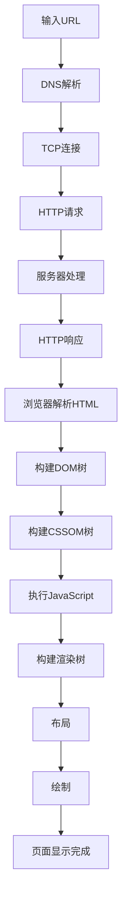
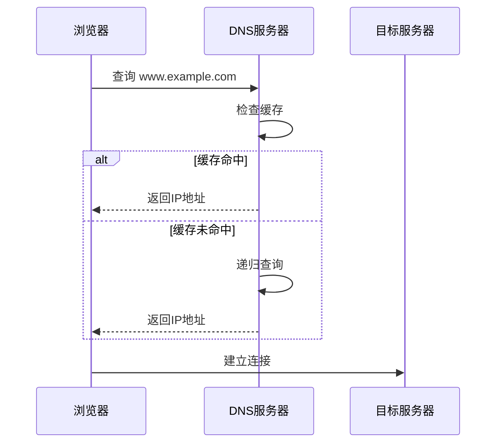
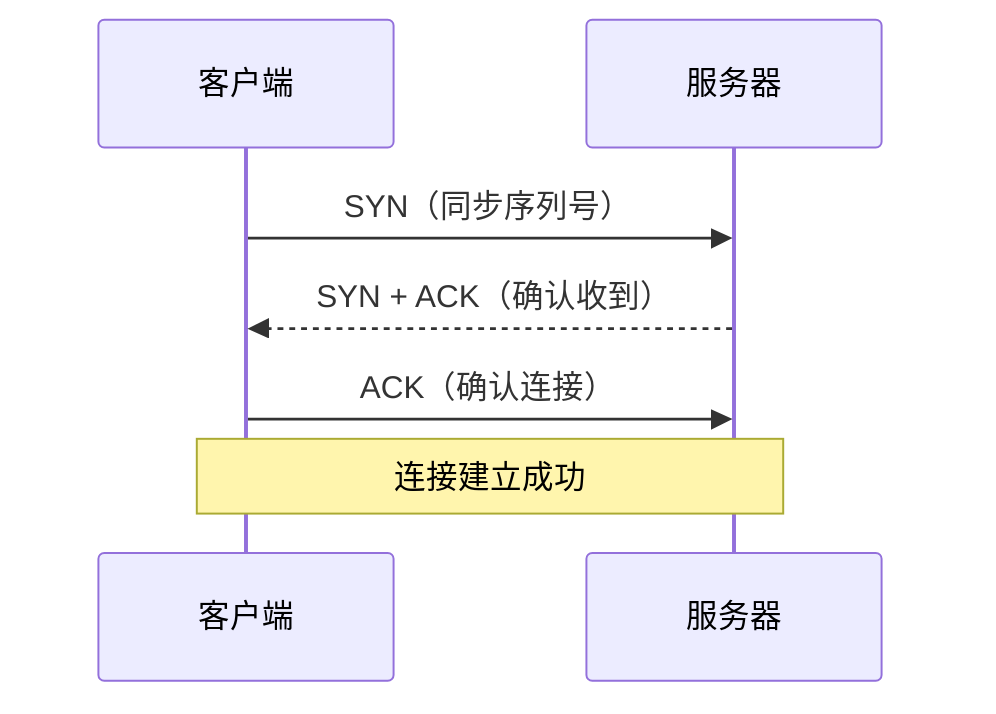
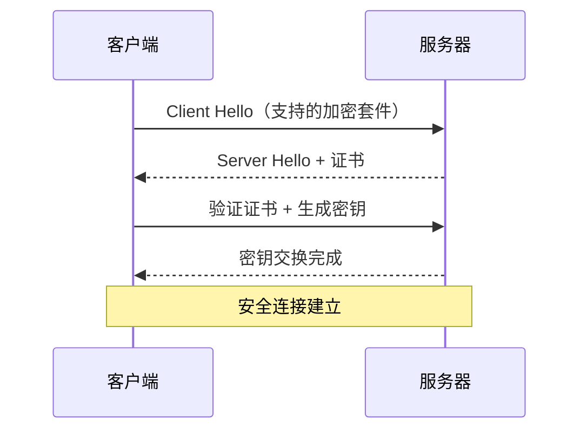
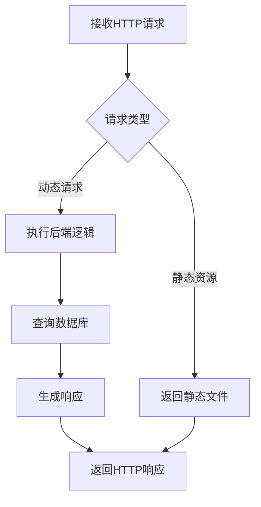
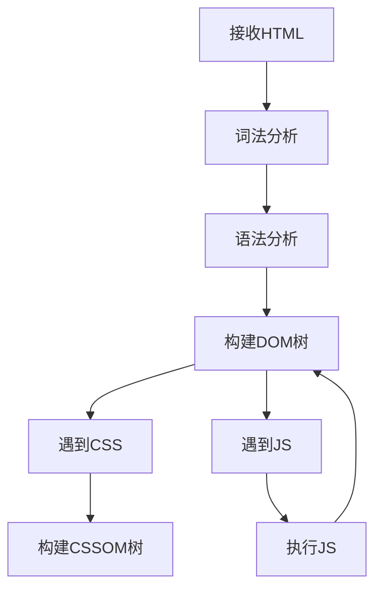
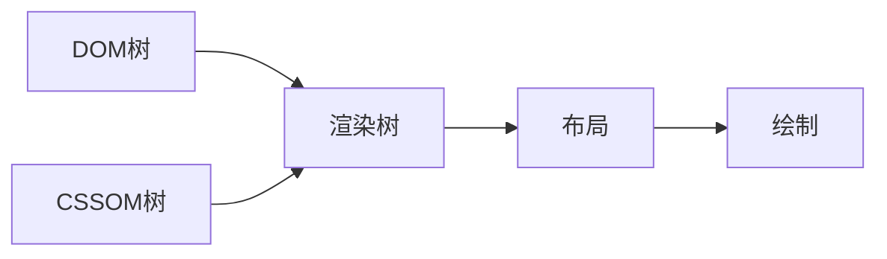
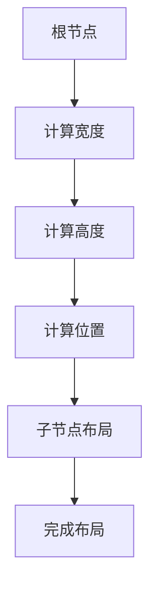
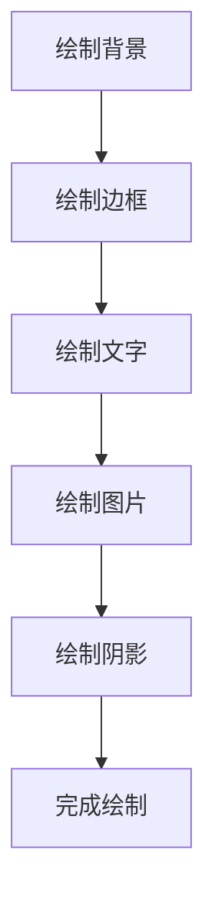
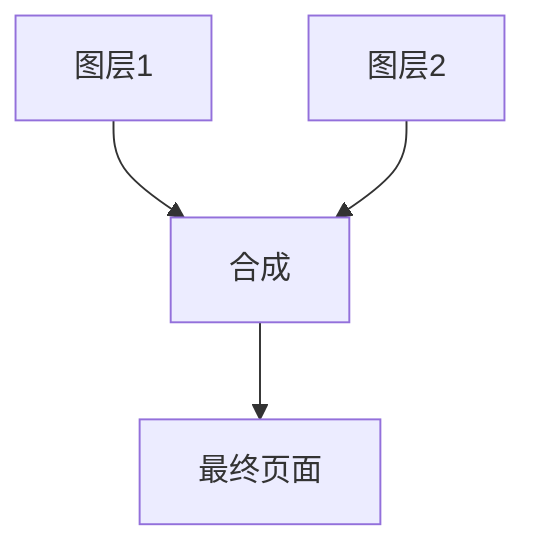

# 从浏览器地址栏输入url到显示页面的步骤

## 完整流程概述

从浏览器地址栏输入URL到页面显示完成，是一个复杂的过程，涉及DNS解析、TCP连接、HTTP请求、资源加载、页面渲染等多个环节。



## 详细步骤解析

### 1. URL解析

浏览器首先解析输入的URL，提取出各个组成部分：

```javascript
const url = 'https://www.example.com:443/path/to/page?query=123#hash';

// URL组成部分
{
  protocol: 'https',    // 协议
  hostname: 'www.example.com',  // 域名
  port: '443',          // 端口
  pathname: '/path/to/page',     // 路径
  search: '?query=123', // 查询参数
  hash: '#hash'         // 哈希值
}
```

**注意事项：**
- 如果输入的不是完整URL，浏览器会自动补全
- 如果输入的是搜索关键词，会跳转到搜索引擎

### 2. DNS解析

将域名解析为IP地址的过程。



**DNS解析过程：**
1. 检查浏览器缓存
2. 检查系统缓存（hosts文件）
3. 检查路由器缓存
4. 检查ISP DNS服务器
5. 递归查询根域名服务器
6. 查询顶级域名服务器
7. 查询权威域名服务器
8. 返回IP地址

**DNS优化：**
- 使用DNS预解析：`<link rel="dns-prefetch" href="//example.com">`
- 使用CDN加速
- 减少DNS查询次数

### 3. TCP连接

建立TCP连接，进行三次握手。



**三次握手详解：**
1. 客户端发送SYN包，进入SYN_SENT状态
2. 服务器收到SYN，发送SYN+ACK，进入SYN_RCVD状态
3. 客户端收到SYN+ACK，发送ACK，进入ESTABLISHED状态

**HTTPS连接：**
如果是HTTPS，还需要进行TLS/SSL握手：



### 4. 发送HTTP请求

浏览器构建HTTP请求并发送给服务器。

**HTTP请求结构：**
```http
GET /path/to/page HTTP/1.1
Host: www.example.com
User-Agent: Mozilla/5.0
Accept: text/html,application/xhtml+xml
Accept-Language: zh-CN,zh;q=0.9
Connection: keep-alive

```

**请求头说明：**
- `Host`：目标域名
- `User-Agent`：浏览器信息
- `Accept`：可接受的内容类型
- `Accept-Language`：可接受的语言
- `Connection`：连接方式（keep-alive保持连接）

### 5. 服务器处理请求

服务器接收请求并处理：



**服务器处理流程：**
1. 解析HTTP请求
2. 路由匹配
3. 执行业务逻辑
4. 查询数据库（如需要）
5. 生成HTTP响应

### 6. 接收HTTP响应

服务器返回HTTP响应：

```http
HTTP/1.1 200 OK
Content-Type: text/html; charset=utf-8
Content-Length: 1234
Date: Mon, 01 Jan 2024 00:00:00 GMT
Server: nginx

<!DOCTYPE html>
<html>
<head>
  <title>页面标题</title>
</head>
<body>
  页面内容
</body>
</html>
```

**响应状态码：**
- 200：成功
- 301/302：重定向
- 304：缓存有效
- 404：资源不存在
- 500：服务器错误

### 7. 浏览器解析HTML

浏览器接收HTML并开始解析：



**解析过程：**
1. 词法分析：将HTML转换为标记（tokens）
2. 语法分析：将标记转换为节点（nodes）
3. 构建DOM树：将节点组织成树形结构

### 8. 构建DOM树

DOM（Document Object Model）树是HTML文档的内存表示：

```html
<!DOCTYPE html>
<html>
<head>
  <title>页面标题</title>
</head>
<body>
  <div class="container">
    <h1>标题</h1>
    <p>段落内容</p>
  </div>
</body>
</html>
```

**对应的DOM树：**
```
Document
└── html
    ├── head
    │   └── title
    │       └── "页面标题"
    └── body
        └── div.container
            ├── h1
            │   └── "标题"
            └── p
                └── "段落内容"
```

### 9. 构建CSSOM树

CSSOM（CSS Object Model）树是CSS样式的内存表示：

```css
body {
  margin: 0;
  padding: 0;
}
.container {
  width: 100%;
  max-width: 1200px;
}
h1 {
  font-size: 24px;
  color: #333;
}
```

**CSSOM树结构：**
```
CSSOM
└── body
    ├── margin: 0
    ├── padding: 0
    └── .container
        ├── width: 100%
        ├── max-width: 1200px
        └── h1
            ├── font-size: 24px
            └── color: #333
```

### 10. 执行JavaScript

浏览器在解析HTML时遇到`<script>`标签会暂停HTML解析，执行JavaScript：

```javascript
// JavaScript可以修改DOM和CSSOM
document.querySelector('h1').textContent = '新标题';
document.querySelector('h1').style.color = 'red';
```

**JavaScript执行对渲染的影响：**
- 阻塞HTML解析
- 可能修改DOM结构
- 可能修改CSS样式
- 触发重排和重绘

### 11. 构建渲染树

将DOM树和CSSOM树合并，构建渲染树：



**渲染树特点：**
- 只包含可见的节点
- 包含每个节点的样式信息
- 不包含`<head>`、`<script>`等不可见元素
- 不包含`display: none`的元素

### 12. 布局

计算渲染树中每个节点的位置和大小：



**布局计算：**
- 确定每个元素的宽度和高度
- 确定每个元素的位置
- 处理盒模型（margin、padding、border）
- 处理浮动和定位

### 13. 绘制

将布局好的元素绘制到屏幕上：



**绘制过程：**
- 绘制背景颜色和图片
- 绘制边框
- 绘制文字
- 绘制替换元素（图片、视频等）
- 绘制阴影和其他效果

### 14. 合成

将多个图层合成最终页面：



**合成优化：**
- 使用`will-change`属性提示浏览器
- 使用`transform`和`opacity`进行动画
- 避免频繁触发重排和重绘

## 性能优化

### 1. DNS解析优化

```html
<!-- DNS预解析 -->
<link rel="dns-prefetch" href="//cdn.example.com">
<link rel="dns-prefetch" href="//api.example.com">
```

### 2. TCP连接优化

```html
<!-- 预连接 -->
<link rel="preconnect" href="//cdn.example.com">
<link rel="preconnect" href="//api.example.com" crossorigin>
```

### 3. 资源预加载

```html
<!-- 预加载关键资源 -->
<link rel="preload" href="critical.css" as="style">
<link rel="preload" href="critical.js" as="script">
<link rel="preload" href="image.jpg" as="image">
```

### 4. 减少HTTP请求

- 合并CSS和JavaScript文件
- 使用CSS Sprites合并图片
- 使用字体图标代替图片

### 5. 使用缓存

```http
Cache-Control: max-age=3600
ETag: "abc123"
Last-Modified: Mon, 01 Jan 2024 00:00:00 GMT
```

### 6. 压缩资源

```http
Content-Encoding: gzip
Content-Type: text/html; charset=utf-8
```

### 7. 使用CDN

将静态资源部署到CDN，加速访问。

### 8. 懒加载

```html
<!-- 图片懒加载 -->

```

## 常见问题

### 1. 为什么页面加载慢？

可能的原因：
- DNS解析慢
- TCP连接慢
- 资源文件大
- HTTP请求多
- 服务器响应慢
- JavaScript执行时间长

### 2. 如何优化首屏加载？

- 内联关键CSS
- 预加载关键资源
- 延迟加载非关键资源
- 使用骨架屏
- 优化JavaScript执行

### 3. 什么是重排和重绘？

**重排：**
- 元素的位置或大小发生变化
- 触发布局计算
- 性能开销大

**重绘：**
- 元素的样式发生变化
- 不影响布局
- 性能开销小

**优化方法：**
- 使用`transform`和`opacity`进行动画
- 批量修改DOM
- 使用文档片段

## 总结

从输入URL到页面显示完成，主要经历以下步骤：

1. **URL解析**：解析URL各个组成部分
2. **DNS解析**：将域名解析为IP地址
3. **TCP连接**：建立TCP连接（HTTPS需要TLS握手）
4. **HTTP请求**：发送HTTP请求到服务器
5. **服务器处理**：服务器处理请求并生成响应
6. **HTTP响应**：返回HTML文档
7. **HTML解析**：解析HTML构建DOM树
8. **CSS解析**：解析CSS构建CSSOM树
9. **JavaScript执行**：执行JavaScript代码
10. **渲染树构建**：合并DOM和CSSOM构建渲染树
11. **布局**：计算元素位置和大小
12. **绘制**：将元素绘制到屏幕
13. **合成**：合成多个图层显示页面

**性能优化关键点：**
- 减少DNS查询
- 使用CDN
- 减少HTTP请求
- 启用缓存
- 压缩资源
- 优化JavaScript执行
- 避免重排和重绘
