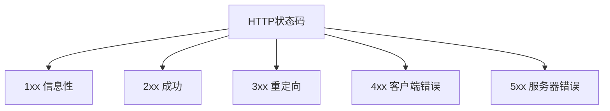
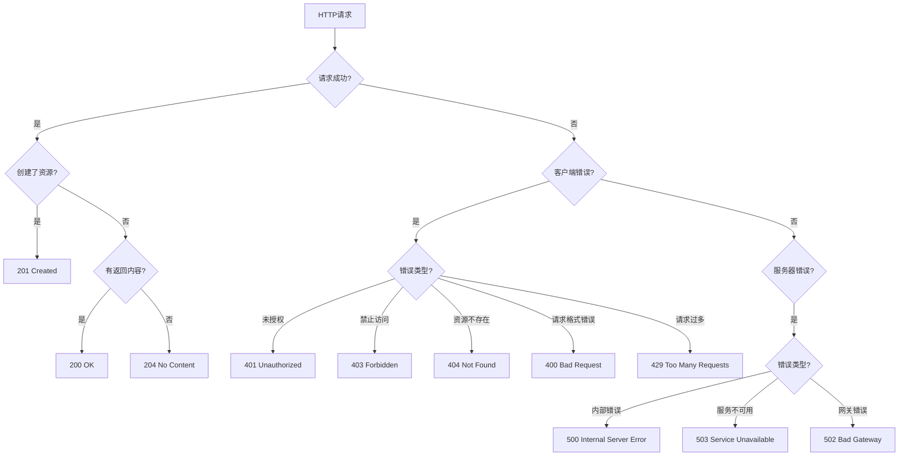

# 常见HTTP状态码及其含义

## HTTP状态码概述

HTTP状态码是服务器返回的3位数字代码，用于表示HTTP请求的处理结果。状态码分为5大类：



## 1xx 信息性响应

表示服务器已接收请求，正在处理中。

### 100 Continue

服务器已接收请求头，客户端应继续发送请求体。

**使用场景：**
- 客户端发送大文件时，先检查服务器是否愿意接收
- 避免发送大量数据后被拒绝

**示例：**
```http
POST /upload HTTP/1.1
Host: example.com
Content-Length: 1000000
Expect: 100-continue

HTTP/1.1 100 Continue

[继续发送请求体]
```

### 101 Switching Protocols

服务器已理解客户端请求，并将通过Upgrade头切换协议。

**使用场景：**
- HTTP升级到WebSocket
- 切换到其他协议

**示例：**
```http
GET /chat HTTP/1.1
Host: example.com
Upgrade: websocket
Connection: Upgrade

HTTP/1.1 101 Switching Protocols
Upgrade: websocket
Connection: Upgrade
```

## 2xx 成功响应

表示请求已成功被服务器接收、理解并处理。

### 200 OK

请求成功，返回请求的数据。

**使用场景：**
- GET请求成功获取资源
- POST请求成功创建资源
- PUT请求成功更新资源

**示例：**
```http
GET /api/users/1 HTTP/1.1
Host: example.com

HTTP/1.1 200 OK
Content-Type: application/json

{
  "id": 1,
  "name": "张三",
  "email": "zhangsan@example.com"
}
```

### 201 Created

请求成功，服务器创建了新资源。

**使用场景：**
- POST请求创建新资源
- PUT请求创建新资源

**示例：**
```http
POST /api/users HTTP/1.1
Host: example.com
Content-Type: application/json

{
  "name": "李四",
  "email": "lisi@example.com"
}

HTTP/1.1 201 Created
Location: /api/users/2
Content-Type: application/json

{
  "id": 2,
  "name": "李四",
  "email": "lisi@example.com"
}
```

### 202 Accepted

请求已接受，但处理尚未完成。

**使用场景：**
- 异步处理任务
- 长时间运行的请求

**示例：**
```http
POST /api/reports HTTP/1.1
Host: example.com

HTTP/1.1 202 Accepted
Content-Type: application/json

{
  "message": "报告生成中",
  "status": "processing",
  "taskId": "abc123"
}
```

### 204 No Content

请求成功，但没有返回内容。

**使用场景：**
- DELETE请求成功删除资源
- PUT请求更新成功但不需要返回数据

**示例：**
```http
DELETE /api/users/1 HTTP/1.1
Host: example.com

HTTP/1.1 204 No Content
```

## 3xx 重定向

表示需要客户端采取进一步的操作才能完成请求。

### 301 Moved Permanently

资源已永久移动到新位置。

**使用场景：**
- 网站改版，URL永久变更
- HTTP重定向到HTTPS

**示例：**
```http
GET /old-page HTTP/1.1
Host: example.com

HTTP/1.1 301 Moved Permanently
Location: https://example.com/new-page
```

### 302 Found

资源临时移动到新位置。

**使用场景：**
- 临时重定向
- A/B测试
- 维护页面

**示例：**
```http
GET /temp-page HTTP/1.1
Host: example.com

HTTP/1.1 302 Found
Location: https://example.com/temp-new-page
```

### 304 Not Modified

资源未修改，可以使用缓存的版本。

**使用场景：**
- 浏览器缓存验证
- 减少带宽消耗

**示例：**
```http
GET /style.css HTTP/1.1
Host: example.com
If-None-Match: "abc123"

HTTP/1.1 304 Not Modified
ETag: "abc123"
```

### 307 Temporary Redirect

临时重定向，保持请求方法和请求体不变。

**使用场景：**
- 需要保持POST请求的重定向
- 比302更规范

**示例：**
```http
POST /form HTTP/1.1
Host: example.com

HTTP/1.1 307 Temporary Redirect
Location: https://example.com/new-form
```

### 308 Permanent Redirect

永久重定向，保持请求方法和请求体不变。

**使用场景：**
- 需要保持POST请求的永久重定向
- 比301更规范

**示例：**
```http
POST /api/old-endpoint HTTP/1.1
Host: example.com

HTTP/1.1 308 Permanent Redirect
Location: https://example.com/api/new-endpoint
```

## 4xx 客户端错误

表示客户端发送的请求有错误。

### 400 Bad Request

请求格式错误或无法理解。

**使用场景：**
- JSON格式错误
- 缺少必需参数
- 参数类型错误

**示例：**
```http
POST /api/users HTTP/1.1
Host: example.com
Content-Type: application/json

{
  "name": "张三"
}

HTTP/1.1 400 Bad Request
Content-Type: application/json

{
  "error": "缺少必需参数: email"
}
```

### 401 Unauthorized

未授权，需要身份验证。

**使用场景：**
- 用户未登录
- Token过期
- 身份验证失败

**示例：**
```http
GET /api/profile HTTP/1.1
Host: example.com

HTTP/1.1 401 Unauthorized
WWW-Authenticate: Bearer realm="api"

{
  "error": "未授权，请先登录"
}
```

### 403 Forbidden

禁止访问，服务器理解请求但拒绝执行。

**使用场景：**
- 权限不足
- IP被封禁
- 资源不可访问

**示例：**
```http
GET /api/admin/users HTTP/1.1
Host: example.com
Authorization: Bearer token123

HTTP/1.1 403 Forbidden

{
  "error": "权限不足，需要管理员权限"
}
```

### 404 Not Found

资源不存在。

**使用场景：**
- URL错误
- 资源已被删除
- 路由不存在

**示例：**
```http
GET /api/users/999 HTTP/1.1
Host: example.com

HTTP/1.1 404 Not Found

{
  "error": "用户不存在"
}
```

### 405 Method Not Allowed

请求方法不被允许。

**使用场景：**
- 使用错误的HTTP方法
- 资源不支持该操作

**示例：**
```http
DELETE /api/users/1 HTTP/1.1
Host: example.com

HTTP/1.1 405 Method Not Allowed
Allow: GET, PUT

{
  "error": "不允许使用DELETE方法"
}
```

### 408 Request Timeout

请求超时。

**使用场景：**
- 客户端发送请求太慢
- 服务器等待超时

**示例：**
```http
POST /api/upload HTTP/1.1
Host: example.com
Content-Length: 1000000000

[发送很慢...]

HTTP/1.1 408 Request Timeout

{
  "error": "请求超时"
}
```

### 409 Conflict

请求与当前资源状态冲突。

**使用场景：**
- 资源已存在
- 版本冲突
- 数据冲突

**示例：**
```http
POST /api/users HTTP/1.1
Host: example.com
Content-Type: application/json

{
  "email": "existing@example.com"
}

HTTP/1.1 409 Conflict

{
  "error": "邮箱已被使用"
}
```

### 410 Gone

资源已永久删除，不再可用。

**使用场景：**
- 资源已被永久删除
- 不再提供该服务

**示例：**
```http
GET /api/old-service HTTP/1.1
Host: example.com

HTTP/1.1 410 Gone

{
  "error": "该服务已下线"
}
```

### 413 Payload Too Large

请求体过大。

**使用场景：**
- 上传文件超过限制
- 请求数据量过大

**示例：**
```http
POST /api/upload HTTP/1.1
Host: example.com
Content-Length: 100000000

HTTP/1.1 413 Payload Too Large

{
  "error": "文件大小超过限制（最大10MB）"
}
```

### 414 URI Too Long

URI过长。

**使用场景：**
- URL参数过多
- URL过长

### 415 Unsupported Media Type

不支持的媒体类型。

**使用场景：**
- Content-Type错误
- 不支持的文件格式

**示例：**
```http
POST /api/upload HTTP/1.1
Host: example.com
Content-Type: text/plain

HTTP/1.1 415 Unsupported Media Type

{
  "error": "不支持的媒体类型，请使用multipart/form-data"
}
```

### 422 Unprocessable Entity

请求格式正确，但语义错误。

**使用场景：**
- 数据验证失败
- 业务逻辑错误

**示例：**
```http
POST /api/users HTTP/1.1
Host: example.com
Content-Type: application/json

{
  "name": "",
  "email": "invalid-email"
}

HTTP/1.1 422 Unprocessable Entity

{
  "error": "数据验证失败",
  "details": {
    "name": "姓名不能为空",
    "email": "邮箱格式不正确"
  }
}
```

### 429 Too Many Requests

请求过多，触发限流。

**使用场景：**
- API限流
- 防止DDoS攻击

**示例：**
```http
GET /api/data HTTP/1.1
Host: example.com

HTTP/1.1 429 Too Many Requests
Retry-After: 60

{
  "error": "请求过于频繁，请60秒后重试"
}
```

## 5xx 服务器错误

表示服务器在处理请求时发生了错误。

### 500 Internal Server Error

服务器内部错误。

**使用场景：**
- 代码错误
- 服务器配置错误
- 数据库连接失败

**示例：**
```http
GET /api/data HTTP/1.1
Host: example.com

HTTP/1.1 500 Internal Server Error

{
  "error": "服务器内部错误"
}
```

### 501 Not Implemented

服务器不支持该功能。

**使用场景：**
- 请求的方法未实现
- 功能未开发

**示例：**
```http
PATCH /api/users/1 HTTP/1.1
Host: example.com

HTTP/1.1 501 Not Implemented

{
  "error": "PATCH方法暂未实现"
}
```

### 502 Bad Gateway

网关或代理服务器从上游服务器接收到无效响应。

**使用场景：**
- 上游服务器宕机
- 网关配置错误
- 网络问题

**示例：**
```http
GET /api/data HTTP/1.1
Host: example.com

HTTP/1.1 502 Bad Gateway

{
  "error": "网关错误"
}
```

### 503 Service Unavailable

服务暂时不可用。

**使用场景：**
- 服务器维护
- 服务器过载
- 临时服务中断

**示例：**
```http
GET /api/data HTTP/1.1
Host: example.com

HTTP/1.1 503 Service Unavailable
Retry-After: 3600

{
  "error": "服务维护中，预计1小时后恢复"
}
```

### 504 Gateway Timeout

网关或代理服务器等待上游服务器超时。

**使用场景：**
- 上游服务器响应慢
- 网关超时设置过短

**示例：**
```http
GET /api/data HTTP/1.1
Host: example.com

HTTP/1.1 504 Gateway Timeout

{
  "error": "网关超时"
}
```

### 505 HTTP Version Not Supported

服务器不支持请求的HTTP版本。

**使用场景：**
- 客户端使用过时的HTTP版本
- 服务器不支持新版本

## 状态码选择指南



## 最佳实践

### 1. RESTful API状态码使用

| 操作 | 成功 | 失败 |
|------|------|------|
| GET | 200 | 404, 403, 401 |
| POST | 201 | 400, 409, 422 |
| PUT | 200/204 | 400, 404, 409 |
| DELETE | 204 | 404, 403 |
| PATCH | 200/204 | 400, 404, 422 |

### 2. 错误响应格式

```json
{
  "error": "错误描述",
  "code": "ERROR_CODE",
  "details": {
    "field": "具体错误信息"
  },
  "timestamp": "2024-01-01T00:00:00Z",
  "path": "/api/resource"
}
```

### 3. 常用响应头

- `Location`：重定向URL
- `Retry-After`：重试时间
- `WWW-Authenticate`：认证信息
- `Allow`：允许的HTTP方法

## 总结

| 类别 | 状态码 | 含义 |
|------|--------|------|
| 1xx | 100, 101 | 信息性响应 |
| 2xx | 200, 201, 202, 204 | 成功响应 |
| 3xx | 301, 302, 304, 307, 308 | 重定向 |
| 4xx | 400, 401, 403, 404, 405, 409, 422, 429 | 客户端错误 |
| 5xx | 500, 502, 503, 504 | 服务器错误 |

**核心要点：**
1. 正确使用状态码可以提高API的可读性和可维护性
2. 2xx表示成功，4xx表示客户端错误，5xx表示服务器错误
3. 3xx用于重定向，注意301/302和307/308的区别
4. 错误响应应包含详细的错误信息，便于调试
5. 遵循RESTful API规范，使用合适的状态码
