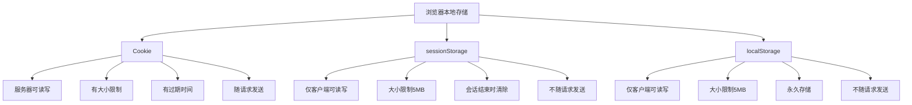
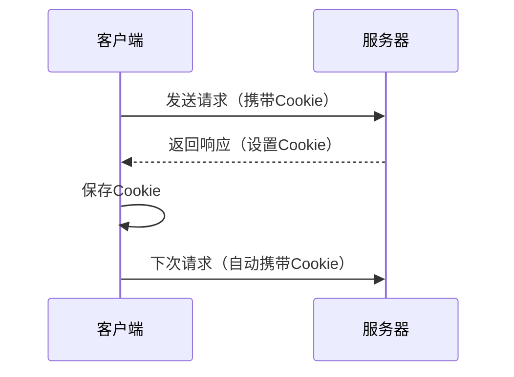
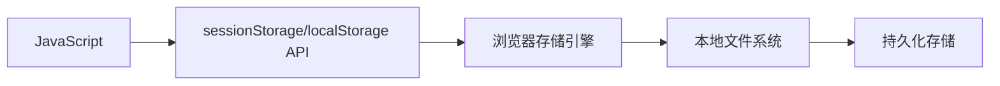
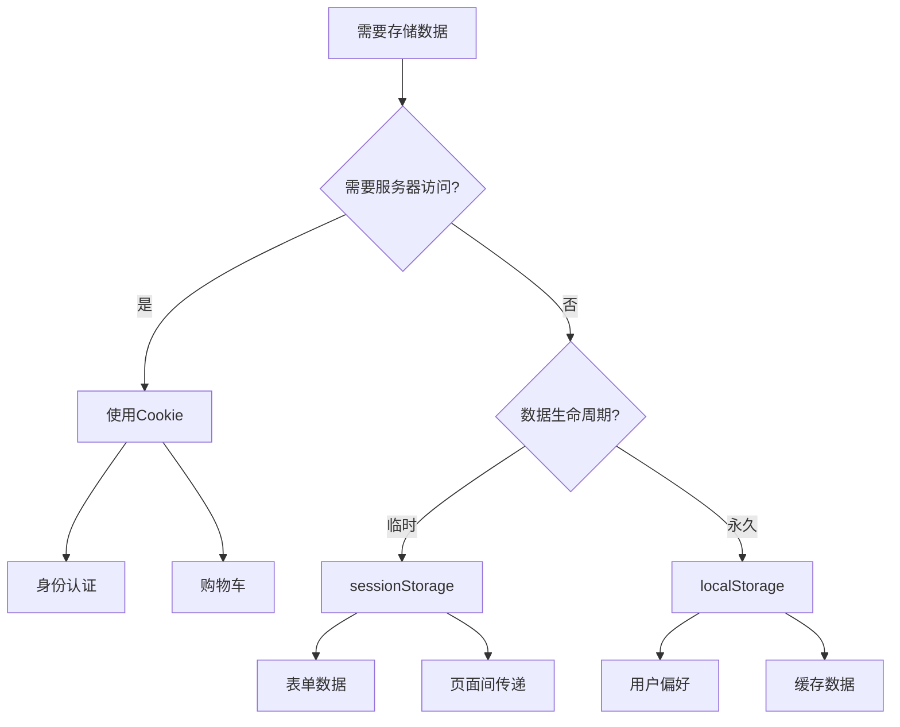

# cookie、sessionStorage和localStorage的区别

## 基本概念

这三种都是浏览器提供的本地存储方案，用于在客户端存储数据。



## 详细对比

### 1. Cookie

**特点：**
- 由服务器设置，也可以通过JavaScript设置
- 每次HTTP请求都会自动携带Cookie
- 有大小限制（约4KB）
- 可以设置过期时间
- 可以设置HttpOnly和Secure属性

**基本用法：**

```javascript
// 设置Cookie
document.cookie = 'username=张三; expires=Fri, 31 Dec 2024 23:59:59 GMT; path=/';

// 读取Cookie
console.log(document.cookie);

// 删除Cookie（设置过期时间为过去的时间）
document.cookie = 'username=; expires=Thu, 01 Jan 1970 00:00:00 GMT; path=/';
```

**Cookie属性：**

| 属性 | 说明 |
|------|------|
| `name=value` | Cookie的名称和值 |
| `expires` | 过期时间（GMT格式） |
| `max-age` | 过期时间（秒数） |
| `domain` | 域名限制 |
| `path` | 路径限制 |
| `secure` | 仅HTTPS传输 |
| `httpOnly` | 仅HTTP可访问，JavaScript不可访问 |
| `sameSite` | 防止CSRF攻击 |

**示例：**

```javascript
// 设置完整的Cookie
document.cookie = 'token=abc123; expires=Fri, 31 Dec 2024 23:59:59 GMT; path=/; domain=.example.com; secure; httpOnly; sameSite=strict';
```

**适用场景：**
- 用户身份认证（Session ID）
- 购物车
- 个性化设置
- 追踪用户行为

### 2. sessionStorage

**特点：**
- 仅在当前会话窗口有效
- 窗口关闭后数据清除
- 大小限制约5MB
- 仅客户端可读写
- 不随HTTP请求发送

**基本用法：**

```javascript
// 存储数据
sessionStorage.setItem('username', '张三');
sessionStorage.setItem('age', '25');

// 读取数据
const username = sessionStorage.getItem('username');
console.log(username);

// 删除指定数据
sessionStorage.removeItem('username');

// 清空所有数据
sessionStorage.clear();

// 获取数据数量
console.log(sessionStorage.length);

// 获取指定索引的key
console.log(sessionStorage.key(0));
```

**适用场景：**
- 表单临时数据
- 页面间数据传递
- 临时状态保存
- 单页应用的状态管理

### 3. localStorage

**特点：**
- 永久存储（除非手动清除）
- 大小限制约5MB
- 仅客户端可读写
- 不随HTTP请求发送
- 同源策略限制

**基本用法：**

```javascript
// 存储数据
localStorage.setItem('username', '张三');
localStorage.setItem('age', '25');

// 存储对象（需要序列化）
const user = { name: '张三', age: 25 };
localStorage.setItem('user', JSON.stringify(user));

// 读取数据
const username = localStorage.getItem('username');
console.log(username);

// 读取对象（需要反序列化）
const user = JSON.parse(localStorage.getItem('user'));
console.log(user);

// 删除指定数据
localStorage.removeItem('username');

// 清空所有数据
localStorage.clear();

// 获取数据数量
console.log(localStorage.length);

// 获取指定索引的key
console.log(localStorage.key(0));
```

**适用场景：**
- 用户偏好设置
- 缓存数据
- 离线应用
- 长期保存的数据

## 详细对比表

| 特性 | Cookie | sessionStorage | localStorage |
|------|--------|----------------|--------------|
| 存储大小 | 约4KB | 约5MB | 约5MB |
| 生命周期 | 可设置过期时间 | 会话结束（窗口关闭） | 永久（除非手动清除） |
| 数据作用域 | 同域名+同路径 | 同源+同窗口 | 同源 |
| 服务器访问 | 每次请求自动携带 | 不自动携带 | 不自动携带 |
| 存储位置 | 浏览器和服务器 | 浏览器 | 浏览器 |
| API | document.cookie | sessionStorage | localStorage |
| 数据类型 | 字符串 | 字符串 | 字符串 |
| 安全性 | 可设置HttpOnly | 较低 | 较低 |

## 存储机制

### Cookie存储机制



**Cookie工作流程：**
1. 客户端首次请求服务器
2. 服务器返回响应，设置Set-Cookie头
3. 客户端保存Cookie
4. 后续请求自动携带Cookie
5. 服务器读取Cookie进行身份验证

### sessionStorage和localStorage存储机制



**工作流程：**
1. JavaScript调用API存储数据
2. 浏览器存储引擎处理数据
3. 数据保存到本地文件系统
4. 后续可通过API读取数据

## 安全性

### Cookie安全性

**安全措施：**

```javascript
// 设置安全的Cookie
document.cookie = 'token=abc123; secure; httpOnly; sameSite=strict';
```

**安全属性说明：**

1. **HttpOnly**
   - 防止XSS攻击窃取Cookie
   - JavaScript无法读取Cookie
   - 只能通过HTTP请求传输

2. **Secure**
   - 仅通过HTTPS传输
   - 防止中间人攻击

3. **SameSite**
   - `strict`：严格模式，仅同站请求发送
   - `lax`：宽松模式，部分跨站请求发送
   - `none`：允许跨站，需要配合Secure使用

**XSS攻击防护：**

```javascript
// 不安全的做法
const token = getCookie('token');
document.getElementById('token').value = token;

// 安全的做法
// 使用HttpOnly Cookie，JavaScript无法读取
```

**CSRF攻击防护：**

```javascript
// 使用SameSite属性
document.cookie = 'token=abc123; sameSite=strict';

// 或使用CSRF Token
const csrfToken = generateCSRFToken();
document.cookie = `csrf_token=${csrfToken}; secure; httpOnly`;
```

### sessionStorage和localStorage安全性

**安全措施：**

```javascript
// 敏感数据加密存储
const encryptedData = encrypt(sensitiveData);
localStorage.setItem('data', encryptedData);

// 读取时解密
const decryptedData = decrypt(localStorage.getItem('data'));
```

**注意事项：**
- 不要存储敏感信息（密码、信用卡号等）
- 容易受到XSS攻击
- 建议对敏感数据进行加密

## 性能优化

### Cookie性能优化

```javascript
// 减少Cookie大小
document.cookie = 'id=123'; // 而不是 'userId=1234567890'

// 减少Cookie数量
document.cookie = 'user=张三|25|北京'; // 合并多个值

// 设置合理的过期时间
document.cookie = 'token=abc123; max-age=3600'; // 1小时后过期
```

### localStorage性能优化

```javascript
// 批量读取
const keys = ['key1', 'key2', 'key3'];
const values = keys.map(key => localStorage.getItem(key));

// 批量写入
const data = { key1: 'value1', key2: 'value2', key3: 'value3' };
Object.entries(data).forEach(([key, value]) => {
  localStorage.setItem(key, value);
});

// 使用缓存策略
const CACHE_KEY = 'api_data';
const CACHE_EXPIRY = 3600000; // 1小时

function getCachedData(key) {
  const cached = localStorage.getItem(key);
  if (!cached) return null;
  
  const { data, timestamp } = JSON.parse(cached);
  if (Date.now() - timestamp > CACHE_EXPIRY) {
    localStorage.removeItem(key);
    return null;
  }
  
  return data;
}

function setCachedData(key, data) {
  localStorage.setItem(key, JSON.stringify({
    data,
    timestamp: Date.now()
  }));
}
```

## 实际应用示例

### 1. 用户登录状态管理

```javascript
// 使用Cookie存储Session ID
function login(username, password) {
  return fetch('/api/login', {
    method: 'POST',
    headers: { 'Content-Type': 'application/json' },
    body: JSON.stringify({ username, password })
  })
  .then(response => response.json())
  .then(data => {
    if (data.success) {
      // Cookie由服务器设置
      console.log('登录成功');
    }
  });
}

// 检查登录状态
function checkLogin() {
  return fetch('/api/check-auth')
    .then(response => response.json())
    .then(data => data.authenticated);
}
```

### 2. 用户偏好设置

```javascript
// 保存用户偏好
function savePreferences(preferences) {
  localStorage.setItem('user_preferences', JSON.stringify(preferences));
}

// 读取用户偏好
function getPreferences() {
  const preferences = localStorage.getItem('user_preferences');
  return preferences ? JSON.parse(preferences) : {
    theme: 'light',
    language: 'zh-CN',
    fontSize: 'medium'
  };
}

// 应用偏好设置
function applyPreferences() {
  const preferences = getPreferences();
  document.documentElement.setAttribute('data-theme', preferences.theme);
  document.documentElement.lang = preferences.language;
  document.documentElement.style.fontSize = preferences.fontSize;
}
```

### 3. 表单数据临时保存

```javascript
// 保存表单数据
function saveFormData(formId) {
  const form = document.getElementById(formId);
  const formData = new FormData(form);
  const data = {};
  
  formData.forEach((value, key) => {
    data[key] = value;
  });
  
  sessionStorage.setItem(`form_${formId}`, JSON.stringify(data));
}

// 恢复表单数据
function restoreFormData(formId) {
  const data = sessionStorage.getItem(`form_${formId}`);
  if (!data) return;
  
  const formData = JSON.parse(data);
  const form = document.getElementById(formId);
  
  Object.entries(formData).forEach(([key, value]) => {
    const input = form.querySelector(`[name="${key}"]`);
    if (input) {
      input.value = value;
    }
  });
}

// 清除表单数据
function clearFormData(formId) {
  sessionStorage.removeItem(`form_${formId}`);
}
```

### 4. 购物车功能

```javascript
// 添加商品到购物车
function addToCart(product) {
  const cart = JSON.parse(localStorage.getItem('cart') || '[]');
  const existingItem = cart.find(item => item.id === product.id);
  
  if (existingItem) {
    existingItem.quantity += product.quantity || 1;
  } else {
    cart.push({ ...product, quantity: product.quantity || 1 });
  }
  
  localStorage.setItem('cart', JSON.stringify(cart));
}

// 从购物车移除商品
function removeFromCart(productId) {
  const cart = JSON.parse(localStorage.getItem('cart') || '[]');
  const newCart = cart.filter(item => item.id !== productId);
  localStorage.setItem('cart', JSON.stringify(newCart));
}

// 更新商品数量
function updateQuantity(productId, quantity) {
  const cart = JSON.parse(localStorage.getItem('cart') || '[]');
  const item = cart.find(item => item.id === productId);
  
  if (item) {
    item.quantity = quantity;
    localStorage.setItem('cart', JSON.stringify(cart));
  }
}

// 获取购物车
function getCart() {
  return JSON.parse(localStorage.getItem('cart') || '[]');
}

// 清空购物车
function clearCart() {
  localStorage.removeItem('cart');
}
```

## 最佳实践

### 1. 选择合适的存储方案



### 2. 数据序列化

```javascript
// 存储对象
const user = { name: '张三', age: 25 };
localStorage.setItem('user', JSON.stringify(user));

// 读取对象
const user = JSON.parse(localStorage.getItem('user'));

// 存储数组
const items = [1, 2, 3, 4, 5];
localStorage.setItem('items', JSON.stringify(items));

// 读取数组
const items = JSON.parse(localStorage.getItem('items'));
```

### 3. 错误处理

```javascript
// 安全的存储函数
function safeSetItem(key, value) {
  try {
    localStorage.setItem(key, value);
    return true;
  } catch (error) {
    console.error('存储失败:', error);
    return false;
  }
}

// 安全的读取函数
function safeGetItem(key, defaultValue = null) {
  try {
    return localStorage.getItem(key) || defaultValue;
  } catch (error) {
    console.error('读取失败:', error);
    return defaultValue;
  }
}

// 安全的删除函数
function safeRemoveItem(key) {
  try {
    localStorage.removeItem(key);
    return true;
  } catch (error) {
    console.error('删除失败:', error);
    return false;
  }
}
```

### 4. 存储空间管理

```javascript
// 检查存储空间使用情况
function getStorageUsage() {
  let total = 0;
  for (let key in localStorage) {
    if (localStorage.hasOwnProperty(key)) {
      total += localStorage[key].length + key.length;
    }
  }
  return total;
}

// 清理过期数据
function cleanExpiredData() {
  const now = Date.now();
  const EXPIRY_KEY = '_expiry';
  
  for (let key in localStorage) {
    if (key.endsWith(EXPIRY_KEY)) continue;
    
    const expiryKey = `${key}${EXPIRY_KEY}`;
    const expiry = localStorage.getItem(expiryKey);
    
    if (expiry && parseInt(expiry) < now) {
      localStorage.removeItem(key);
      localStorage.removeItem(expiryKey);
    }
  }
}

// 设置带过期时间的数据
function setItemWithExpiry(key, value, ttl) {
  const now = Date.now();
  const expiry = now + ttl;
  
  localStorage.setItem(key, value);
  localStorage.setItem(`${key}_expiry`, expiry.toString());
}
```

## 总结

| 存储方案 | 适用场景 | 优点 | 缺点 |
|---------|---------|------|------|
| Cookie | 身份认证、购物车 | 服务器可读写、自动携带 | 大小限制、安全风险 |
| sessionStorage | 临时数据、表单 | 会话结束自动清除 | 窗口关闭即丢失 |
| localStorage | 用户偏好、缓存 | 永久存储、容量大 | 需要手动清除、安全风险 |

**核心要点：**
1. Cookie适合需要服务器访问的数据，如身份认证
2. sessionStorage适合临时数据，如表单数据
3. localStorage适合永久数据，如用户偏好
4. 注意安全性，敏感数据要加密或使用HttpOnly Cookie
5. 注意性能，避免存储过大的数据
6. 合理使用过期时间，避免数据堆积
