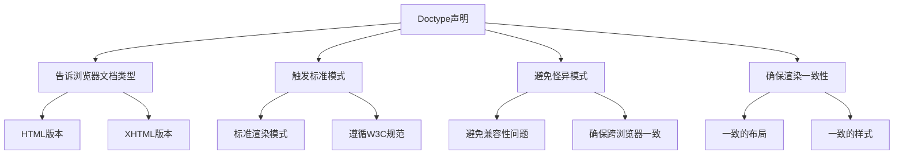
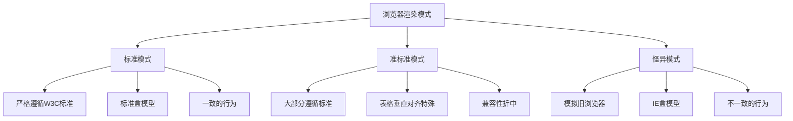
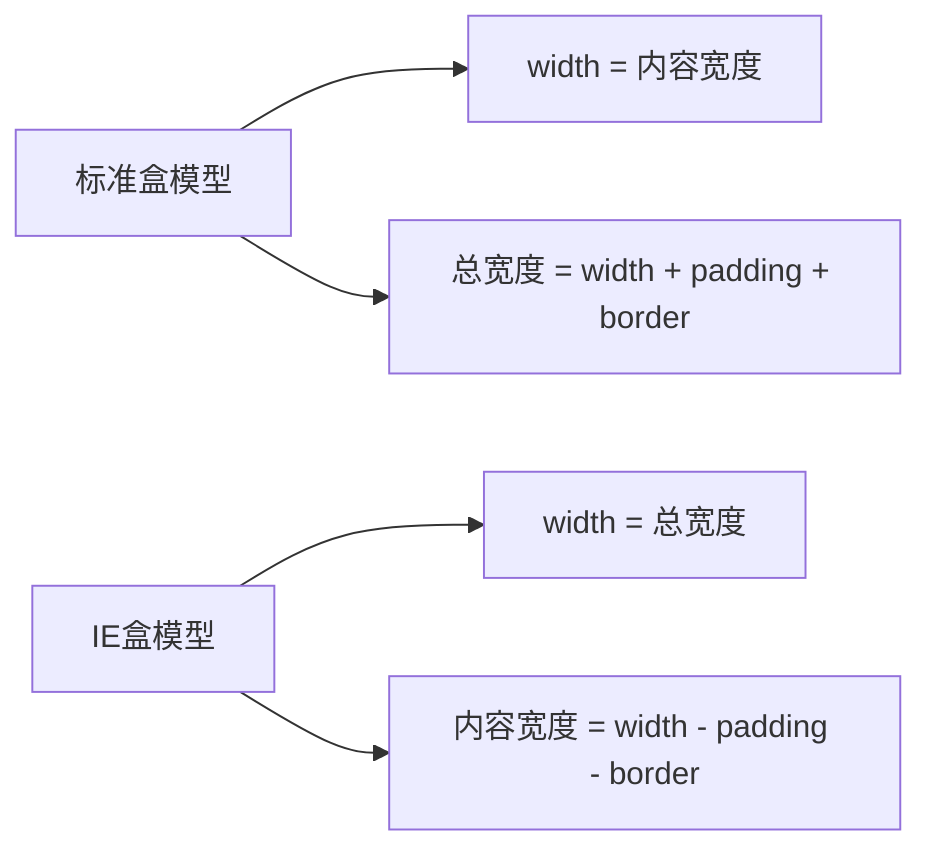

# HTML的Doctype标签有什么作用以及严格模式和混杂模式如何区分

## Doctype标签的作用

`<!DOCTYPE>`声明告诉浏览器当前文档使用哪种HTML或XHTML规范进行解析。

```html
<!DOCTYPE html>
<html>
<head>
  <title>页面标题</title>
</head>
<body>
  页面内容
</body>
</html>
```

### 主要作用



### 历史背景

在HTML4和XHTML时代，有多个Doctype声明：

```html
<!-- HTML 4.01 Strict -->
<!DOCTYPE HTML PUBLIC "-//W3C//DTD HTML 4.01//EN" "http://www.w3.org/TR/html4/strict.dtd">

<!-- HTML 4.01 Transitional -->
<!DOCTYPE HTML PUBLIC "-//W3C//DTD HTML 4.01 Transitional//EN" "http://www.w3.org/TR/html4/loose.dtd">

<!-- HTML 4.01 Frameset -->
<!DOCTYPE HTML PUBLIC "-//W3C//DTD HTML 4.01 Frameset//EN" "http://www.w3.org/TR/html4/frameset.dtd">

<!-- XHTML 1.0 Strict -->
<!DOCTYPE html PUBLIC "-//W3C//DTD XHTML 1.0 Strict//EN" "http://www.w3.org/TR/xhtml1/DTD/xhtml1-strict.dtd">

<!-- XHTML 1.0 Transitional -->
<!DOCTYPE html PUBLIC "-//W3C//DTD XHTML 1.0 Transitional//EN" "http://www.w3.org/TR/xhtml1/DTD/xhtml1-transitional.dtd">

<!-- XHTML 1.1 -->
<!DOCTYPE html PUBLIC "-//W3C//DTD XHTML 1.1//EN" "http://www.w3.org/TR/xhtml11/DTD/xhtml11.dtd">
```

### HTML5简化

HTML5简化了Doctype声明：

```html
<!DOCTYPE html>
```

这个简短的声明足以触发标准模式，所有现代浏览器都能识别。

## 渲染模式

浏览器有两种主要的渲染模式：

### 1. 标准模式（Standards Mode）

也称为"严格模式"，浏览器按照W3C标准规范渲染页面。

**特点：**
- 严格遵循W3C标准
- CSS盒模型正确实现
- 布局和样式一致
- 跨浏览器兼容性好

**触发条件：**
- 使用完整的Doctype声明
- 使用HTML5的`<!DOCTYPE html>`

### 2. 怪异模式（Quirks Mode）

也称为"混杂模式"，浏览器模拟旧版本浏览器的行为，以兼容旧网页。

**特点：**
- 模拟旧浏览器行为
- 盒模型不标准
- 布局和样式不一致
- 存在兼容性问题

**触发条件：**
- 没有Doctype声明
- 使用不完整的Doctype声明
- 使用HTML3.2或更早的文档类型

### 3. 准标准模式（Almost Standards Mode）

介于标准模式和怪异模式之间，主要用于处理表格的垂直对齐。

**特点：**
- 大部分遵循标准
- 表格单元格的垂直对齐使用怪异模式的行为

**触发条件：**
- 使用某些过渡性的Doctype声明

## 模式对比



## 盒模型差异

### 标准盒模型（标准模式）

```css
.box {
  width: 200px;
  padding: 20px;
  border: 5px solid #000;
  margin: 10px;
}

/* 实际占用宽度 = width + padding + border = 200 + 20*2 + 5*2 = 250px */
```

### IE盒模型（怪异模式）

```css
.box {
  width: 200px;
  padding: 20px;
  border: 5px solid #000;
  margin: 10px;
}

/* 实际占用宽度 = width = 200px */
/* 内容宽度 = width - padding - border = 200 - 20*2 - 5*2 = 150px */
```

### 盒模型对比



## 常见差异

### 1. 图片垂直对齐

```html
<!-- 标准模式 -->
<div>
  
  <span>文字</span>
</div>

<style>
  div {
    background: #f0f0f0;
  }
  
  img {
    vertical-align: bottom;
  }
</style>
```

**标准模式：** 图片底部与基线对齐，可能有间隙
**怪异模式：** 图片底部与容器底部对齐

### 2. 表格单元格高度

```html
<table>
  <tr>
    <td>内容</td>
  </tr>
</table>

<style>
  td {
    height: 50px;
    padding: 10px;
  }
</style>
```

**标准模式：** height包含padding
**怪异模式：** height不包含padding

### 3. 字体继承

```html
<div style="font-size: 16px;">
  <table>
    <tr>
      <td>表格内容</td>
    </tr>
  </table>
</div>
```

**标准模式：** 表格不继承父元素的字体大小
**怪异模式：** 表格继承父元素的字体大小

### 4. 百分比高度

```html
<div style="height: 200px;">
  <div style="height: 50%;">
    子元素
  </div>
</div>
```

**标准模式：** 父元素有明确高度时，子元素的百分比高度才有效
**怪异模式：** 百分比高度可能无效

## 如何检测渲染模式

### JavaScript检测

```javascript
// 检测渲染模式
function getRenderingMode() {
  if (document.compatMode === 'CSS1Compat') {
    return '标准模式';
  } else if (document.compatMode === 'BackCompat') {
    return '怪异模式';
  } else {
    return '未知模式';
  }
}

console.log(getRenderingMode());

// 检测盒模型
function getBoxModel() {
  const div = document.createElement('div');
  div.style.width = '100px';
  div.style.padding = '10px';
  div.style.border = '5px solid #000';
  document.body.appendChild(div);
  
  const width = div.offsetWidth;
  document.body.removeChild(div);
  
  if (width === 100) {
    return 'IE盒模型（怪异模式）';
  } else if (width === 130) {
    return '标准盒模型（标准模式）';
  } else {
    return '未知盒模型';
  }
}

console.log(getBoxModel());
```

### CSS检测

```css
/* 使用CSS变量检测 */
:root {
  --box-model: standard;
}

/* 在怪异模式下覆盖 */
@media screen and (-ms-high-contrast: active), (-ms-high-contrast: none) {
  :root {
    --box-model: quirks;
  }
}
```

## 实际应用

### 1. 确保标准模式

```html
<!DOCTYPE html>
<html>
<head>
  <meta charset="UTF-8">
  <title>标准模式示例</title>
  <style>
    /* 使用标准盒模型 */
    * {
      box-sizing: content-box;
    }
    
    .box {
      width: 200px;
      padding: 20px;
      border: 5px solid #000;
    }
  </style>
</head>
<body>
  <div class="box">
    内容
  </div>
  
  <script>
    // 检测渲染模式
    console.log(document.compatMode);
  </script>
</body>
</html>
```

### 2. 处理旧网页兼容性

```html
<!DOCTYPE html>
<html>
<head>
  <meta charset="UTF-8">
  <title>兼容性处理</title>
  <style>
    /* 统一盒模型 */
    * {
      box-sizing: border-box;
    }
    
    /* 重置默认样式 */
    body, html {
      margin: 0;
      padding: 0;
    }
    
    /* 表格样式重置 */
    table {
      border-collapse: collapse;
      font-size: inherit;
    }
    
    /* 图片垂直对齐 */
    img {
      vertical-align: bottom;
    }
  </style>
</head>
<body>
  页面内容
</body>
</html>
```

### 3. 使用CSS Reset

```css
/* CSS Reset确保跨浏览器一致性 */
* {
  margin: 0;
  padding: 0;
  box-sizing: border-box;
}

html, body {
  height: 100%;
}

body {
  font-family: Arial, sans-serif;
  line-height: 1.6;
}

img {
  max-width: 100%;
  height: auto;
  vertical-align: bottom;
}

table {
  border-collapse: collapse;
  width: 100%;
}
```

## 最佳实践

### 1. 始终使用Doctype声明

```html
<!-- 好的做法 -->
<!DOCTYPE html>
<html>
  <!-- 页面内容 -->
</html>

<!-- 不好的做法 -->
<html>
  <!-- 缺少Doctype声明 -->
</html>
```

### 2. 使用HTML5 Doctype

```html
<!-- 推荐：HTML5 Doctype -->
<!DOCTYPE html>

<!-- 不推荐：旧的Doctype -->
<!DOCTYPE HTML PUBLIC "-//W3C//DTD HTML 4.01//EN" "http://www.w3.org/TR/html4/strict.dtd">
```

### 3. 统一盒模型

```css
/* 统一使用标准盒模型 */
* {
  box-sizing: border-box;
}

/* 或使用border-box */
*, *::before, *::after {
  box-sizing: border-box;
}
```

### 4. 使用CSS Reset或Normalize

```html
<!DOCTYPE html>
<html>
<head>
  <meta charset="UTF-8">
  <title>页面标题</title>
  
  <!-- 使用Normalize.css -->
  <link rel="stylesheet" href="normalize.css">
  
  <!-- 或使用自定义Reset -->
  <style>
    /* CSS Reset代码 */
  </style>
</head>
<body>
  页面内容
</body>
</html>
```

### 5. 测试不同模式

```javascript
// 在开发时测试不同模式
function testRenderingModes() {
  console.log('当前渲染模式:', document.compatMode);
  console.log('盒模型:', getBoxModel());
  
  // 测试样式
  const testDiv = document.createElement('div');
  testDiv.style.width = '100px';
  testDiv.style.padding = '10px';
  testDiv.style.border = '5px solid #000';
  document.body.appendChild(testDiv);
  
  console.log('测试元素宽度:', testDiv.offsetWidth);
  document.body.removeChild(testDiv);
}

testRenderingModes();
```

## 总结

| 特性 | 标准模式 | 怪异模式 |
|------|---------|---------|
| Doctype | 完整声明 | 无声明或不完整 |
| 盒模型 | 标准盒模型 | IE盒模型 |
| W3C标准 | 严格遵循 | 模拟旧浏览器 |
| 兼容性 | 现代浏览器 | 旧网页兼容 |
| 一致性 | 跨浏览器一致 | 不一致 |

**核心要点：**
1. 始终使用`<!DOCTYPE html>`声明
2. 标准模式遵循W3C标准，怪异模式模拟旧浏览器
3. 盒模型是两种模式的主要差异
4. 使用CSS Reset或Normalize确保一致性
5. 统一使用`box-sizing: border-box`
6. 检测渲染模式：`document.compatMode`
7. 现代网页应始终使用标准模式
