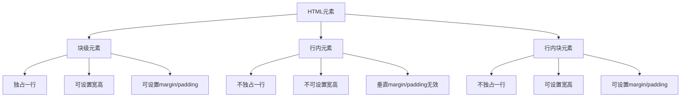

# 常见HTML行元素以及块元素有哪些

## 基本概念

HTML元素根据显示特性分为块级元素和行内元素。



## 块级元素

### 特点

- 独占一行，从新行开始
- 宽度默认为100%
- 可以设置宽度、高度
- 可以设置margin和padding
- 可以包含其他块级元素和行内元素

### 常见块级元素

```html
<!-- div -->
<div>这是一个div</div>

<!-- 标题 -->
<h1>一级标题</h1>
<h2>二级标题</h2>
<h3>三级标题</h3>
<h4>四级标题</h4>
<h5>五级标题</h5>
<h6>六级标题</h6>

<!-- 段落 -->
<p>这是一个段落</p>

<!-- 列表 -->
<ul>
  <li>无序列表项</li>
</ul>

<ol>
  <li>有序列表项</li>
</ol>

<dl>
  <dt>定义术语</dt>
  <dd>定义描述</dd>
</dl>

<!-- 表格 -->
<table>
  <tr>
    <td>单元格</td>
  </tr>
</table>

<!-- 表单 -->
<form>
  <input type="text">
  <button>提交</button>
</form>

<!-- 分隔线 -->
<hr>

<!-- 引用块 -->
<blockquote>引用内容</blockquote>

<!-- 预格式化文本 -->
<pre>预格式化文本</pre>

<!-- 地址 -->
<address>地址信息</address>

<!-- 标题分组 -->
<header>页眉</header>
<footer>页脚</footer>
<main>主要内容</main>
<section>章节</section>
<article>文章</article>
<aside>侧边栏</aside>
<nav>导航</nav>

<!-- 其他 -->
<figure>图片组</figure>
<figcaption>图片说明</figcaption>
<details>详细信息</details>
<summary>摘要</summary>
```

## 行内元素

### 特点

- 不独占一行，与其他元素在同一行显示
- 宽度由内容决定
- 不能设置宽度、高度
- 水平方向的margin和padding有效，垂直方向无效
- 只能包含文本和其他行内元素

### 常见行内元素

```html
<!-- 文本格式化 -->
<span>这是一个span</span>
<strong>粗体</strong>
<em>斜体</em>
<b>粗体</b>
<i>斜体</i>
<u>下划线</u>
<s>删除线</s>
<del>删除线</del>
<ins>插入线</ins>
<mark>高亮</mark>
<small>小号文字</small>
<sub>下标</sub>
<sup>上标</sup>

<!-- 链接 -->
<a href="https://example.com">链接</a>

<!-- 图片 -->


<!-- 表单元素 -->
<input type="text">
<input type="password">
<input type="checkbox">
<input type="radio">
<input type="file">
<select>
  <option>选项</option>
</select>
<textarea>文本域</textarea>
<label>标签</label>
<button>按钮</button>

<!-- 代码 -->
<code>代码</code>
<kbd>键盘输入</kbd>
<samp>示例输出</samp>
<var>变量</var>

<!-- 引用 -->
<q>行内引用</q>
<cite>引用来源</cite>
<abbr>缩写</abbr>
<acronym>首字母缩写</acronym>

<!-- 换行和空格 -->
<br>
<wbr>

<!-- 其他 -->
<time>时间</time>
<data>数据</data>
<meter>度量</meter>
<progress>进度</progress>
<output>输出</output>
<bdi>双向隔离</bdi>
<bdo>双向覆盖</bdo>
<ruby>注音</ruby>
<rt>注音文本</rt>
<rp>注音括号</rp>
```

## 行内块元素

### 特点

- 不独占一行，与其他元素在同一行显示
- 可以设置宽度、高度
- 可以设置margin和padding
- 默认宽度由内容决定

### 常见行内块元素

```html
<!-- 图片 -->


<!-- 表单元素 -->
<input type="text">
<input type="checkbox">
<input type="radio">
<select>
  <option>选项</option>
</select>
<textarea>文本域</textarea>
<button>按钮</button>

<!-- 其他 -->
<object>对象</object>
<embed>嵌入</embed>
<video>视频</video>
<audio>音频</audio>
<canvas>画布</canvas>
<iframe>内联框架</iframe>
```

## 元素转换

### display属性转换

```css
/* 块级元素转行内元素 */
div {
  display: inline;
}

/* 行内元素转块级元素 */
span {
  display: block;
}

/* 转换为行内块元素 */
span {
  display: inline-block;
}

/* 转换为flex容器 */
div {
  display: flex;
}

/* 转换为grid容器 */
div {
  display: grid;
}
```

### 实际应用

```html
<!DOCTYPE html>
<html>
<head>
  <style>
    /* 行内元素转块级元素 */
    a {
      display: block;
      width: 200px;
      height: 50px;
      line-height: 50px;
      text-align: center;
      background: #007bff;
      color: white;
      text-decoration: none;
    }
    
    /* 块级元素转行内元素 */
    div {
      display: inline;
      background: #f0f0f0;
      padding: 10px;
    }
    
    /* 转换为行内块元素 */
    span {
      display: inline-block;
      width: 100px;
      height: 100px;
      background: #28a745;
      color: white;
      text-align: center;
      line-height: 100px;
    }
  </style>
</head>
<body>
  <a href="#">块级链接</a>
  
  <div>行内div1</div>
  <div>行内div2</div>
  
  <span>行内块span1</span>
  <span>行内块span2</span>
</body>
</html>
```

## 嵌套规则

### 块级元素可以包含

- 其他块级元素
- 行内元素
- 行内块元素

```html
<div>
  <h1>标题</h1>
  <p>段落<span>行内元素</span></p>
  <div>嵌套div</div>
</div>
```

### 行内元素只能包含

- 文本
- 其他行内元素

```html
<span>
  文本<strong>粗体</strong><em>斜体</em>
</span>
```

### 特殊情况

某些块级元素只能包含行内元素：

```html
<!-- p标签不能包含块级元素 -->
<p>
  这是段落<span>行内元素</span>
  <!-- 错误：不能包含div -->
  <!-- <div>块级元素</div> -->
</p>

<!-- h1-h6不能包含块级元素 -->
<h1>
  标题<span>行内元素</span>
  <!-- 错误：不能包含div -->
  <!-- <div>块级元素</div> -->
</h1>
```

## 布局应用

### 水平居中

```css
/* 块级元素水平居中 */
.block {
  width: 200px;
  margin: 0 auto;
}

/* 行内元素水平居中 */
.container {
  text-align: center;
}

/* 行内块元素水平居中 */
.container {
  text-align: center;
}
```

### 垂直居中

```css
/* 单行文本垂直居中 */
.container {
  height: 100px;
  line-height: 100px;
}

/* 使用flex垂直居中 */
.container {
  display: flex;
  align-items: center;
  justify-content: center;
  height: 100px;
}

/* 使用grid垂直居中 */
.container {
  display: grid;
  place-items: center;
  height: 100px;
}
```

## 总结

| 特性 | 块级元素 | 行内元素 | 行内块元素 |
|------|---------|---------|-----------|
| 独占一行 | 是 | 否 | 否 |
| 可设置宽高 | 是 | 否 | 是 |
| 可设置margin/padding | 是 | 水平有效 | 是 |
| 可包含其他元素 | 块级和行内 | 仅行内 | 块级和行内 |
| 默认宽度 | 100% | 由内容决定 | 由内容决定 |

**核心要点：**
1. 块级元素独占一行，可以设置宽高
2. 行内元素不独占一行，不能设置宽高
3. 行内块元素结合了两者的优点
4. 可以使用display属性转换元素类型
5. 注意嵌套规则，避免无效的HTML结构
6. 根据布局需求选择合适的元素类型
