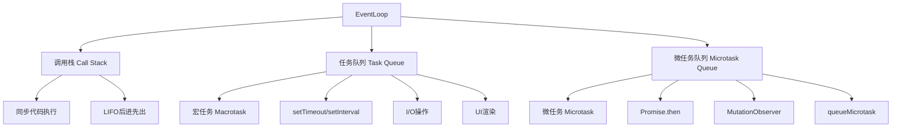
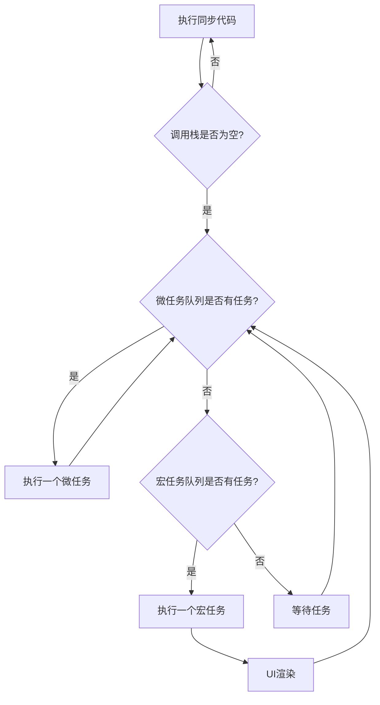
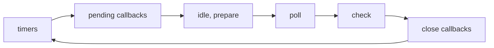

# 什么是EventLoop

## 一、EventLoop概述

EventLoop（事件循环）是JavaScript实现异步编程的核心机制。由于JavaScript是单线程语言，EventLoop负责协调代码执行、事件处理和回调函数的调度。



## 二、执行流程



### 执行顺序

1. 执行同步代码（宏任务）
2. 检查微任务队列，有则执行所有微任务
3. UI渲染（浏览器）
4. 执行下一个宏任务
5. 重复步骤2-4

## 三、宏任务与微任务

### 宏任务（Macrotask）

| 来源 | 示例 |
|-----|------|
| script | 整体代码 |
| setTimeout | setTimeout(() => {}, 0) |
| setInterval | setInterval(() => {}, 100) |
| setImmediate | setImmediate(() => {}) (Node.js) |
| I/O | 文件读写、网络请求 |
| UI Rendering | 浏览器UI渲染 |

### 微任务（Microtask）

| 来源 | 示例 |
|-----|------|
| Promise.then/catch/finally | Promise.resolve().then(() => {}) |
| MutationObserver | new MutationObserver(() => {}) |
| queueMicrotask | queueMicrotask(() => {}) |
| process.nextTick | process.nextTick(() => {}) (Node.js) |

## 四、代码示例

### 基础示例

```javascript
console.log('1. 同步代码开始');

setTimeout(() => {
  console.log('2. setTimeout');
}, 0);

Promise.resolve().then(() => {
  console.log('3. Promise.then');
});

console.log('4. 同步代码结束');

// 输出顺序: 1 -> 4 -> 3 -> 2
```

### 复杂示例

```javascript
console.log('1. script start');

setTimeout(() => {
  console.log('2. setTimeout 1');
  
  Promise.resolve().then(() => {
    console.log('3. promise inside setTimeout');
  });
}, 0);

Promise.resolve()
  .then(() => {
    console.log('4. promise 1');
  })
  .then(() => {
    console.log('5. promise 2');
  });

setTimeout(() => {
  console.log('6. setTimeout 2');
}, 0);

console.log('7. script end');

// 输出顺序: 1 -> 7 -> 4 -> 5 -> 2 -> 3 -> 6
```

### async/await示例

```javascript
const asyncFunction = async () => {
  console.log('1. async start');
  
  await Promise.resolve();
  
  console.log('2. async end');
};

console.log('3. script start');

asyncFunction();

console.log('4. script end');

// 输出顺序: 3 -> 1 -> 4 -> 2
```

### 详细执行过程

```javascript
const test = async () => {
  console.log('1. test start');
  
  await new Promise(resolve => {
    console.log('2. promise executor');
    resolve();
  });
  
  console.log('3. test end');
};

console.log('4. script start');

test();

console.log('5. script end');

Promise.resolve().then(() => {
  console.log('6. promise then');
});

// 输出顺序: 4 -> 1 -> 2 -> 5 -> 6 -> 3
```

## 五、Node.js EventLoop

### 阶段



| 阶段 | 说明 |
|-----|------|
| timers | 执行setTimeout/setInterval回调 |
| pending callbacks | 执行系统操作的回调 |
| idle, prepare | 内部使用 |
| poll | 执行I/O回调 |
| check | 执行setImmediate回调 |
| close callbacks | 执行close事件回调 |

### process.nextTick

```javascript
console.log('1. script start');

setImmediate(() => {
  console.log('2. setImmediate');
});

process.nextTick(() => {
  console.log('3. nextTick');
});

Promise.resolve().then(() => {
  console.log('4. promise');
});

console.log('5. script end');

// Node.js输出顺序: 1 -> 5 -> 3 -> 4 -> 2
```

## 六、面试题

### 题目1

```javascript
const promise = new Promise((resolve, reject) => {
  console.log('1. promise constructor');
  resolve();
});

promise.then(() => {
  console.log('2. promise then');
});

console.log('3. script end');

// 输出: 1 -> 3 -> 2
```

### 题目2

```javascript
console.log('1. start');

setTimeout(() => {
  console.log('2. children2');
  Promise.resolve().then(() => {
    console.log('3. children3');
  });
}, 0);

new Promise((resolve, reject) => {
  console.log('4. children4');
  setTimeout(() => {
    console.log('5. children5');
    resolve('6. children6');
  }, 0);
}).then(res => {
  console.log(res);
});

// 输出: 1 -> 4 -> 2 -> 3 -> 5 -> 6
```

### 题目3

```javascript
const first = () => new Promise((resolve, reject) => {
  console.log('1. first');
  resolve('2. second');
});

const second = () => new Promise((resolve, reject) => {
  console.log('3. third');
  resolve('4. fourth');
});

first().then(res => {
  console.log(res);
  return second();
}).then(res => {
  console.log(res);
});

console.log('5. fifth');

// 输出: 1 -> 5 -> 2 -> 3 -> 4
```

## 七、总结

| 概念 | 说明 |
|-----|------|
| 调用栈 | 执行同步代码，LIFO结构 |
| 宏任务队列 | 存放宏任务，如setTimeout |
| 微任务队列 | 存放微任务，如Promise.then |
| 执行顺序 | 同步代码 -> 微任务 -> 宏任务 |

**核心要点：**
1. JavaScript是单线程语言
2. EventLoop负责协调任务执行
3. 微任务优先级高于宏任务
4. 每个宏任务执行完后会清空微任务队列
5. Node.js EventLoop有6个阶段
