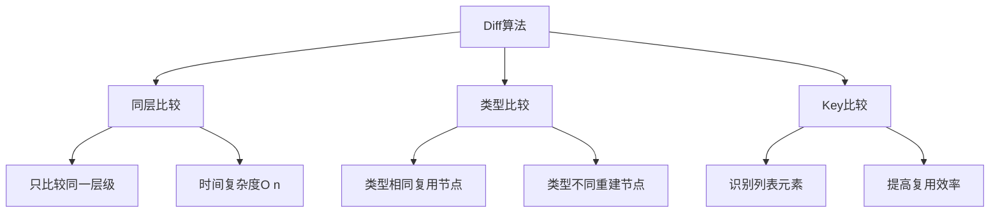
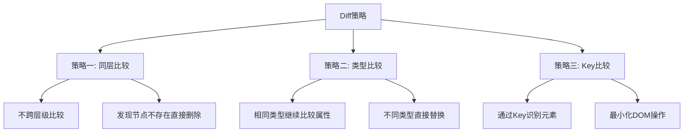
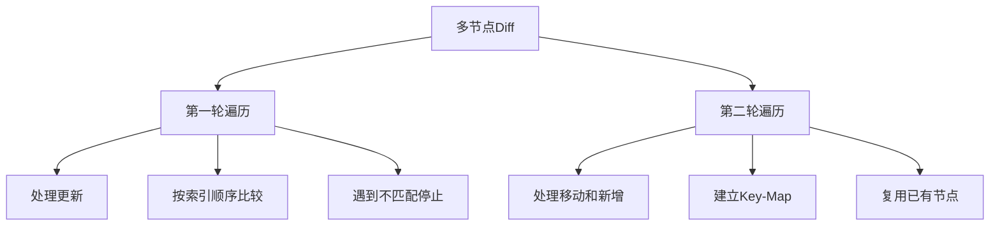
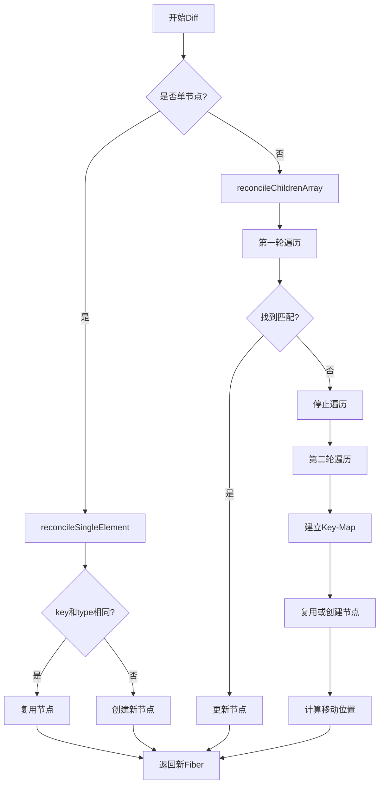

# React DOM Diff是怎么工作的

## 一、Diff算法概述

React的Diff算法用于比较新旧虚拟DOM树，找出最小变化，然后高效更新真实DOM。



## 二、Diff策略

### 1. 三大策略



### 2. 策略详解

| 策略 | 说明 | 时间复杂度 |
|-----|------|-----------|
| 同层比较 | 只比较同一层级的节点 | O(n) |
| 类型比较 | 类型不同直接替换整个子树 | O(n) |
| Key比较 | 通过Key识别列表中的元素 | O(n) |

## 三、Diff实现

### 1. reconcileChildren

```javascript
const reconcileChildren = (current, workInProgress, nextChildren, renderLanes) => {
  if (current === null) {
    workInProgress.child = mountChildFibers(
      workInProgress,
      null,
      nextChildren,
      renderLanes
    );
  } else {
    workInProgress.child = reconcileChildFibers(
      workInProgress,
      current.child,
      nextChildren,
      renderLanes
    );
  }
};
```

### 2. reconcileChildFibers

```javascript
const reconcileChildFibers = (
  returnFiber,
  currentFirstChild,
  newChild,
  lanes
) => {
  const isObject = typeof newChild === 'object' && newChild !== null;
  
  if (isObject) {
    switch (newChild.$$typeof) {
      case REACT_ELEMENT_TYPE:
        return placeSingleChild(
          reconcileSingleElement(
            returnFiber,
            currentFirstChild,
            newChild,
            lanes
          )
        );
    }
  }
  
  if (Array.isArray(newChild)) {
    return reconcileChildrenArray(
      returnFiber,
      currentFirstChild,
      newChild,
      lanes
    );
  }
  
  return deleteRemainingChildren(returnFiber, currentFirstChild);
};
```

## 四、单节点Diff

### 1. reconcileSingleElement

```javascript
const reconcileSingleElement = (
  returnFiber,
  currentFirstChild,
  element,
  lanes
) => {
  const key = element.key;
  let child = currentFirstChild;
  
  while (child !== null) {
    if (child.key === key) {
      if (child.elementType === element.type) {
        deleteRemainingChildren(returnFiber, child.sibling);
        
        const existing = useFiber(child, element.props);
        existing.return = returnFiber;
        return existing;
      } else {
        deleteRemainingChildren(returnFiber, child);
        break;
      }
    } else {
      deleteChild(returnFiber, child);
    }
    child = child.sibling;
  }
  
  const created = createFiberFromElement(element, returnFiber.mode, lanes);
  created.return = returnFiber;
  return created;
};
```

### 2. 单节点Diff示例

```javascript
// 旧节点
const oldNode = {
  type: 'div',
  key: 'a',
  props: { className: 'old' }
};

// 新节点
const newNode = {
  type: 'div',
  key: 'a',
  props: { className: 'new' }
};

// Diff结果：复用节点，更新className
```

## 五、多节点Diff

### 1. reconcileChildrenArray

```javascript
const reconcileChildrenArray = (
  returnFiber,
  currentFirstChild,
  newChildren,
  lanes
) => {
  let resultingFirstChild = null;
  let previousNewFiber = null;
  
  let oldFiber = currentFirstChild;
  let lastPlacedIndex = 0;
  let newIdx = 0;
  let nextOldFiber = null;
  
  // 第一轮遍历：处理更新的节点
  for (; oldFiber !== null && newIdx < newChildren.length; newIdx++) {
    if (oldFiber.index > newIdx) {
      nextOldFiber = oldFiber;
      oldFiber = null;
    } else {
      nextOldFiber = oldFiber.sibling;
    }
    
    const newFiber = updateSlot(
      returnFiber,
      oldFiber,
      newChildren[newIdx],
      lanes
    );
    
    if (newFiber === null) {
      if (oldFiber === null) {
        oldFiber = nextOldFiber;
      }
      break;
    }
    
    if (shouldTrackSideEffects) {
      if (oldFiber && newFiber.alternate === null) {
        deleteChild(returnFiber, oldFiber);
      }
    }
    
    lastPlacedIndex = placeChild(newFiber, lastPlacedIndex, newIdx);
    
    if (previousNewFiber === null) {
      resultingFirstChild = newFiber;
    } else {
      previousNewFiber.sibling = newFiber;
    }
    previousNewFiber = newFiber;
    oldFiber = nextOldFiber;
  }
  
  if (newIdx === newChildren.length) {
    deleteRemainingChildren(returnFiber, oldFiber);
    return resultingFirstChild;
  }
  
  if (oldFiber === null) {
    for (; newIdx < newChildren.length; newIdx++) {
      const newFiber = createChild(returnFiber, newChildren[newIdx], lanes);
      if (newFiber === null) {
        continue;
      }
      lastPlacedIndex = placeChild(newFiber, lastPlacedIndex, newIdx);
      if (previousNewFiber === null) {
        resultingFirstChild = newFiber;
      } else {
        previousNewFiber.sibling = newFiber;
      }
      previousNewFiber = newFiber;
    }
    return resultingFirstChild;
  }
  
  // 第二轮遍历：处理移动的节点
  const existingChildren = mapRemainingChildren(returnFiber, oldFiber);
  
  for (; newIdx < newChildren.length; newIdx++) {
    const newFiber = updateFromMap(
      existingChildren,
      returnFiber,
      newIdx,
      newChildren[newIdx],
      lanes
    );
    
    if (newFiber !== null) {
      if (shouldTrackSideEffects) {
        if (newFiber.alternate !== null) {
          existingChildren.delete(
            newFiber.key === null ? newIdx : newFiber.key
          );
        }
      }
      lastPlacedIndex = placeChild(newFiber, lastPlacedIndex, newIdx);
      if (previousNewFiber === null) {
        resultingFirstChild = newFiber;
      } else {
        previousNewFiber.sibling = newFiber;
      }
      previousNewFiber = newFiber;
    }
  }
  
  if (shouldTrackSideEffects) {
    existingChildren.forEach(child => deleteChild(returnFiber, child));
  }
  
  return resultingFirstChild;
};
```

### 2. 两轮遍历



### 3. 移动判断

```javascript
const placeChild = (newFiber, lastPlacedIndex, newIndex) => {
  newFiber.index = newIndex;
  
  if (!shouldTrackSideEffects) {
    return lastPlacedIndex;
  }
  
  const current = newFiber.alternate;
  
  if (current !== null) {
    const oldIndex = current.index;
    
    if (oldIndex < lastPlacedIndex) {
      // 需要移动
      newFiber.flags |= Placement;
      return lastPlacedIndex;
    } else {
      // 不需要移动
      return oldIndex;
    }
  } else {
    // 新节点
    newFiber.flags |= Placement;
    return lastPlacedIndex;
  }
};
```

## 六、Key的作用

### 1. 无Key的问题

```jsx
const List = ({ items }) => (
  <ul>
    {items.map(item => <li>{item.text}</li>)}
  </ul>
);

// 原列表: [A, B, C]
// 新列表: [D, A, B, C]

// 无Key时：React会认为A变成了D，B变成了A...
// 导致所有节点都更新，而不是插入D
```

### 2. 有Key的优势

```jsx
const List = ({ items }) => (
  <ul>
    {items.map(item => <li key={item.id}>{item.text}</li>)}
  </ul>
);

// 原列表: [A, B, C]
// 新列表: [D, A, B, C]

// 有Key时：React识别出D是新增，A、B、C保持不变
// 只需插入D，其他节点复用
```

### 3. Key比较示例

```javascript
// 旧节点
const oldChildren = [
  { key: 'a', type: 'li', children: 'A' },
  { key: 'b', type: 'li', children: 'B' },
  { key: 'c', type: 'li', children: 'C' }
];

// 新节点
const newChildren = [
  { key: 'd', type: 'li', children: 'D' },
  { key: 'a', type: 'li', children: 'A' },
  { key: 'b', type: 'li', children: 'B' },
  { key: 'c', type: 'li', children: 'C' }
];

// Diff过程：
// 1. 第一轮：a vs d，key不同，停止
// 2. 建立Map: { a: fiberA, b: fiberB, c: fiberC }
// 3. 遍历新节点：
//    - d: 新建
//    - a: 复用，移动
//    - b: 复用，移动
//    - c: 复用，移动
```

## 七、Diff流程图



## 八、Diff性能优化

### 1. 使用稳定的Key

```jsx
// 不推荐：使用索引作为Key
{items.map((item, index) => (
  <li key={index}>{item.text}</li>
))}

// 推荐：使用唯一ID作为Key
{items.map(item => (
  <li key={item.id}>{item.text}</li>
))}
```

### 2. 避免不必要的组件更新

```jsx
const MemoComponent = React.memo(({ data }) => {
  return <div>{data}</div>;
});

const Parent = ({ items }) => {
  return (
    <ul>
      {items.map(item => (
        <MemoComponent key={item.id} data={item} />
      ))}
    </ul>
  );
};
```

### 3. 使用useMemo和useCallback

```jsx
const List = ({ items, onItemClick }) => {
  const memoizedItems = useMemo(() => {
    return items.map(item => (
      <Item key={item.id} item={item} onClick={onItemClick} />
    ));
  }, [items, onItemClick]);
  
  return <ul>{memoizedItems}</ul>;
};

const Parent = () => {
  const [items, setItems] = useState([]);
  
  const handleClick = useCallback((id) => {
    console.log('Clicked:', id);
  }, []);
  
  return <List items={items} onItemClick={handleClick} />;
};
```

## 九、Diff算法总结

| 场景 | 处理方式 |
|-----|---------|
| 单节点 | 比较key和type，相同复用，不同创建 |
| 多节点更新 | 第一轮按索引比较，找到不匹配停止 |
| 多节点移动 | 第二轮建立Map，复用已有节点 |
| 多节点新增 | 创建新节点并标记Placement |
| 多节点删除 | 标记ChildDeletion |

**核心要点：**
1. Diff算法采用同层比较，时间复杂度O(n)
2. 类型不同直接替换整个子树
3. Key用于识别列表元素，提高复用效率
4. 两轮遍历处理多节点Diff
5. lastPlacedIndex判断节点是否需要移动
6. 使用稳定唯一的Key优化性能
