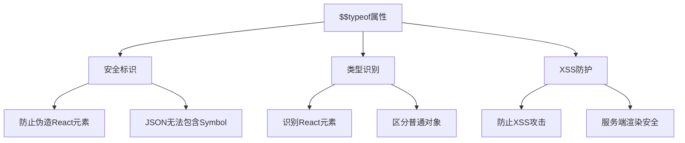
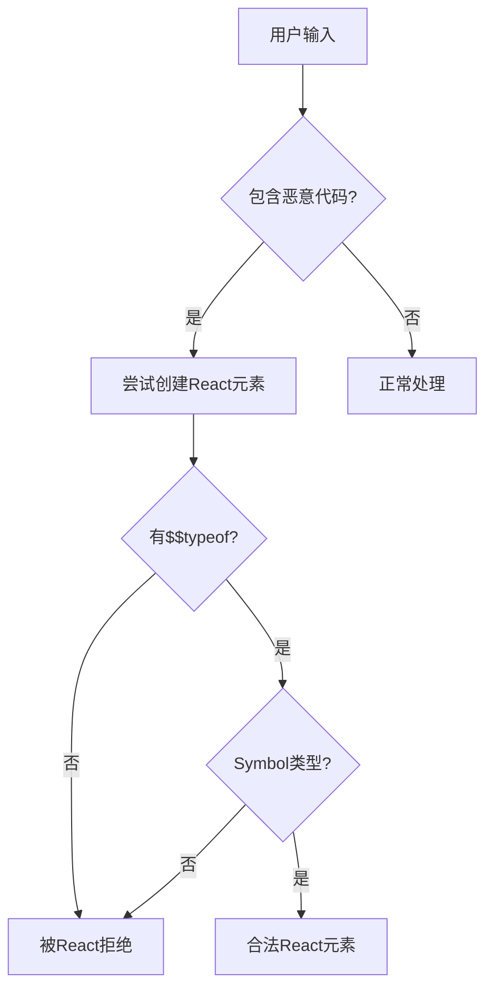
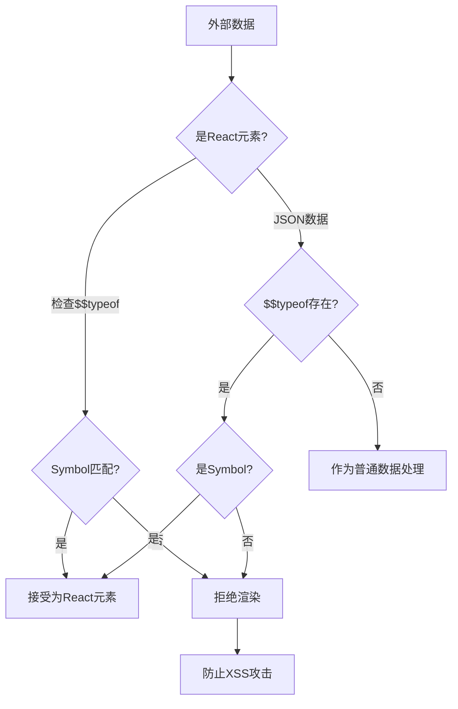

# 为什么React元素有一个$$typeof属性

## 一、$$typeof概述

$$typeof是React元素的一个内部属性，用于标识该对象是一个合法的React元素。



## 二、$$typeof的定义

### 1. 值的定义

```javascript
const REACT_ELEMENT_TYPE = Symbol.for('react.element');

const element = {
  $$typeof: REACT_ELEMENT_TYPE,
  type: 'div',
  key: null,
  ref: null,
  props: {
    children: 'Hello'
  }
};
```

### 2. 兼容性处理

```javascript
const REACT_ELEMENT_TYPE = typeof Symbol === 'function' && Symbol.for
  ? Symbol.for('react.element')
  : 0xeac7;

// 0xeac7 是一个随机数，在老版本浏览器中作为fallback
```

## 三、React元素结构

### 1. 完整结构

```javascript
const reactElement = {
  $$typeof: Symbol.for('react.element'),
  
  type: 'div',           // 元素类型
  key: null,             // key属性
  ref: null,             // ref属性
  props: {               // props属性
    className: 'container',
    children: 'Hello'
  },
  
  _owner: null,          // 创建该元素的组件实例
  _store: {},            // 存储验证信息
  _self: null,           // 用于开发工具
  _source: null          // 源码位置信息
};
```

### 2. createElement实现

```javascript
const createElement = (type, config, children) => {
  let key = null;
  let ref = null;
  let props = {};
  
  if (config != null) {
    if (config.key !== undefined) {
      key = '' + config.key;
    }
    if (config.ref !== undefined) {
      ref = config.ref;
    }
    
    for (const propName in config) {
      if (
        hasOwnProperty.call(config, propName) &&
        !RESERVED_PROPS.hasOwnProperty(propName)
      ) {
        props[propName] = config[propName];
      }
    }
  }
  
  const childrenLength = arguments.length - 2;
  if (childrenLength === 1) {
    props.children = children;
  } else if (childrenLength > 1) {
    const childArray = Array(childrenLength);
    for (let i = 0; i < childrenLength; i++) {
      childArray[i] = arguments[i + 2];
    }
    props.children = childArray;
  }
  
  if (type && type.defaultProps) {
    const defaultProps = type.defaultProps;
    for (const propName in defaultProps) {
      if (props[propName] === undefined) {
        props[propName] = defaultProps[propName];
      }
    }
  }
  
  return {
    $$typeof: REACT_ELEMENT_TYPE,
    type,
    key,
    ref,
    props,
    _owner: ReactCurrentOwner.current
  };
};
```

## 四、安全作用

### 1. 防止XSS攻击



### 2. JSON注入攻击示例

```javascript
// 假设没有$$typeof属性

// 服务端存储的用户数据
const userData = {
  name: 'John',
  bio: {
    __html: ''
  }
};

// 如果React接受普通对象作为元素
const maliciousElement = {
  type: 'div',
  props: {
    dangerouslySetInnerHTML: userData.bio
  }
};

// React渲染时会执行恶意代码
```

### 3. $$typeof如何防止

```javascript
const isValidElement = (object) => {
  return (
    typeof object === 'object' &&
    object !== null &&
    object.$$typeof === REACT_ELEMENT_TYPE
  );
};

// JSON无法包含Symbol
const json = JSON.stringify({
  $$typeof: Symbol.for('react.element'),  // 这会被忽略
  type: 'div'
});

const parsed = JSON.parse(json);
console.log(parsed.$$typeof);  // undefined

// 因此从JSON解析的对象无法伪造React元素
```

## 五、React元素验证

### 1. ReactElement.isValidElement

```javascript
const isValidElement = (object) => {
  return (
    typeof object === 'object' &&
    object !== null &&
    object.$$typeof === REACT_ELEMENT_TYPE
  );
};

// 使用示例
console.log(isValidElement(<div />));     // true
console.log(isValidElement({}));          // false
console.log(isValidElement(null));        // false
console.log(isValidElement('text'));      // false
```

### 2. React.Children.only

```javascript
const onlyChild = (children) => {
  if (!isValidElement(children)) {
    throw new Error(
      'React.Children.only expected to receive a single React element child.'
    );
  }
  return children;
};

// 使用示例
const Parent = ({ children }) => {
  return React.Children.only(children);
};

<Parent>
  <Child />  // 正确：只有一个子元素
</Parent>

<Parent>
  <Child />
  <Child />  // 错误：有多个子元素
</Parent>
```

## 六、其他$$typeof类型

### 1. React内部类型

```javascript
const REACT_ELEMENT_TYPE = Symbol.for('react.element');
const REACT_PORTAL_TYPE = Symbol.for('react.portal');
const REACT_FRAGMENT_TYPE = Symbol.for('react.fragment');
const REACT_STRICT_MODE_TYPE = Symbol.for('react.strict_mode');
const REACT_PROFILER_TYPE = Symbol.for('react.profiler');
const REACT_PROVIDER_TYPE = Symbol.for('react.provider');
const REACT_CONTEXT_TYPE = Symbol.for('react.context');
const REACT_FORWARD_REF_TYPE = Symbol.for('react.forward_ref');
const REACT_SUSPENSE_TYPE = Symbol.for('react.suspense');
const REACT_SUSPENSE_LIST_TYPE = Symbol.for('react.suspense_list');
const REACT_MEMO_TYPE = Symbol.for('react.memo');
const REACT_LAZY_TYPE = Symbol.for('react.lazy');
```

### 2. 类型判断

```javascript
const isPortal = (object) => {
  return (
    typeof object === 'object' &&
    object !== null &&
    object.$$typeof === REACT_PORTAL_TYPE
  );
};

const isFragment = (object) => {
  return object.type === REACT_FRAGMENT_TYPE;
};

const isMemo = (object) => {
  return object.$$typeof === REACT_MEMO_TYPE;
};

const isLazy = (object) => {
  return object.$$typeof === REACT_LAZY_TYPE;
};
```

## 七、Portal示例

### 1. Portal结构

```javascript
const createPortal = (children, container, key = null) => {
  return {
    $$typeof: REACT_PORTAL_TYPE,
    key: key == null ? null : '' + key,
    children,
    containerInfo: container,
    implementation: null
  };
};

// 使用示例
const Modal = ({ children }) => {
  return createPortal(
    <div className="modal">{children}</div>,
    document.getElementById('modal-root')
  );
};
```

## 八、安全流程图



## 九、开发环境额外检查

### 1. 开发模式验证

```javascript
const ReactElement = function(type, key, ref, self, source, owner, props) {
  const element = {
    $$typeof: REACT_ELEMENT_TYPE,
    type,
    key,
    ref,
    props,
    _owner: owner
  };
  
  if (Object.freeze) {
    Object.freeze(element.props);
    Object.freeze(element);
  }
  
  return element;
};

// 开发环境下冻结元素，防止被修改
```

### 2. 开发工具支持

```javascript
const element = {
  $$typeof: REACT_ELEMENT_TYPE,
  type: 'div',
  props: {},
  _store: {
    validated: false  // 用于验证props是否有效
  },
  _self: null,        // 指向组件实例
  _source: {          // 源码位置
    fileName: 'App.js',
    lineNumber: 10
  }
};
```

## 十、总结

| 特性 | 说明 |
|-----|------|
| 类型 | Symbol.for('react.element') |
| 值 | 0xeac7（兼容模式） |
| 作用 | 标识React元素、防止XSS |
| 验证 | isValidElement检查 |
| 安全 | JSON无法伪造Symbol |

**核心要点：**
1. $$typeof用于标识合法的React元素
2. 使用Symbol确保唯一性和不可伪造
3. 防止JSON注入攻击和XSS
4. React内部有多种$$typeof类型
5. 开发环境下会冻结元素对象
6. isValidElement用于验证元素合法性
