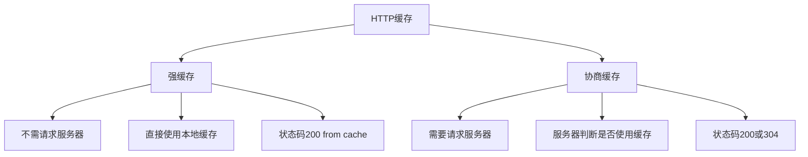
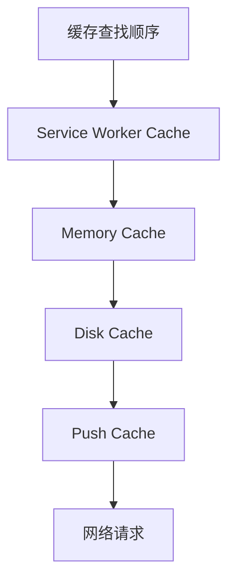
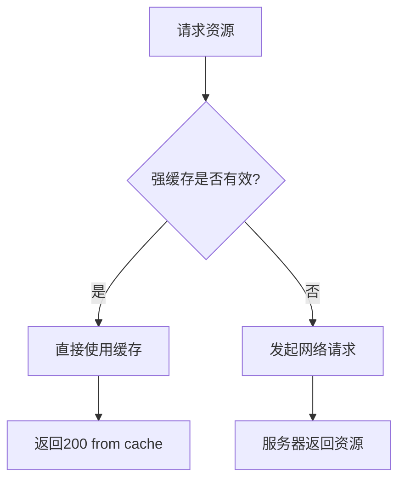
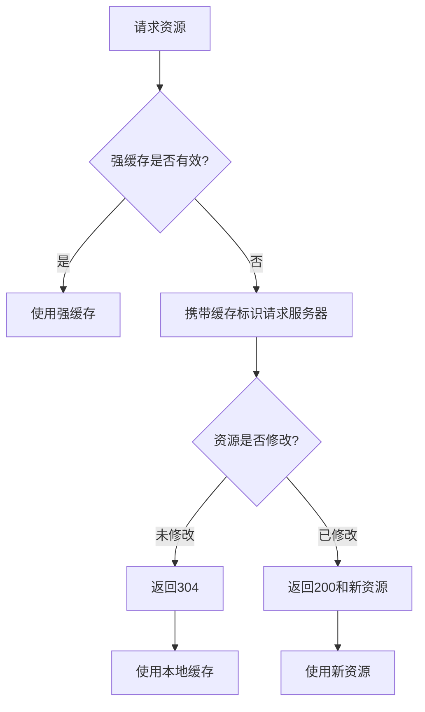
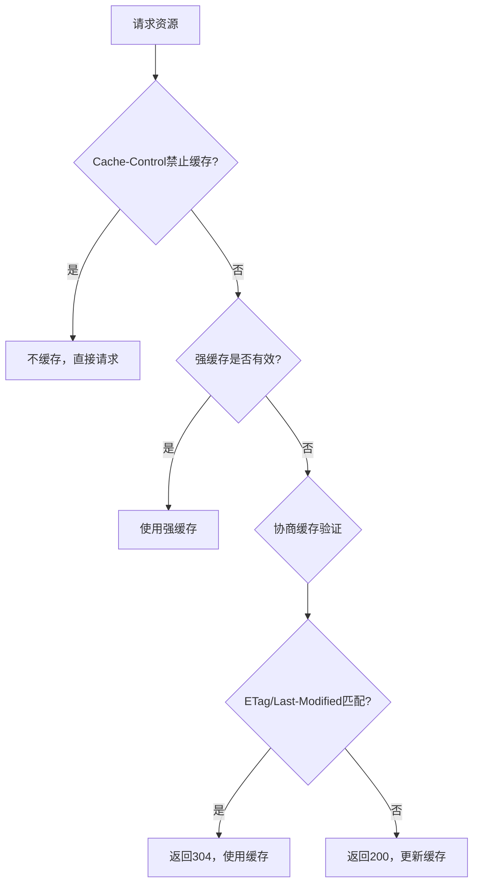

# 谈谈HTTP缓存，什么是强缓存什么是协商缓存

## 一、HTTP缓存概述

HTTP缓存是浏览器和服务器之间的一种机制，用于减少网络请求，提高页面加载速度。



## 二、缓存位置

### 1. 四种缓存位置



### 2. 各位置特点

| 缓存位置 | 特点 | 存储内容 |
|---------|------|---------|
| Service Worker Cache | 独立线程，可自定义缓存策略 | 任意请求 |
| Memory Cache | 内存缓存，速度快但容量小 | 当前页面资源 |
| Disk Cache | 磁盘缓存，容量大但速度慢 | 大文件、非当前页面 |
| Push Cache | HTTP/2推送缓存，会话级别 | 推送资源 |

## 三、强缓存

### 1. 强缓存流程



### 2. Expires

```http
Expires: Wed, 21 Oct 2026 07:28:00 GMT
```

```javascript
// Expires是HTTP/1.0的响应头
// 表示资源的绝对过期时间

// 问题：依赖客户端时间，时间不准确会导致缓存失效
```

### 3. Cache-Control

```http
Cache-Control: max-age=31536000
```

```javascript
// Cache-Control是HTTP/1.1的响应头
// 常用指令：

Cache-Control: max-age=31536000     // 缓存有效期（秒）
Cache-Control: no-cache             // 使用前需验证（协商缓存）
Cache-Control: no-store             // 不缓存任何内容
Cache-Control: public               // 可被任何缓存存储
Cache-Control: private              // 只能被浏览器缓存
Cache-Control: must-revalidate      // 过期后必须验证
Cache-Control: no-transform         // 不允许转换内容
Cache-Control: immutable            // 资源永不变化
```

### 4. Cache-Control优先级

```javascript
// 同时存在时，Cache-Control优先于Expires

// 示例
Expires: Wed, 21 Oct 2026 07:28:00 GMT
Cache-Control: max-age=3600

// 实际使用max-age=3600（1小时）
```

### 5. 强缓存示例

```javascript
// Express设置强缓存
app.use(express.static('public', {
  maxAge: '1y',           // 一年强缓存
  immutable: true         // 资源永不变化
}));

// Nginx设置强缓存
location /static/ {
  expires 1y;
  add_header Cache-Control "public, immutable";
}
```

## 四、协商缓存

### 1. 协商缓存流程



### 2. Last-Modified / If-Modified-Since

```http
// 第一次请求响应
Last-Modified: Wed, 21 Oct 2025 07:28:00 GMT

// 第二次请求携带
If-Modified-Since: Wed, 21 Oct 2025 07:28:00 GMT
```

```javascript
// Last-Modified是资源的最后修改时间

// 问题：
// 1. 只能精确到秒
// 2. 内容没变但修改时间变了会重新请求
// 3. 分布式服务器时间可能不一致
```

### 3. ETag / If-None-Match

```http
// 第一次请求响应
ETag: "abc123"

// 第二次请求携带
If-None-Match: "abc123"
```

```javascript
// ETag是资源的唯一标识符
// 通常由内容生成，内容不变ETag不变

// 优势：
// 1. 更精确的判断
// 2. 不受时间影响
// 3. 分布式环境更可靠
```

### 4. ETag优先级

```javascript
// 同时存在时，ETag优先于Last-Modified

// 服务器验证顺序：
// 1. 先验证If-None-Match（ETag）
// 2. 再验证If-Modified-Since（Last-Modified）
```

### 5. 协商缓存示例

```javascript
// Express实现协商缓存
const express = require('express');
const app = express();

app.get('/api/data', (req, res) => {
  const data = { message: 'Hello' };
  const etag = generateETag(data);
  
  // 检查ETag
  if (req.headers['if-none-match'] === etag) {
    return res.status(304).end();
  }
  
  res.set('ETag', etag);
  res.json(data);
});

// Nginx配置
location /api/ {
  etag on;
  if_modified_since exact;
}
```

## 五、缓存决策流程



## 六、缓存策略

### 1. 静态资源策略

```javascript
// HTML文件：不缓存或短时间缓存
app.get('*.html', (req, res, next) => {
  res.set('Cache-Control', 'no-cache');
  next();
});

// JS/CSS：长期缓存 + 文件名哈希
// 文件名：app.abc123.js
app.use(express.static('dist', {
  setHeaders: (res, path) => {
    if (path.endsWith('.js') || path.endsWith('.css')) {
      res.set('Cache-Control', 'public, max-age=31536000, immutable');
    }
  }
}));

// 图片：长期缓存
app.use('/images', express.static('images', {
  maxAge: '1y'
}));
```

### 2. API请求策略

```javascript
// GET请求：短期缓存或协商缓存
app.get('/api/data', (req, res) => {
  res.set('Cache-Control', 'max-age=60');  // 1分钟缓存
  res.json(data);
});

// POST/PUT/DELETE：不缓存
app.post('/api/data', (req, res) => {
  res.set('Cache-Control', 'no-store');
  res.json(result);
});
```

### 3. 用户数据策略

```javascript
// 敏感数据：不缓存
app.get('/api/user', (req, res) => {
  res.set('Cache-Control', 'no-store, private');
  res.json(userData);
});

// 公共数据：可缓存
app.get('/api/articles', (req, res) => {
  res.set('Cache-Control', 'public, max-age=300');
  res.json(articles);
});
```

## 七、缓存配置示例

### 1. Webpack配置

```javascript
// webpack.config.js
module.exports = {
  output: {
    filename: '[name].[contenthash:8].js',
    chunkFilename: '[name].[contenthash:8].chunk.js'
  },
  
  plugins: [
    new MiniCssExtractPlugin({
      filename: '[name].[contenthash:8].css'
    })
  ]
};
```

### 2. Nginx配置

```nginx
server {
  # HTML文件：不缓存
  location / {
    root /var/www/html;
    index index.html;
    add_header Cache-Control "no-cache";
    try_files $uri $uri/ /index.html;
  }
  
  # 静态资源：长期缓存
  location ~* \.(js|css|png|jpg|jpeg|gif|ico|svg|woff|woff2|ttf|eot)$ {
    root /var/www/html;
    expires 1y;
    add_header Cache-Control "public, immutable";
  }
  
  # API：协商缓存
  location /api/ {
    proxy_pass http://backend;
    proxy_cache_valid 200 304 12h;
    proxy_cache_valid any 1m;
    add_header X-Cache-Status $upstream_cache_status;
  }
}
```

### 3. Service Worker缓存

```javascript
const CACHE_NAME = 'v1';
const STATIC_ASSETS = [
  '/',
  '/index.html',
  '/styles.css',
  '/app.js'
];

self.addEventListener('install', (event) => {
  event.waitUntil(
    caches.open(CACHE_NAME).then((cache) => {
      return cache.addAll(STATIC_ASSETS);
    })
  );
});

self.addEventListener('fetch', (event) => {
  event.respondWith(
    caches.match(event.request).then((response) => {
      return response || fetch(event.request);
    })
  );
});
```

## 八、缓存对比

| 特性 | 强缓存 | 协商缓存 |
|-----|-------|---------|
| 是否请求服务器 | 否 | 是 |
| 响应速度 | 快 | 较慢 |
| 状态码 | 200 from cache | 200或304 |
| 响应头 | Cache-Control/Expires | ETag/Last-Modified |
| 请求头 | 无 | If-None-Match/If-Modified-Since |
| 适用场景 | 静态资源 | 动态内容 |

## 九、缓存问题及解决方案

### 1. 缓存更新问题

```javascript
// 问题：资源更新但缓存未过期

// 解决方案：文件名哈希
// 旧版本：app.js
// 新版本：app.abc123.js

// HTML引用新文件名，自动获取新资源
<script src="app.abc123.js"></script>
```

### 2. 缓存雪崩

```javascript
// 问题：大量缓存同时过期

// 解决方案：随机过期时间
const getRandomExpire = (baseTime, range) => {
  return baseTime + Math.random() * range;
};

// 设置缓存
res.set('Cache-Control', `max-age=${getRandomExpire(3600, 600)}`);
```

### 3. 缓存穿透

```javascript
// 问题：请求不存在的资源绕过缓存

// 解决方案：缓存空值
const getData = async (key) => {
  const cached = await cache.get(key);
  if (cached !== null) {
    return cached === 'NULL' ? null : cached;
  }
  
  const data = await db.query(key);
  await cache.set(key, data || 'NULL', 60);
  return data;
};
```

## 十、总结

| 缓存类型 | 关键响应头 | 关键请求头 | 状态码 |
|---------|-----------|-----------|-------|
| 强缓存 | Cache-Control, Expires | 无 | 200 |
| 协商缓存 | ETag, Last-Modified | If-None-Match, If-Modified-Since | 304 |

**核心要点：**
1. 强缓存不请求服务器，直接使用本地缓存
2. 协商缓存需要请求服务器验证
3. Cache-Control优先于Expires
4. ETag优先于Last-Modified
5. 静态资源使用长期强缓存 + 文件名哈希
6. HTML使用no-cache或短期缓存
7. API根据数据特性选择合适的缓存策略
