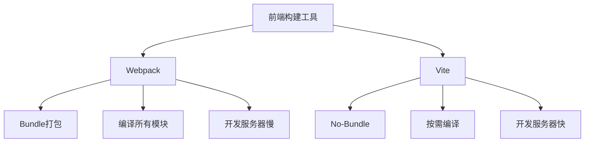
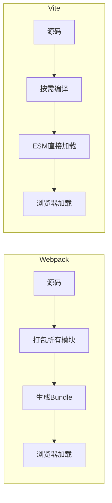
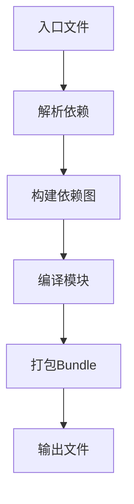
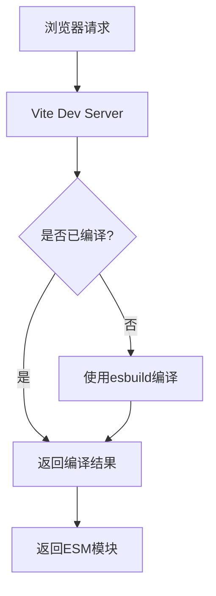
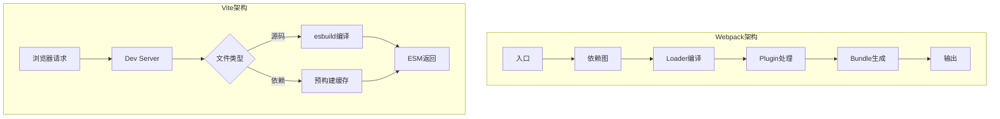

# Webpack和Vite的异同

## 一、概述

Webpack和Vite都是前端构建工具，但它们的设计理念和实现方式有本质区别。



## 二、核心区别

### 1. 构建模式对比



### 2. 主要差异

| 特性 | Webpack | Vite |
|-----|---------|------|
| 构建模式 | Bundle打包 | No-Bundle |
| 开发服务器 | 打包后启动 | 按需编译 |
| 启动速度 | 较慢 | 极快 |
| 热更新 | 重新打包 | 即时更新 |
| 底层语言 | JavaScript | Go (esbuild) |
| 生产构建 | Webpack | Rollup |
| 生态成熟度 | 成熟 | 发展中 |

## 三、Webpack工作原理

### 1. 打包流程



### 2. 核心概念

```javascript
// webpack.config.js
module.exports = {
  entry: './src/index.js',
  
  output: {
    path: path.resolve(__dirname, 'dist'),
    filename: '[name].[contenthash:8].js'
  },
  
  module: {
    rules: [
      {
        test: /\.js$/,
        use: 'babel-loader'
      },
      {
        test: /\.css$/,
        use: ['style-loader', 'css-loader']
      }
    ]
  },
  
  plugins: [
    new HtmlWebpackPlugin({
      template: './public/index.html'
    })
  ],
  
  optimization: {
    splitChunks: {
      chunks: 'all'
    }
  }
};
```

### 3. 模块打包

```javascript
// Webpack打包结果简化版
((modules) => {
  const installedModules = {};
  
  const __webpack_require__ = (moduleId) => {
    if (installedModules[moduleId]) {
      return installedModules[moduleId].exports;
    }
    
    const module = {
      exports: {}
    };
    
    modules[moduleId](module, module.exports, __webpack_require__);
    installedModules[moduleId] = module;
    
    return module.exports;
  };
  
  __webpack_require__('./src/index.js');
})({
  './src/index.js': (module, exports, __webpack_require__) => {
    const hello = __webpack_require__('./src/hello.js');
    console.log(hello);
  },
  './src/hello.js': (module, exports) => {
    module.exports = 'Hello World';
  }
});
```

## 四、Vite工作原理

### 1. 开发模式



### 2. 核心配置

```javascript
// vite.config.js
import { defineConfig } from 'vite';
import react from '@vitejs/plugin-react';

export default defineConfig({
  plugins: [react()],
  
  server: {
    port: 3000,
    open: true,
    proxy: {
      '/api': {
        target: 'http://localhost:8080',
        changeOrigin: true
      }
    }
  },
  
  build: {
    outDir: 'dist',
    sourcemap: true,
    rollupOptions: {
      output: {
        manualChunks: {
          vendor: ['react', 'react-dom']
        }
      }
    }
  },
  
  resolve: {
    alias: {
      '@': '/src'
    }
  }
});
```

### 3. ESM加载

```html
<!-- Vite开发模式下的HTML -->
<script type="module" src="/src/main.jsx"></script>
```

```javascript
// Vite处理后的模块
import React from '/node_modules/.vite/deps/react.js?v=abc123';
import ReactDOM from '/node_modules/.vite/deps/react-dom.js?v=abc123';
import App from '/src/App.jsx';

ReactDOM.render(React.createElement(App), document.getElementById('root'));
```

## 五、性能对比

### 1. 启动速度

```javascript
// Webpack启动流程
// 1. 解析配置
// 2. 编译所有入口文件
// 3. 解析所有依赖
// 4. 应用所有loader
// 5. 生成bundle
// 6. 启动dev server
// 大型项目可能需要几十秒到几分钟

// Vite启动流程
// 1. 解析配置
// 2. 预构建依赖（使用esbuild）
// 3. 启动dev server
// 通常只需几秒
```

### 2. 热更新速度

```javascript
// Webpack HMR
// 1. 文件变化
// 2. 重新编译相关模块
// 3. 重新打包
// 4. 推送更新到浏览器
// 大型项目可能需要几秒

// Vite HMR
// 1. 文件变化
// 2. 仅编译变化的文件
// 3. 通过ESM推送更新
// 通常只需几十毫秒
```

### 3. 依赖预构建

```javascript
// Vite依赖预构建
// 使用esbuild将CommonJS/UMD转换为ESM
// 预构建结果存储在node_modules/.vite/deps

// 优势：
// 1. esbuild比Webpack快10-100倍
// 2. 减少HTTP请求数量
// 3. 缓存优化
```

## 六、功能对比

### 1. Loader/Plugin

```javascript
// Webpack Loader
module.exports = {
  module: {
    rules: [
      {
        test: /\.scss$/,
        use: [
          'style-loader',
          'css-loader',
          'sass-loader'
        ]
      }
    ]
  }
};

// Vite内置支持
// .scss文件自动处理
// 无需配置loader
```

### 2. 代码分割

```javascript
// Webpack代码分割
module.exports = {
  optimization: {
    splitChunks: {
      chunks: 'all',
      cacheGroups: {
        vendors: {
          test: /[\\/]node_modules[\\/]/,
          name: 'vendors',
          chunks: 'all'
        }
      }
    }
  }
};

// Vite代码分割（使用Rollup）
export default defineConfig({
  build: {
    rollupOptions: {
      output: {
        manualChunks: {
          vendor: ['react', 'react-dom'],
          utils: ['lodash', 'axios']
        }
      }
    }
  }
});
```

### 3. 环境变量

```javascript
// Webpack环境变量
// webpack.config.js
const webpack = require('webpack');

module.exports = {
  plugins: [
    new webpack.DefinePlugin({
      'process.env.NODE_ENV': JSON.stringify(process.env.NODE_ENV)
    })
  ]
};

// Vite环境变量
// .env.development
VITE_API_URL=http://localhost:8080

// 使用
const apiUrl = import.meta.env.VITE_API_URL;
```

## 七、迁移指南

### 1. 从Webpack迁移到Vite

```javascript
// 1. 安装Vite
// npm install -D vite @vitejs/plugin-react

// 2. 创建vite.config.js
import { defineConfig } from 'vite';
import react from '@vitejs/plugin-react';

export default defineConfig({
  plugins: [react()],
  resolve: {
    alias: {
      '@': '/src'
    }
  }
});

// 3. 修改package.json
{
  "scripts": {
    "dev": "vite",
    "build": "vite build",
    "preview": "vite preview"
  }
}

// 4. 移动index.html到根目录
// 5. 更新环境变量使用方式
// process.env.XXX -> import.meta.env.VITE_XXX
```

### 2. 兼容性处理

```javascript
// Vite配置兼容Webpack行为
export default defineConfig({
  define: {
    'process.env': {}
  },
  
  resolve: {
    alias: {
      process: 'process/browser'
    }
  },
  
  optimizeDeps: {
    include: ['process']
  }
});
```

## 八、适用场景

### 1. Webpack适用场景

```javascript
// 1. 复杂的企业级项目
// - 需要丰富的loader和plugin生态
// - 需要高度定制化的构建流程

// 2. 需要兼容旧浏览器
// - 需要复杂的polyfill配置
// - 需要特定的代码转换

// 3. 微前端架构
// - Module Federation
// - 多团队协作
```

### 2. Vite适用场景

```javascript
// 1. 新项目
// - 使用现代浏览器特性
// - 追求开发体验

// 2. 中小型项目
// - 快速启动和热更新
// - 简单配置

// 3. 库开发
// - Rollup的优秀打包能力
// - 多格式输出
```

## 九、架构对比图



## 十、总结

| 维度 | Webpack | Vite |
|-----|---------|------|
| 启动速度 | 慢（全量打包） | 快（按需编译） |
| 热更新 | 较慢 | 极快 |
| 配置复杂度 | 复杂 | 简单 |
| 生态成熟度 | 成熟 | 发展中 |
| 生产构建 | Webpack | Rollup |
| 学习曲线 | 陡峭 | 平缓 |
| 适用项目 | 大型复杂项目 | 中小型新项目 |

**核心要点：**
1. Webpack是Bundle-based，Vite是No-Bundle
2. Vite开发模式使用esbuild，生产模式使用Rollup
3. Vite利用浏览器原生ESM能力
4. Webpack生态更成熟，功能更全面
5. Vite开发体验更好，启动和热更新更快
6. 选择工具应根据项目需求和团队情况
