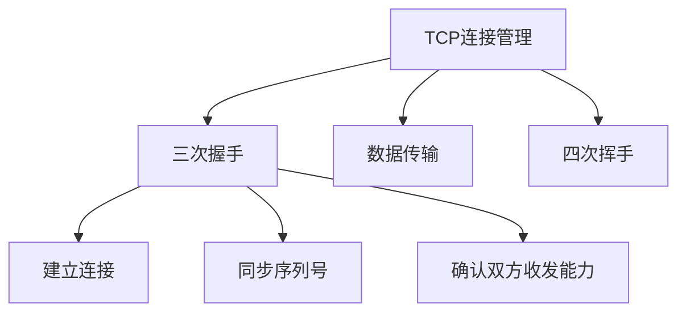
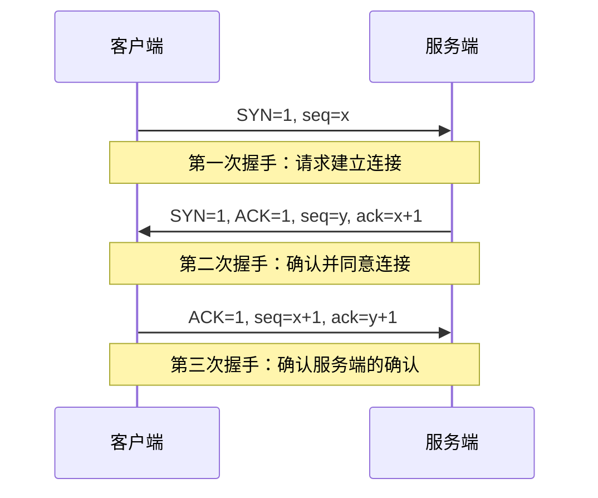
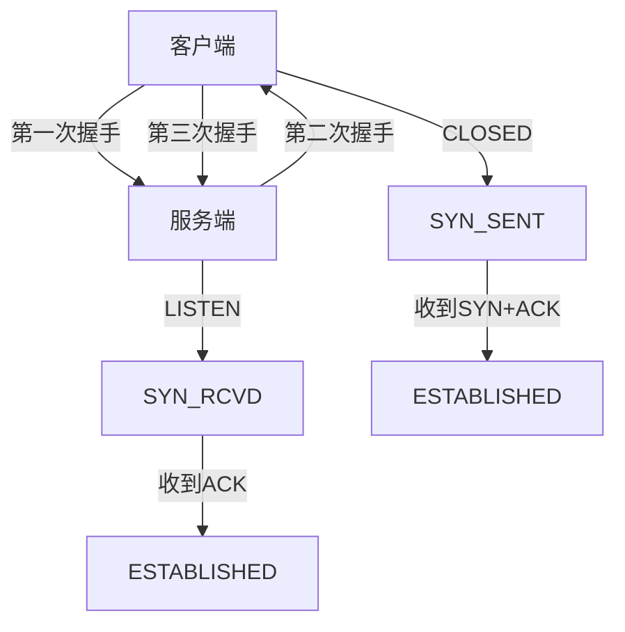
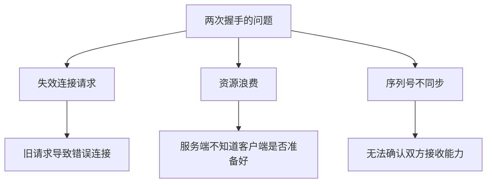
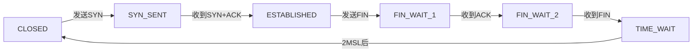
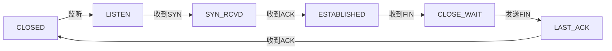
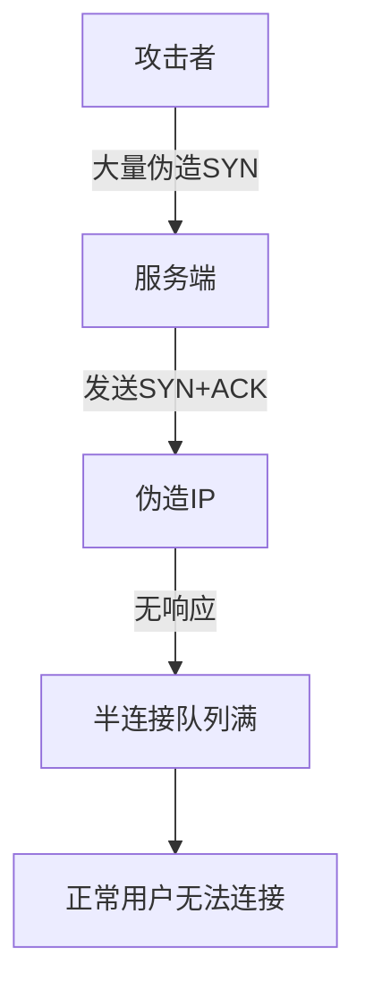

# 讲讲TCP三次握手的过程

## 一、TCP连接概述

TCP是面向连接的可靠传输协议，在数据传输前需要建立连接，三次握手就是建立连接的过程。



## 二、三次握手流程

### 1. 完整流程图



### 2. 详细步骤



## 三、各次握手详解

### 1. 第一次握手

```javascript
// 客户端发送SYN报文
const firstHandshake = {
  SYN: 1,           // 同步标志位
  seq: x,           // 客户端初始序列号
  // 其他信息
  sourcePort: 12345,
  destPort: 80,
  window: 65535,
  options: ['MSS=1460', 'WS=6']
};

// 客户端状态变化
// CLOSED -> SYN_SENT

// 意义：
// 1. 客户端请求建立连接
// 2. 告知服务端自己的初始序列号
// 3. 客户端进入SYN_SENT状态
```

### 2. 第二次握手

```javascript
// 服务端发送SYN+ACK报文
const secondHandshake = {
  SYN: 1,           // 同步标志位
  ACK: 1,           // 确认标志位
  seq: y,           // 服务端初始序列号
  ack: x + 1,       // 确认号 = 客户端seq + 1
  // 其他信息
  sourcePort: 80,
  destPort: 12345,
  window: 65535
};

// 服务端状态变化
// LISTEN -> SYN_RCVD

// 意义：
// 1. 服务端确认收到客户端的SYN
// 2. 服务端同意建立连接
// 3. 告知客户端自己的初始序列号
// 4. 服务端进入SYN_RCVD状态
```

### 3. 第三次握手

```javascript
// 客户端发送ACK报文
const thirdHandshake = {
  ACK: 1,           // 确认标志位
  seq: x + 1,       // 序列号 = 第一次seq + 1
  ack: y + 1,       // 确认号 = 服务端seq + 1
  // 其他信息
  sourcePort: 12345,
  destPort: 80,
  window: 65535
};

// 客户端状态变化
// SYN_SENT -> ESTABLISHED

// 服务端收到后状态变化
// SYN_RCVD -> ESTABLISHED

// 意义：
// 1. 客户端确认收到服务端的SYN+ACK
// 2. 双方都进入ESTABLISHED状态
// 3. 连接建立完成，可以开始传输数据
```

## 四、为什么是三次握手

### 1. 两次握手的问题



### 2. 失效连接请求示例

```javascript
// 场景：网络延迟导致的失效请求

// 1. 客户端发送SYN（延迟在网络中）
const oldRequest = {
  SYN: 1,
  seq: 100,
  timestamp: '10:00:00'
};

// 2. 客户端超时重发SYN
const newRequest = {
  SYN: 1,
  seq: 200,
  timestamp: '10:00:05'
};

// 3. 新请求正常完成连接
// 4. 旧请求到达服务端

// 如果是两次握手：
// - 服务端立即建立连接，等待数据
// - 客户端不会发送数据（已经关闭）
// - 服务端资源浪费

// 三次握手：
// - 服务端发送SYN+ACK
// - 客户端发现是旧请求，发送RST拒绝
// - 连接不会建立
```

### 3. 三次握手的必要性

```javascript
// 三次握手确保：

// 1. 双向通道验证
const verifyChannel = {
  clientToServer: '第一次握手证明客户端能发',
  serverToClient: '第二次握手证明服务端能收能发',
  clientAck: '第三次握手证明客户端能收'
};

// 2. 序列号同步
const syncSequence = {
  clientSeq: '第一次握手告知客户端序列号',
  serverSeq: '第二次握手告知服务端序列号',
  confirm: '第三次握手确认双方序列号'
};

// 3. 防止历史连接
const preventOldConnection = {
  detect: '第三次握手可以检测到旧请求',
  reject: '客户端发送RST拒绝旧连接'
};
```

## 五、TCP标志位

### 1. 标志位说明

| 标志位 | 名称 | 说明 |
|-------|------|------|
| SYN | Synchronize | 同步序列号，用于建立连接 |
| ACK | Acknowledge | 确认标志，确认序号有效 |
| FIN | Finish | 结束标志，用于关闭连接 |
| RST | Reset | 重置连接 |
| PSH | Push | 推送标志，尽快交付应用层 |
| URG | Urgent | 紧急标志，紧急指针有效 |

### 2. 报文结构

```javascript
const tcpHeader = {
  sourcePort: 16,      // 源端口
  destPort: 16,        // 目标端口
  seq: 32,             // 序列号
  ack: 32,             // 确认号
  dataOffset: 4,       // 数据偏移
  reserved: 6,         // 保留
  flags: {
    URG: 1,
    ACK: 1,
    PSH: 1,
    RST: 1,
    SYN: 1,
    FIN: 1
  },
  window: 16,          // 窗口大小
  checksum: 16,        // 校验和
  urgentPointer: 16    // 紧急指针
};
```

## 六、状态变迁

### 1. 客户端状态



### 2. 服务端状态



## 七、SYN Flood攻击

### 1. 攻击原理



### 2. 防御措施

```javascript
// 1. SYN Cookies
const synCookies = {
  principle: '不分配资源，通过加密计算验证',
  process: [
    '服务端收到SYN，不分配TCB',
    '计算cookie值作为初始序列号',
    '收到ACK时验证cookie',
    '验证通过才分配资源'
  ]
};

// 2. 增加半连接队列长度
const increaseBacklog = {
  command: 'sysctl -w net.ipv4.tcp_max_syn_backlog=8192'
};

// 3. 减少SYN+ACK重试次数
const reduceRetries = {
  command: 'sysctl -w net.ipv4.tcp_synack_retries=2'
};

// 4. 启用SYN Cookies
const enableCookies = {
  command: 'sysctl -w net.ipv4.tcp_syncookies=1'
};
```

## 八、连接超时处理

### 1. 连接建立超时

```javascript
// 客户端超时重试机制
const connectTimeout = {
  firstRetry: 1,      // 第一次重试：1秒
  secondRetry: 2,     // 第二次重试：2秒
  thirdRetry: 4,      // 第三次重试：4秒
  // ...指数退避
  
  maxRetries: 5,      // 最大重试次数
  totalTimeout: 127   // 总超时时间（秒）
};

// Linux默认配置
const linuxDefault = {
  tcp_syn_retries: 6,      // SYN重试次数
  tcp_synack_retries: 5,   // SYN+ACK重试次数
  tcp_syncookies: 1        // 启用SYN Cookies
};
```

### 2. 超时处理代码示例

```javascript
const connectWithTimeout = (host, port, timeout = 5000) => {
  return new Promise((resolve, reject) => {
    const socket = new net.Socket();
    const timer = setTimeout(() => {
      socket.destroy();
      reject(new Error('Connection timeout'));
    }, timeout);
    
    socket.connect(port, host, () => {
      clearTimeout(timer);
      resolve(socket);
    });
    
    socket.on('error', (err) => {
      clearTimeout(timer);
      reject(err);
    });
  });
};
```

## 九、抓包分析

### 1. 使用tcpdump

```bash
# 抓取TCP三次握手
tcpdump -i eth0 'tcp[tcpflags] & tcp-syn != 0' -nn

# 输出示例
# 10:00:00.000000 IP 192.168.1.1.12345 > 192.168.1.2.80: Flags [S], seq 100
# 10:00:00.000100 IP 192.168.1.2.80 > 192.168.1.1.12345: Flags [S.], seq 200, ack 101
# 10:00:00.000200 IP 192.168.1.1.12345 > 192.168.1.2.80: Flags [.], ack 201
```

### 2. 使用Wireshark

```javascript
// 过滤器表达式
const wiresharkFilter = 'tcp.flags.syn == 1 || tcp.flags.ack == 1';

// 分析要点
const analysisPoints = [
  '检查三次握手是否完整',
  '查看序列号和确认号',
  '分析RTT（往返时间）',
  '检查TCP选项（MSS、WS等）'
];
```

## 十、总结

| 阶段 | 客户端状态 | 服务端状态 | 报文类型 |
|-----|-----------|-----------|---------|
| 初始 | CLOSED | LISTEN | - |
| 第一次握手 | SYN_SENT | LISTEN | SYN |
| 第二次握手 | SYN_SENT | SYN_RCVD | SYN+ACK |
| 第三次握手 | ESTABLISHED | ESTABLISHED | ACK |

**核心要点：**
1. 三次握手确保双向通信能力验证
2. 同步双方的初始序列号
3. 防止历史连接请求导致错误
4. SYN Flood攻击利用半连接队列
5. SYN Cookies可有效防御SYN Flood
6. 连接超时采用指数退避重试
