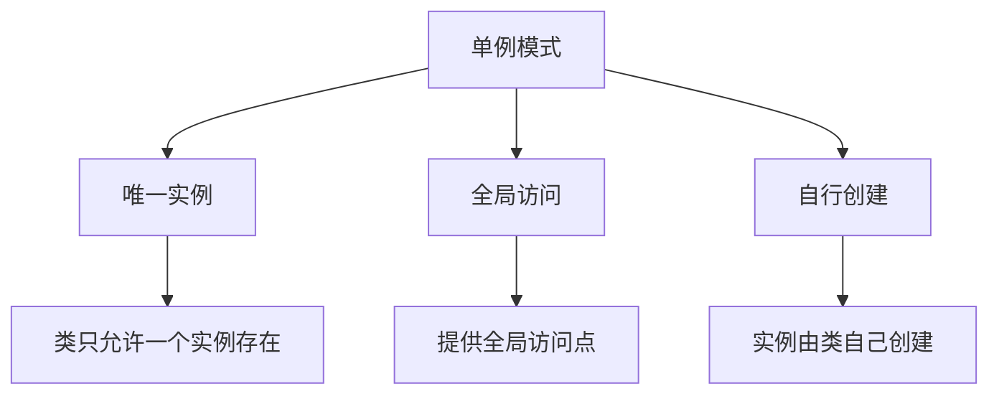
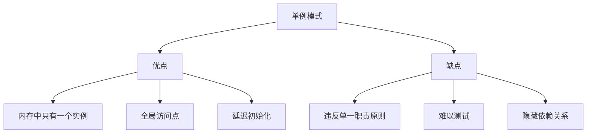

# 什么是单例模式

## 一、单例模式概述

单例模式确保一个类只有一个实例，并提供一个全局访问点。



## 二、实现方式

### 1. 基本实现

```javascript
class Singleton {
  static instance = null;
  
  constructor() {
    if (Singleton.instance) {
      return Singleton.instance;
    }
    Singleton.instance = this;
  }
  
  static getInstance = () => {
    if (!Singleton.instance) {
      Singleton.instance = new Singleton();
    }
    return Singleton.instance;
  };
}

const instance1 = new Singleton();
const instance2 = new Singleton();
console.log(instance1 === instance2);  // true
```

### 2. 闭包实现

```javascript
const Singleton = (() => {
  let instance = null;
  
  const createInstance = () => {
    return {
      name: 'Singleton Instance',
      getData: () => 'Some data'
    };
  };
  
  return {
    getInstance: () => {
      if (!instance) {
        instance = createInstance();
      }
      return instance;
    }
  };
})();

const instance1 = Singleton.getInstance();
const instance2 = Singleton.getInstance();
console.log(instance1 === instance2);  // true
```

### 3. ES6模块实现

```javascript
// singleton.js
class Singleton {
  constructor() {
    this.data = [];
  }
  
  add = (item) => {
    this.data.push(item);
  };
  
  getData = () => this.data;
}

export default new Singleton();

// 使用
import singleton from './singleton.js';
singleton.add('item');
```

## 三、应用场景

### 1. 全局状态管理

```javascript
const Store = (() => {
  let instance = null;
  let state = {};
  const listeners = [];
  
  const init = () => ({
    getState: () => state,
    
    setState: (newState) => {
      state = { ...state, ...newState };
      listeners.forEach(listener => listener(state));
    },
    
    subscribe: (listener) => {
      listeners.push(listener);
      return () => {
        const index = listeners.indexOf(listener);
        listeners.splice(index, 1);
      };
    }
  });
  
  return {
    getInstance: () => {
      if (!instance) {
        instance = init();
      }
      return instance;
    }
  };
})();

const store = Store.getInstance();
store.setState({ user: 'John' });
```

### 2. 数据库连接池

```javascript
class DatabaseConnection {
  static instance = null;
  
  constructor(config) {
    if (DatabaseConnection.instance) {
      return DatabaseConnection.instance;
    }
    this.config = config;
    this.pool = [];
    this.connect();
    DatabaseConnection.instance = this;
  }
  
  connect = () => {
    console.log('Creating connection pool...');
  };
  
  query = (sql) => {
    console.log(`Executing: ${sql}`);
    return `Result of ${sql}`;
  };
  
  static getInstance = (config) => {
    if (!DatabaseConnection.instance) {
      DatabaseConnection.instance = new DatabaseConnection(config);
    }
    return DatabaseConnection.instance;
  };
}

const db1 = DatabaseConnection.getInstance({ host: 'localhost' });
const db2 = DatabaseConnection.getInstance({ host: 'localhost' });
console.log(db1 === db2);  // true
```

### 3. 日志管理器

```javascript
const Logger = (() => {
  let instance = null;
  const logs = [];
  
  const createLogger = () => ({
    log: (message) => {
      const timestamp = new Date().toISOString();
      logs.push({ timestamp, level: 'LOG', message });
      console.log(`[${timestamp}] LOG: ${message}`);
    },
    
    error: (message) => {
      const timestamp = new Date().toISOString();
      logs.push({ timestamp, level: 'ERROR', message });
      console.error(`[${timestamp}] ERROR: ${message}`);
    },
    
    getLogs: () => logs
  });
  
  return {
    getInstance: () => {
      if (!instance) {
        instance = createLogger();
      }
      return instance;
    }
  };
})();

const logger1 = Logger.getInstance();
const logger2 = Logger.getInstance();
logger1.log('First message');
logger2.log('Second message');
console.log(logger1 === logger2);  // true
```

## 四、线程安全实现

### 1. 惰性初始化

```javascript
class Singleton {
  static instance = null;
  static lock = false;
  
  constructor() {
    if (Singleton.instance) {
      return Singleton.instance;
    }
    this.data = 'Singleton Data';
    Singleton.instance = this;
  }
  
  static getInstance = () => {
    if (!Singleton.instance) {
      if (!Singleton.lock) {
        Singleton.lock = true;
        Singleton.instance = new Singleton();
        Singleton.lock = false;
      }
    }
    return Singleton.instance;
  };
}
```

### 2. 预初始化

```javascript
class Singleton {
  static instance = new Singleton();
  
  constructor() {
    this.data = 'Singleton Data';
  }
  
  static getInstance = () => Singleton.instance;
}

const instance = Singleton.getInstance();
```

## 五、优缺点



| 优点 | 缺点 |
|-----|------|
| 内存中只有一个实例 | 违反单一职责原则 |
| 提供全局访问点 | 难以进行单元测试 |
| 延迟初始化 | 隐藏依赖关系 |
| 避免全局变量污染 | 可能导致过度使用 |

## 六、最佳实践

### 1. 使用场景判断

```javascript
const shouldUseSingleton = (scenario) => {
  const validScenarios = [
    '全局配置管理',
    '日志记录器',
    '数据库连接池',
    '缓存管理器',
    '线程池'
  ];
  
  return validScenarios.includes(scenario);
};
```

### 2. 结合其他模式

```javascript
const FactoryWithSingleton = (() => {
  let instance = null;
  
  const createFactory = () => {
    const products = new Map();
    
    return {
      register: (name, ProductClass) => {
        products.set(name, ProductClass);
      },
      
      create: (name, ...args) => {
        const ProductClass = products.get(name);
        if (!ProductClass) {
          throw new Error(`Product ${name} not registered`);
        }
        return new ProductClass(...args);
      }
    };
  };
  
  return {
    getInstance: () => {
      if (!instance) {
        instance = createFactory();
      }
      return instance;
    }
  };
})();
```

## 七、总结

**核心要点：**
1. 确保类只有一个实例
2. 提供全局访问点
3. 实例由类自己创建
4. 适用于全局状态管理、资源管理等场景
5. 注意避免过度使用
6. 在JavaScript中可使用模块系统天然实现单例
