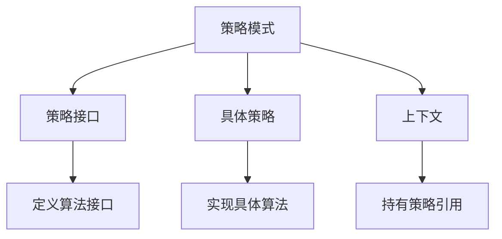
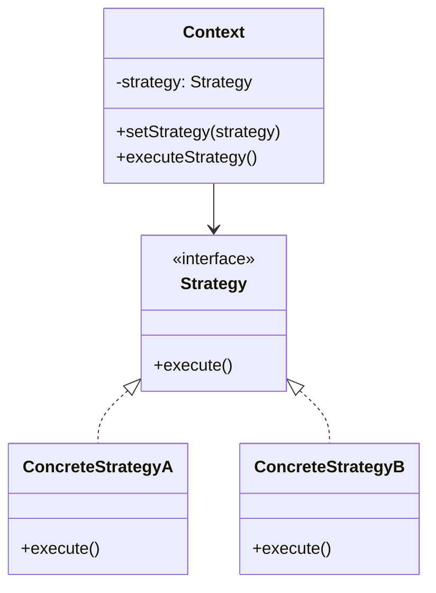
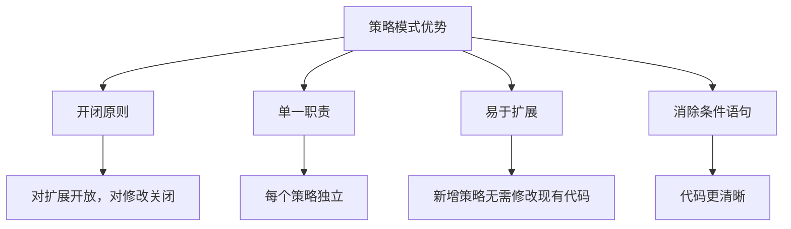

# 什么是策略模式

## 一、策略模式概述

策略模式定义一系列算法，把它们封装起来，并使它们可以相互替换。



## 二、基本结构

### 1. UML类图



### 2. 基本实现

```javascript
const strategies = {
  strategyA: () => {
    console.log('执行策略A');
    return 'Result A';
  },
  
  strategyB: () => {
    console.log('执行策略B');
    return 'Result B';
  },
  
  strategyC: () => {
    console.log('执行策略C');
    return 'Result C';
  }
};

const context = (strategy) => {
  return strategies[strategy]();
};

context('strategyA');  // 执行策略A
context('strategyB');  // 执行策略B
```

## 三、应用场景

### 1. 表单验证

```javascript
const validators = {
  required: (value) => {
    if (value === undefined || value === null || value === '') {
      return '此字段必填';
    }
    return '';
  },
  
  minLength: (value, min) => {
    if (value.length < min) {
      return `长度不能小于${min}个字符`;
    }
    return '';
  },
  
  maxLength: (value, max) => {
    if (value.length > max) {
      return `长度不能超过${max}个字符`;
    }
    return '';
  },
  
  email: (value) => {
    const regex = /^[^\s@]+@[^\s@]+\.[^\s@]+$/;
    if (!regex.test(value)) {
      return '请输入有效的邮箱地址';
    }
    return '';
  },
  
  phone: (value) => {
    const regex = /^1[3-9]\d{9}$/;
    if (!regex.test(value)) {
      return '请输入有效的手机号';
    }
    return '';
  }
};

const validate = (value, rules) => {
  for (const rule of rules) {
    const { type, params = [], message } = rule;
    const error = validators[type](value, ...params);
    if (error) {
      return message || error;
    }
  }
  return '';
};

const result = validate('test@example.com', [
  { type: 'required' },
  { type: 'email' }
]);
console.log(result);  // ''
```

### 2. 计算奖金

```javascript
const bonusStrategies = {
  S: (salary) => salary * 4,
  A: (salary) => salary * 3,
  B: (salary) => salary * 2,
  C: (salary) => salary * 1
};

const calculateBonus = (level, salary) => {
  const strategy = bonusStrategies[level];
  if (!strategy) {
    throw new Error(`Invalid level: ${level}`);
  }
  return strategy(salary);
};

console.log(calculateBonus('S', 10000));  // 40000
console.log(calculateBonus('A', 10000));  // 30000
console.log(calculateBonus('B', 10000));  // 20000
```

### 3. 动画效果

```javascript
const animations = {
  fadeIn: (element, duration = 300) => {
    element.style.opacity = 0;
    element.style.display = 'block';
    
    const start = performance.now();
    
    const animate = (currentTime) => {
      const elapsed = currentTime - start;
      const progress = Math.min(elapsed / duration, 1);
      
      element.style.opacity = progress;
      
      if (progress < 1) {
        requestAnimationFrame(animate);
      }
    };
    
    requestAnimationFrame(animate);
  },
  
  fadeOut: (element, duration = 300) => {
    const start = performance.now();
    
    const animate = (currentTime) => {
      const elapsed = currentTime - start;
      const progress = Math.min(elapsed / duration, 1);
      
      element.style.opacity = 1 - progress;
      
      if (progress < 1) {
        requestAnimationFrame(animate);
      } else {
        element.style.display = 'none';
      }
    };
    
    requestAnimationFrame(animate);
  },
  
  slideDown: (element, duration = 300) => {
    element.style.height = '0';
    element.style.overflow = 'hidden';
    element.style.display = 'block';
    
    const targetHeight = element.scrollHeight;
    const start = performance.now();
    
    const animate = (currentTime) => {
      const elapsed = currentTime - start;
      const progress = Math.min(elapsed / duration, 1);
      
      element.style.height = `${targetHeight * progress}px`;
      
      if (progress < 1) {
        requestAnimationFrame(animate);
      } else {
        element.style.height = '';
        element.style.overflow = '';
      }
    };
    
    requestAnimationFrame(animate);
  }
};

const animate = (element, type, duration) => {
  animations[type](element, duration);
};
```

### 4. 支付方式

```javascript
const paymentStrategies = {
  alipay: (amount) => {
    console.log(`支付宝支付: ${amount}元`);
    return { success: true, method: 'alipay' };
  },
  
  wechat: (amount) => {
    console.log(`微信支付: ${amount}元`);
    return { success: true, method: 'wechat' };
  },
  
  creditCard: (amount) => {
    console.log(`信用卡支付: ${amount}元`);
    return { success: true, method: 'creditCard' };
  },
  
  bankTransfer: (amount) => {
    console.log(`银行转账: ${amount}元`);
    return { success: true, method: 'bankTransfer' };
  }
};

const pay = (method, amount) => {
  const strategy = paymentStrategies[method];
  if (!strategy) {
    throw new Error(`Unsupported payment method: ${method}`);
  }
  return strategy(amount);
};

pay('alipay', 100);
pay('wechat', 200);
```

## 四、策略模式类实现

```javascript
class Context {
  constructor(strategy) {
    this.strategy = strategy;
  }
  
  setStrategy = (strategy) => {
    this.strategy = strategy;
  };
  
  executeStrategy = (...args) => {
    return this.strategy.execute(...args);
  };
}

class StrategyA {
  execute = (data) => {
    console.log('策略A处理:', data);
    return data.toUpperCase();
  };
}

class StrategyB {
  execute = (data) => {
    console.log('策略B处理:', data);
    return data.toLowerCase();
  };
}

const context = new Context(new StrategyA());
console.log(context.executeStrategy('Hello'));  // HELLO

context.setStrategy(new StrategyB());
console.log(context.executeStrategy('Hello'));  // hello
```

## 五、策略模式 vs 条件语句

### 1. 条件语句实现

```javascript
const calculateBonus = (level, salary) => {
  if (level === 'S') {
    return salary * 4;
  } else if (level === 'A') {
    return salary * 3;
  } else if (level === 'B') {
    return salary * 2;
  } else if (level === 'C') {
    return salary * 1;
  }
  throw new Error('Invalid level');
};
```

### 2. 策略模式优势



## 六、优缺点

| 优点 | 缺点 |
|-----|------|
| 遵循开闭原则 | 客户端需要知道所有策略 |
| 避免多重条件语句 | 增加对象数量 |
| 提高代码复用性 | 策略过多时难以维护 |
| 易于扩展新策略 | - |

## 七、实际应用示例

### 1. 价格计算

```javascript
const priceStrategies = {
  normal: (price) => price,
  
  discount: (price, discount) => price * discount,
  
  member: (price, memberLevel) => {
    const discounts = {
      gold: 0.8,
      silver: 0.9,
      bronze: 0.95
    };
    return price * (discounts[memberLevel] || 1);
  },
  
  holiday: (price, holidayDiscount) => {
    return price * holidayDiscount;
  }
};

const calculatePrice = (price, strategy, ...params) => {
  return priceStrategies[strategy](price, ...params);
};

console.log(calculatePrice(100, 'normal'));           // 100
console.log(calculatePrice(100, 'discount', 0.8));    // 80
console.log(calculatePrice(100, 'member', 'gold'));   // 80
console.log(calculatePrice(100, 'holiday', 0.9));     // 90
```

### 2. 排序策略

```javascript
const sortStrategies = {
  asc: (arr) => [...arr].sort((a, b) => a - b),
  
  desc: (arr) => [...arr].sort((a, b) => b - a),
  
  random: (arr) => {
    const result = [...arr];
    for (let i = result.length - 1; i > 0; i--) {
      const j = Math.floor(Math.random() * (i + 1));
      [result[i], result[j]] = [result[j], result[i]];
    }
    return result;
  },
  
  byKey: (arr, key) => [...arr].sort((a, b) => a[key] - b[key])
};

const sort = (arr, strategy, ...params) => {
  return sortStrategies[strategy](arr, ...params);
};

const numbers = [3, 1, 4, 1, 5, 9, 2, 6];
console.log(sort(numbers, 'asc'));    // [1, 1, 2, 3, 4, 5, 6, 9]
console.log(sort(numbers, 'desc'));   // [9, 6, 5, 4, 3, 2, 1, 1]
```

## 八、总结

**核心要点：**
1. 定义一系列算法，封装起来，使它们可以相互替换
2. 策略模式让算法独立于使用它的客户端
3. 消除大量的条件语句
4. 遵循开闭原则，易于扩展
5. 常用于表单验证、计算规则、动画效果等场景
6. 在JavaScript中可以使用对象字面量简化实现
