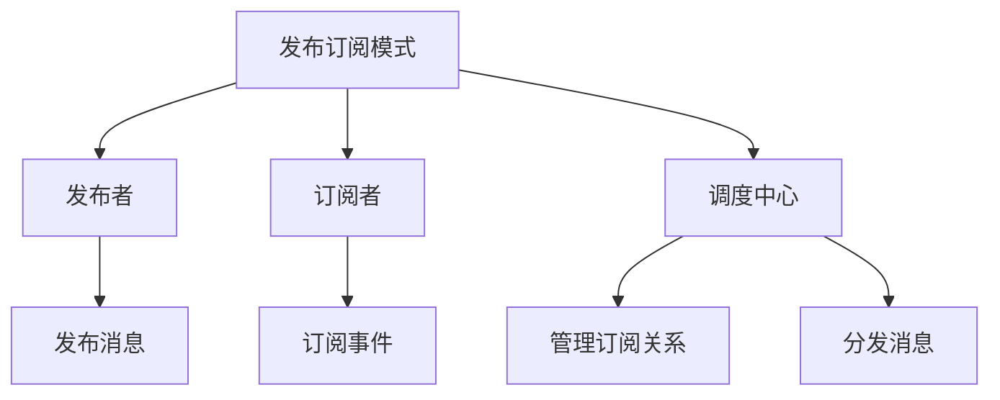
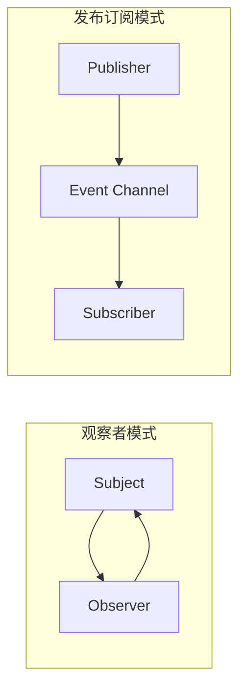
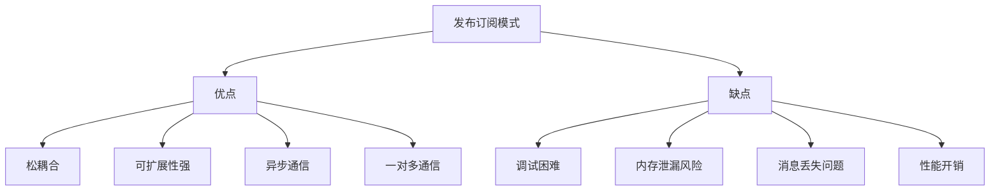

# 什么是发布订阅模式

## 一、发布订阅模式概述

发布订阅模式是一种消息范式，发送者（发布者）不会直接发送消息给接收者（订阅者），而是通过调度中心进行消息分发。



## 二、与观察者模式的区别

### 1. 架构对比



### 2. 主要区别

| 特性 | 观察者模式 | 发布订阅模式 |
|-----|-----------|-------------|
| 耦合度 | 紧耦合 | 松耦合 |
| 通信方式 | 直接通信 | 通过调度中心 |
| 知晓关系 | 观察者知道被观察者 | 双方互不知道 |
| 适用场景 | 简单的一对多依赖 | 复杂的消息系统 |

## 三、基本实现

### 1. 简单实现

```javascript
const EventBus = (() => {
  const events = {};
  
  return {
    on: (event, callback) => {
      if (!events[event]) {
        events[event] = [];
      }
      events[event].push(callback);
    },
    
    off: (event, callback) => {
      if (!events[event]) return;
      if (!callback) {
        events[event] = [];
      } else {
        events[event] = events[event].filter(cb => cb !== callback);
      }
    },
    
    emit: (event, ...args) => {
      if (!events[event]) return;
      events[event].forEach(callback => callback(...args));
    },
    
    once: (event, callback) => {
      const wrapper = (...args) => {
        callback(...args);
        EventBus.off(event, wrapper);
      };
      EventBus.on(event, wrapper);
    }
  };
})();

EventBus.on('login', (user) => {
  console.log(`用户 ${user} 已登录`);
});

EventBus.emit('login', 'John');  // 用户 John 已登录
```

### 2. 完整实现

```javascript
class EventEmitter {
  constructor() {
    this.events = new Map();
  }
  
  on = (event, callback) => {
    if (!this.events.has(event)) {
      this.events.set(event, new Set());
    }
    this.events.get(event).add(callback);
    return () => this.off(event, callback);
  };
  
  off = (event, callback) => {
    if (!this.events.has(event)) return;
    if (!callback) {
      this.events.delete(event);
    } else {
      this.events.get(event).delete(callback);
    }
  };
  
  emit = (event, ...args) => {
    if (!this.events.has(event)) return;
    this.events.get(event).forEach(callback => {
      try {
        callback(...args);
      } catch (error) {
        console.error(`Error in event handler for ${event}:`, error);
      }
    });
  };
  
  once = (event, callback) => {
    const wrapper = (...args) => {
      callback(...args);
      this.off(event, wrapper);
    };
    this.on(event, wrapper);
    return () => this.off(event, wrapper);
  };
  
  removeAllListeners = (event) => {
    if (event) {
      this.events.delete(event);
    } else {
      this.events.clear();
    }
  };
  
  listenerCount = (event) => {
    if (!this.events.has(event)) return 0;
    return this.events.get(event).size;
  };
}

const emitter = new EventEmitter();

const unsubscribe = emitter.on('message', (data) => {
  console.log('收到消息:', data);
});

emitter.emit('message', 'Hello');  // 收到消息: Hello
unsubscribe();
emitter.emit('message', 'World');  // 无输出
```

## 四、应用场景

### 1. 组件通信

```javascript
const eventBus = new EventEmitter();

const ComponentA = {
  handleClick: () => {
    eventBus.emit('user-selected', { id: 1, name: 'John' });
  }
};

const ComponentB = {
  init: () => {
    eventBus.on('user-selected', (user) => {
      console.log('ComponentB 收到用户:', user);
    });
  }
};

const ComponentC = {
  init: () => {
    eventBus.on('user-selected', (user) => {
      console.log('ComponentC 收到用户:', user);
    });
  }
};

ComponentB.init();
ComponentC.init();
ComponentA.handleClick();
```

### 2. 状态管理

```javascript
const createStore = (initialState) => {
  const emitter = new EventEmitter();
  let state = initialState;
  
  return {
    getState: () => state,
    
    setState: (newState) => {
      const prevState = state;
      state = { ...state, ...newState };
      emitter.emit('state-change', { prevState, newState: state });
    },
    
    subscribe: (callback) => {
      return emitter.on('state-change', callback);
    }
  };
};

const store = createStore({ user: null, theme: 'light' });

store.subscribe(({ prevState, newState }) => {
  console.log('状态变化:', { prevState, newState });
});

store.setState({ user: { name: 'John' } });
```

### 3. 异步任务

```javascript
const TaskQueue = (() => {
  const emitter = new EventEmitter();
  const queue = [];
  let processing = false;
  
  const processQueue = async () => {
    if (processing || queue.length === 0) return;
    
    processing = true;
    const task = queue.shift();
    
    try {
      const result = await task.execute();
      emitter.emit('task-complete', { id: task.id, result });
    } catch (error) {
      emitter.emit('task-error', { id: task.id, error });
    }
    
    processing = false;
    processQueue();
  };
  
  return {
    addTask: (task) => {
      queue.push(task);
      emitter.emit('task-added', task);
      processQueue();
    },
    
    onComplete: (callback) => emitter.on('task-complete', callback),
    onError: (callback) => emitter.on('task-error', callback),
    onAdded: (callback) => emitter.on('task-added', callback)
  };
})();

TaskQueue.onComplete(({ id, result }) => {
  console.log(`任务 ${id} 完成:`, result);
});

TaskQueue.addTask({
  id: 1,
  execute: () => Promise.resolve('Success')
});
```

### 4. 跨窗口通信

```javascript
const CrossTabCommunication = (() => {
  const emitter = new EventEmitter();
  const channel = new BroadcastChannel('app-channel');
  
  channel.onmessage = (event) => {
    emitter.emit('cross-tab-message', event.data);
  };
  
  return {
    send: (message) => {
      channel.postMessage(message);
    },
    
    onMessage: (callback) => {
      return emitter.on('cross-tab-message', callback);
    }
  };
})();

CrossTabCommunication.onMessage((data) => {
  console.log('收到跨窗口消息:', data);
});

CrossTabCommunication.send({ type: 'sync', data: 'Hello' });
```

## 五、主题订阅实现

### 1. 支持通配符

```javascript
class TopicEmitter {
  constructor() {
    this.topics = new Map();
  }
  
  subscribe = (topic, callback) => {
    if (!this.topics.has(topic)) {
      this.topics.set(topic, new Set());
    }
    this.topics.get(topic).add(callback);
    return () => this.unsubscribe(topic, callback);
  };
  
  unsubscribe = (topic, callback) => {
    if (!this.topics.has(topic)) return;
    this.topics.get(topic).delete(callback);
  };
  
  publish = (topic, data) => {
    this.topics.forEach((callbacks, pattern) => {
      if (this.matchTopic(pattern, topic)) {
        callbacks.forEach(callback => callback(data, topic));
      }
    });
  };
  
  matchTopic = (pattern, topic) => {
    if (pattern === '*') return true;
    if (pattern === topic) return true;
    
    const patternParts = pattern.split('.');
    const topicParts = topic.split('.');
    
    for (let i = 0; i < patternParts.length; i++) {
      if (patternParts[i] === '#') return true;
      if (patternParts[i] !== '*' && patternParts[i] !== topicParts[i]) {
        return false;
      }
    }
    
    return patternParts.length === topicParts.length;
  };
}

const topicEmitter = new TopicEmitter();

topicEmitter.subscribe('user.*', (data, topic) => {
  console.log(`[${topic}]`, data);
});

topicEmitter.subscribe('user.login', (data) => {
  console.log('用户登录:', data);
});

topicEmitter.publish('user.login', { userId: 1 });
topicEmitter.publish('user.logout', { userId: 1 });
```

## 六、优缺点



| 优点 | 缺点 |
|-----|------|
| 松耦合，组件独立 | 调试困难 |
| 可扩展性强 | 可能导致内存泄漏 |
| 支持异步通信 | 消息可能丢失 |
| 一对多通信 | 有一定性能开销 |

## 七、最佳实践

### 1. 内存泄漏防护

```javascript
class SafeEventEmitter {
  constructor() {
    this.events = new Map();
    this.maxListeners = 10;
  }
  
  on = (event, callback) => {
    if (!this.events.has(event)) {
      this.events.set(event, new Set());
    }
    
    const listeners = this.events.get(event);
    if (listeners.size >= this.maxListeners) {
      console.warn(`Possible memory leak. ${event} has ${listeners.size} listeners.`);
    }
    
    listeners.add(callback);
    return () => this.off(event, callback);
  };
  
  off = (event, callback) => {
    if (!this.events.has(event)) return;
    this.events.get(event).delete(callback);
    
    if (this.events.get(event).size === 0) {
      this.events.delete(event);
    }
  };
  
  destroy = () => {
    this.events.clear();
  };
}
```

### 2. 错误处理

```javascript
class RobustEventEmitter extends EventEmitter {
  emit = (event, ...args) => {
    if (!this.events.has(event)) return;
    
    const errors = [];
    this.events.get(event).forEach(callback => {
      try {
        callback(...args);
      } catch (error) {
        errors.push({ callback, error });
      }
    });
    
    if (errors.length > 0) {
      this.handleErrors(event, errors);
    }
  };
  
  handleErrors = (event, errors) => {
    console.error(`Errors in event ${event}:`);
    errors.forEach(({ callback, error }) => {
      console.error('Callback:', callback.toString());
      console.error('Error:', error);
    });
  };
}
```

## 八、实际应用示例

### 1. Vue事件总线

```javascript
const EventBus = {
  events: {},
  
  $on: function(event, callback) {
    if (!this.events[event]) {
      this.events[event] = [];
    }
    this.events[event].push(callback);
  },
  
  $off: function(event, callback) {
    if (!this.events[event]) return;
    if (!callback) {
      this.events[event] = [];
    } else {
      this.events[event] = this.events[event].filter(cb => cb !== callback);
    }
  },
  
  $emit: function(event, ...args) {
    if (!this.events[event]) return;
    this.events[event].forEach(callback => callback(...args));
  }
};

export default EventBus;
```

### 2. Node.js EventEmitter简化版

```javascript
const EventEmitter = require('events');

const emitter = new EventEmitter();

emitter.on('connection', (socket) => {
  console.log('新连接:', socket.remoteAddress);
});

emitter.emit('connection', { remoteAddress: '127.0.0.1' });
```

## 九、总结

**核心要点：**
1. 发布者和订阅者通过调度中心通信，实现松耦合
2. 与观察者模式的区别在于是否有调度中心
3. 常用于组件通信、状态管理、事件系统
4. 注意内存泄漏问题，及时取消订阅
5. 做好错误处理，避免单个回调影响整体
6. 可以扩展支持通配符、优先级等高级特性
