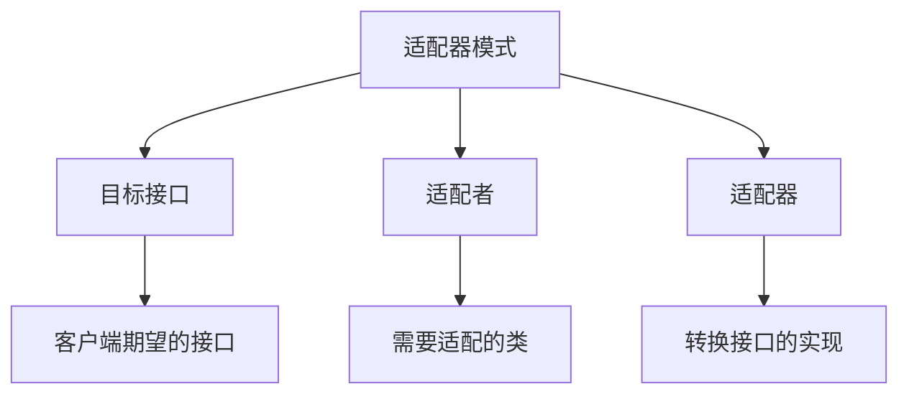
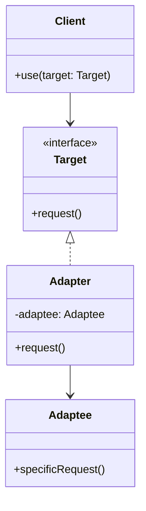
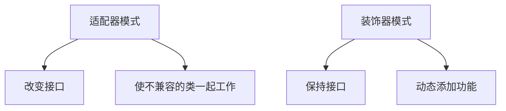
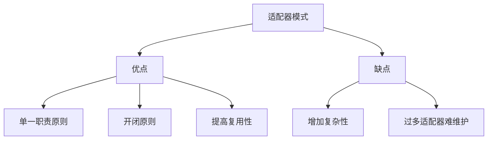

# 什么是适配器模式

## 一、适配器模式概述

适配器模式将一个类的接口转换成客户端期望的另一个接口，使原本不兼容的类可以一起工作。



## 二、基本结构

### 1. UML类图



### 2. 基本实现

```javascript
class Adaptee {
  specificRequest = () => {
    return '特殊请求';
  };
}

class Target {
  request = () => {
    return '标准请求';
  };
}

class Adapter extends Target {
  constructor(adaptee) {
    super();
    this.adaptee = adaptee;
  }
  
  request = () => {
    const result = this.adaptee.specificRequest();
    return `适配后的${result}`;
  };
}

const adaptee = new Adaptee();
const adapter = new Adapter(adaptee);
console.log(adapter.request());  // 适配后的特殊请求
```

## 三、适配器类型

### 1. 类适配器

```javascript
class Adaptee {
  specificRequest = () => {
    return '特殊请求';
  };
}

class Adapter extends Adaptee {
  request = () => {
    const result = this.specificRequest();
    return `适配后的${result}`;
  };
}

const adapter = new Adapter();
console.log(adapter.request());  // 适配后的特殊请求
```

### 2. 对象适配器

```javascript
class Adaptee {
  specificRequest = () => {
    return '特殊请求';
  };
}

class Adapter {
  constructor(adaptee) {
    this.adaptee = adaptee;
  }
  
  request = () => {
    const result = this.adaptee.specificRequest();
    return `适配后的${result}`;
  };
}

const adaptee = new Adaptee();
const adapter = new Adapter(adaptee);
console.log(adapter.request());  // 适配后的特殊请求
```

## 四、应用场景

### 1. 接口统一

```javascript
const oldAPI = {
  getUserInfo: (id) => {
    return {
      id,
      name: 'John',
      age: 25
    };
  }
};

const newAPI = {
  fetchUser: (userId) => {
    return Promise.resolve({
      userId,
      username: 'John',
      userAge: 25
    });
  }
};

const APIAdapter = {
  getUserInfo: async (id) => {
    const data = await newAPI.fetchUser(id);
    return {
      id: data.userId,
      name: data.username,
      age: data.userAge
    };
  }
};

APIAdapter.getUserInfo(1).then(console.log);
```

### 2. 数据格式转换

```javascript
const xmlParser = {
  parse: (xml) => {
    return { type: 'xml', data: xml };
  }
};

const jsonParser = {
  parse: (json) => {
    return JSON.parse(json);
  }
};

const ParserAdapter = {
  parse: (data, format) => {
    switch (format) {
      case 'xml':
        return xmlParser.parse(data);
      case 'json':
        return jsonParser.parse(data);
      default:
        throw new Error('Unsupported format');
    }
  }
};

const jsonData = '{"name":"John"}';
const result = ParserAdapter.parse(jsonData, 'json');
console.log(result);  // { name: 'John' }
```

### 3. 第三方库适配

```javascript
const jQueryAjax = {
  ajax: (options) => {
    return $.ajax(options);
  }
};

const axiosLib = {
  get: (url, config) => axios.get(url, config),
  post: (url, data, config) => axios.post(url, data, config)
};

const HTTPAdapter = {
  get: (url, options = {}) => {
    return axiosLib.get(url, { params: options.params });
  },
  
  post: (url, data, options = {}) => {
    return axiosLib.post(url, data, options);
  },
  
  ajax: (options) => {
    const { method = 'GET', url, data, params } = options;
    
    if (method.toUpperCase() === 'GET') {
      return this.get(url, { params });
    } else {
      return this.post(url, data);
    }
  }
};

HTTPAdapter.get('/api/users').then(console.log);
```

### 4. 存储适配

```javascript
const localStorageAPI = {
  set: (key, value) => localStorage.setItem(key, JSON.stringify(value)),
  get: (key) => JSON.parse(localStorage.getItem(key)),
  remove: (key) => localStorage.removeItem(key)
};

const sessionStorageAPI = {
  set: (key, value) => sessionStorage.setItem(key, JSON.stringify(value)),
  get: (key) => JSON.parse(sessionStorage.getItem(key)),
  remove: (key) => sessionStorage.removeItem(key)
};

const StorageAdapter = (() => {
  let storage = localStorageAPI;
  
  return {
    use: (type) => {
      storage = type === 'session' ? sessionStorageAPI : localStorageAPI;
    },
    
    set: (key, value) => storage.set(key, value),
    get: (key) => storage.get(key),
    remove: (key) => storage.remove(key)
  };
})();

StorageAdapter.set('user', { name: 'John' });
console.log(StorageAdapter.get('user'));  // { name: 'John' }
```

## 五、实际应用示例

### 1. 地图API适配

```javascript
const googleMaps = {
  geocode: (address) => {
    return Promise.resolve({
      lat: 39.9042,
      lng: 116.4074,
      formattedAddress: address
    });
  }
};

const baiduMaps = {
  search: (address) => {
    return Promise.resolve({
      latitude: 39.9042,
      longitude: 116.4074,
      address
    });
  }
};

const MapAdapter = {
  geocode: async (address, provider = 'google') => {
    if (provider === 'google') {
      const result = await googleMaps.geocode(address);
      return {
        lat: result.lat,
        lng: result.lng,
        address: result.formattedAddress
      };
    } else if (provider === 'baidu') {
      const result = await baiduMaps.search(address);
      return {
        lat: result.latitude,
        lng: result.longitude,
        address: result.address
      };
    }
  }
};

MapAdapter.geocode('北京', 'google').then(console.log);
MapAdapter.geocode('北京', 'baidu').then(console.log);
```

### 2. 日志系统适配

```javascript
const consoleLogger = {
  log: (message) => console.log(`[LOG] ${message}`),
  error: (message) => console.error(`[ERROR] ${message}`),
  warn: (message) => console.warn(`[WARN] ${message}`)
};

const fileLogger = {
  write: (level, message) => {
    const timestamp = new Date().toISOString();
    console.log(`[${timestamp}] [${level}] ${message}`);
  }
};

const LoggerAdapter = {
  log: (message) => fileLogger.write('INFO', message),
  error: (message) => fileLogger.write('ERROR', message),
  warn: (message) => fileLogger.write('WARN', message)
};

LoggerAdapter.log('应用启动');
LoggerAdapter.error('发生错误');
```

### 3. 支付接口适配

```javascript
const alipay = {
  createPayment: (orderNo, amount) => {
    return { platform: 'alipay', orderNo, amount };
  }
};

const wechatPay = {
  unifiedOrder: (orderId, totalFee) => {
    return { platform: 'wechat', orderId, totalFee };
  }
};

const PaymentAdapter = {
  createPayment: (options) => {
    const { platform, orderNo, amount } = options;
    
    if (platform === 'alipay') {
      return alipay.createPayment(orderNo, amount);
    } else if (platform === 'wechat') {
      return wechatPay.unifiedOrder(orderNo, amount);
    }
    
    throw new Error('Unsupported payment platform');
  }
};

PaymentAdapter.createPayment({
  platform: 'alipay',
  orderNo: 'ORDER_001',
  amount: 100
});
```

## 六、适配器模式 vs 其他模式

### 1. 与装饰器模式



### 2. 与代理模式

| 特性 | 适配器模式 | 代理模式 |
|-----|-----------|---------|
| 目的 | 转换接口 | 控制访问 |
| 接口 | 改变接口 | 保持接口 |
| 功能 | 兼容性 | 增强功能 |

## 七、优缺点



| 优点 | 缺点 |
|-----|------|
| 符合单一职责原则 | 增加系统复杂性 |
| 符合开闭原则 | 过多使用难以维护 |
| 提高代码复用性 | 可能影响性能 |
| 灵活性好 | - |

## 八、最佳实践

### 1. 双向适配器

```javascript
class TwoWayAdapter {
  constructor(adapteeA, adapteeB) {
    this.adapteeA = adapteeA;
    this.adapteeB = adapteeB;
  }
  
  requestA = () => {
    return this.adapteeB.specificRequestB();
  };
  
  requestB = () => {
    return this.adapteeA.specificRequestA();
  };
}
```

### 2. 缓存适配器

```javascript
const CacheAdapter = (() => {
  const cache = new Map();
  
  return {
    get: (key) => cache.get(key),
    set: (key, value) => cache.set(key, value),
    has: (key) => cache.has(key),
    delete: (key) => cache.delete(key),
    clear: () => cache.clear()
  };
})();

const APIWithCache = {
  get: async (url) => {
    if (CacheAdapter.has(url)) {
      return CacheAdapter.get(url);
    }
    
    const response = await fetch(url);
    const data = await response.json();
    CacheAdapter.set(url, data);
    return data;
  }
};
```

### 3. 配置适配器

```javascript
const ConfigAdapter = (() => {
  let config = {};
  
  return {
    load: (newConfig) => {
      config = { ...config, ...newConfig };
    },
    
    get: (key, defaultValue = null) => {
      return config[key] ?? defaultValue;
    },
    
    set: (key, value) => {
      config[key] = value;
    },
    
    all: () => ({ ...config })
  };
})();

ConfigAdapter.load({
  apiUrl: 'https://api.example.com',
  timeout: 5000
});

console.log(ConfigAdapter.get('apiUrl'));  // https://api.example.com
```

## 九、总结

**核心要点：**
1. 将一个接口转换成另一个接口，使不兼容的类可以一起工作
2. 分为类适配器和对象适配器两种
3. 常用于接口统一、数据格式转换、第三方库适配
4. 符合单一职责原则和开闭原则
5. 注意不要过度使用，增加系统复杂性
6. 可以实现双向适配、缓存适配等高级功能
