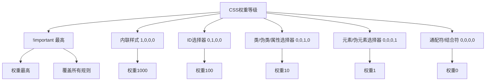
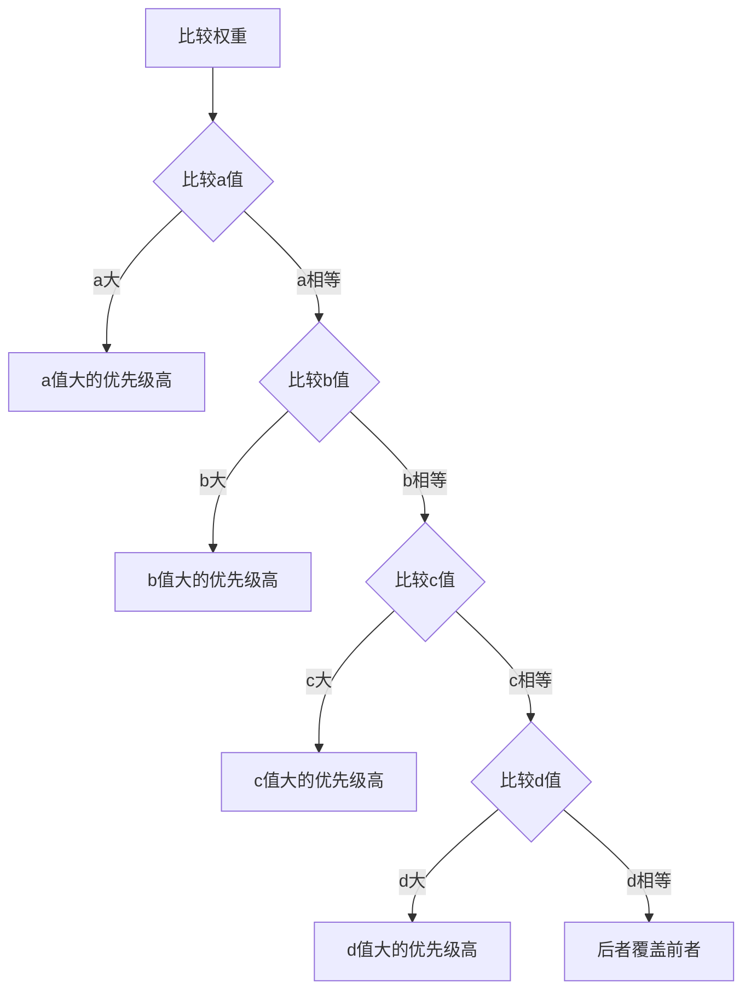

# CSS选择器的权重计算方式

## 一、权重等级

CSS选择器权重从高到低分为四个等级，用(a, b, c, d)表示。



## 二、权重计算规则

### 权重表示法

| 选择器类型 | 权重值 | 表示法 |
|-----------|--------|--------|
| !important | 最高 | - |
| 内联样式 | 1000 | (1, 0, 0, 0) |
| ID选择器 | 100 | (0, 1, 0, 0) |
| 类选择器 | 10 | (0, 0, 1, 0) |
| 伪类选择器 | 10 | (0, 0, 1, 0) |
| 属性选择器 | 10 | (0, 0, 1, 0) |
| 元素选择器 | 1 | (0, 0, 0, 1) |
| 伪元素选择器 | 1 | (0, 0, 0, 1) |
| 通配符* | 0 | (0, 0, 0, 0) |
| 结合符(+ > ~) | 0 | (0, 0, 0, 0) |

### 计算示例

```css
* {}                          /* 0, 0, 0, 0 */
div {}                        /* 0, 0, 0, 1 */
ul li {}                      /* 0, 0, 0, 2 */
ul ol+li {}                   /* 0, 0, 0, 3 */
h1 + *[rel=up] {}             /* 0, 0, 1, 1 */
ul ol li.red {}               /* 0, 0, 1, 3 */
li.red.level {}               /* 0, 0, 2, 1 */
#x34y {}                      /* 0, 1, 0, 0 */
#s12:not(FOO) {}              /* 0, 1, 0, 1 */
style=""                      /* 1, 0, 0, 0 */
```

## 三、详细示例

### 1. 元素选择器

```css
div {
  color: red;
}
/* 权重: 0, 0, 0, 1 */
```

### 2. 类选择器

```css
.text {
  color: blue;
}
/* 权重: 0, 0, 1, 0 */
```

### 3. ID选择器

```css
#title {
  color: green;
}
/* 权重: 0, 1, 0, 0 */
```

### 4. 组合选择器

```css
div p {
  color: red;
}
/* 权重: 0, 0, 0, 2 */

.container .text {
  color: blue;
}
/* 权重: 0, 0, 2, 0 */

#header .nav li {
  color: green;
}
/* 权重: 0, 1, 1, 1 */
```

### 5. 伪类选择器

```css
a:hover {
  color: red;
}
/* 权重: 0, 0, 1, 1 */

li:nth-child(2) {
  color: blue;
}
/* 权重: 0, 0, 1, 1 */

:not(.active) {
  color: green;
}
/* 权重: 0, 0, 1, 0 */
/* 注意: :not()本身不增加权重，括号内的选择器权重照常计算 */
```

### 6. 属性选择器

```css
[type="text"] {
  border: 1px solid #ccc;
}
/* 权重: 0, 0, 1, 0 */

input[type="text"][disabled] {
  background: #eee;
}
/* 权重: 0, 0, 2, 1 */
```

### 7. 伪元素选择器

```css
p::before {
  content: '»';
}
/* 权重: 0, 0, 0, 2 */

p::first-line {
  color: red;
}
/* 权重: 0, 0, 0, 2 */
```

## 四、权重比较

### 比较规则



### 示例对比

```css
/* 权重: 0, 0, 0, 1 */
div {
  color: red;
}

/* 权重: 0, 0, 1, 0 (优先级更高) */
.text {
  color: blue;
}

/* 权重: 0, 1, 0, 0 (优先级最高) */
#title {
  color: green;
}
```

## 五、特殊情况

### 1. !important

```css
div {
  color: red !important;  /* 最高优先级 */
}

#title {
  color: green;  /* 被!important覆盖 */
}

.text {
  color: blue !important;  /* 同为!important，后者覆盖 */
}
```

### 2. 内联样式

```html
<div id="title" class="text" style="color: orange;">
  内联样式优先级仅次于!important
</div>
```

```css
#title {
  color: green;  /* 被内联样式覆盖 */
}
```

### 3. 相同权重

```css
.text {
  color: red;
}

.text {
  color: blue;  /* 后者覆盖前者 */
}
```

### 4. 继承样式

```css
.parent {
  color: red;
}

.child {
  /* 继承的color权重为0 */
  /* 任何直接设置的样式都会覆盖继承样式 */
}

.child {
  color: blue;  /* 覆盖继承的red */
}
```

### 5. :is() 和 :where()

```css
/* :is() 取括号内最高权重 */
:is(#header, .nav, div) {
  color: red;
}
/* 权重: 0, 1, 0, 0 (取#header的权重) */

/* :where() 权重始终为0 */
:where(#header, .nav, div) {
  color: blue;
}
/* 权重: 0, 0, 0, 0 */
```

## 六、权重计算工具函数

```javascript
const calculateSpecificity = (selector) => {
  const result = [0, 0, 0, 0];
  
  const idCount = (selector.match(/#[\w-]+/g) || []).length;
  const classCount = (selector.match(/\.[\w-]+/g) || []).length;
  const attrCount = (selector.match(/\[[^\]]+\]/g) || []).length;
  const pseudoClassCount = (selector.match(/:[\w-]+/g) || []).length;
  const elementCount = (selector.match(/^[a-z]+|[\s>~+][a-z]+/gi) || []).length;
  
  result[1] = idCount;
  result[2] = classCount + attrCount + pseudoClassCount;
  result[3] = elementCount;
  
  return result;
};

console.log(calculateSpecificity('#header .nav li'));
```

## 七、最佳实践

### 1. 避免使用!important

```css
/* 不推荐 */
.text {
  color: red !important;
}

/* 推荐 */
.container .text {
  color: red;
}
```

### 2. 避免过度嵌套

```css
/* 不推荐 */
.container .wrapper .box .item .text {
  color: red;
}

/* 推荐 */
.container .text {
  color: red;
}
```

### 3. 使用语义化类名

```css
/* 不推荐 */
#header .nav ul li a {}

/* 推荐 */
.nav-link {}
```

### 4. 使用CSS Modules或BEM

```css
/* BEM命名 */
.block__element--modifier {
  color: red;
}

/* CSS Modules */
.container__text--active {
  color: red;
}
```

## 八、总结

| 规则 | 说明 |
|-----|------|
| 权重比较 | 从左到右逐位比较 |
| !important | 最高优先级，慎用 |
| 内联样式 | 权重(1,0,0,0) |
| 相同权重 | 后定义的覆盖先定义的 |
| 继承样式 | 权重最低，任何直接样式都会覆盖 |

**核心要点：**
1. 权重计算：(内联, ID, 类/伪类/属性, 元素/伪元素)
2. 从左到右逐位比较，大的优先
3. 相同权重时，后者覆盖前者
4. 避免使用!important和过度嵌套
5. 优先使用类选择器，语义化命名
