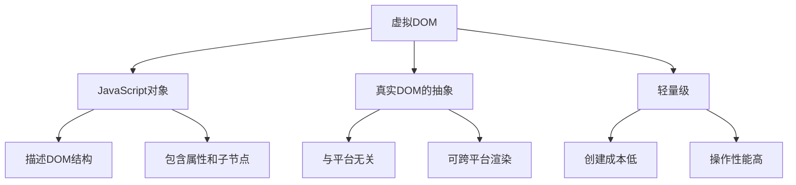
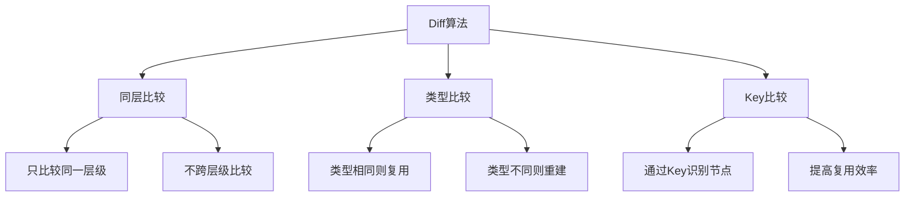
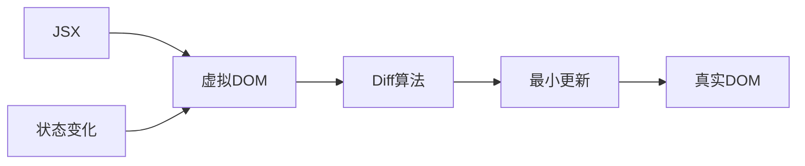

# 谈谈对虚拟DOM的理解

## 一、什么是虚拟DOM

虚拟DOM（Virtual DOM）是一种编程概念，是真实DOM的JavaScript对象表示。它通过JavaScript对象来描述DOM结构，在内存中进行操作，最后批量更新真实DOM。



## 二、虚拟DOM结构

### 基本结构

```javascript
const vnode = {
  type: 'div',
  props: {
    id: 'container',
    className: 'wrapper'
  },
  children: [
    {
      type: 'h1',
      props: {},
      children: 'Hello World'
    },
    {
      type: 'p',
      props: { className: 'text' },
      children: 'This is a paragraph'
    }
  ]
};

// 对应的真实DOM
// <div id="container" class="wrapper">
//   <h1>Hello World</h1>
//   <p class="text">This is a paragraph</p>
// </div>
```

### React中的虚拟DOM

```javascript
const element = (
  <div id="container">
    <h1>Hello World</h1>
    <p className="text">This is a paragraph</p>
  </div>
);

// Babel转译后
const element = React.createElement(
  'div',
  { id: 'container' },
  React.createElement('h1', null, 'Hello World'),
  React.createElement('p', { className: 'text' }, 'This is a paragraph')
);

// 生成的虚拟DOM对象
const vnode = {
  $$typeof: Symbol(react.element),
  type: 'div',
  key: null,
  ref: null,
  props: {
    id: 'container',
    children: [
      {
        $$typeof: Symbol(react.element),
        type: 'h1',
        props: { children: 'Hello World' }
      },
      {
        $$typeof: Symbol(react.element),
        type: 'p',
        props: { className: 'text', children: 'This is a paragraph' }
      }
    ]
  }
};
```

## 三、虚拟DOM的优势

### 1. 性能优化

```javascript
// 传统DOM操作 - 多次重排重绘
const list = document.getElementById('list');
for (let i = 0; i < 1000; i++) {
  const item = document.createElement('li');
  item.textContent = `Item ${i}`;
  list.appendChild(item);  // 每次都触发重排
}

// 虚拟DOM - 批量更新
const vnodes = Array.from({ length: 1000 }, (_, i) => ({
  type: 'li',
  children: `Item ${i}`
}));

render({ type: 'ul', children: vnodes });  // 一次性更新
```

### 2. 跨平台能力

```javascript
// 同一虚拟DOM可渲染到不同平台
const vnode = {
  type: 'View',
  props: { style: { padding: 10 } },
  children: 'Hello'
};

// Web平台
ReactDOM.render(vnode, document.getElementById('root'));

// React Native
AppRegistry.registerComponent('App', () => () => vnode);

// 服务端渲染
ReactDOMServer.renderToString(vnode);
```

### 3. 声明式编程

```jsx
// 声明式 - 描述UI应该是什么样子
const TodoList = ({ items }) => (
  <ul>
    {items.map(item => (
      <li key={item.id}>{item.text}</li>
    ))}
  </ul>
);

// 命令式 - 需要手动操作DOM
const renderTodoList = (items) => {
  const ul = document.getElementById('todoList');
  ul.innerHTML = '';
  items.forEach(item => {
    const li = document.createElement('li');
    li.textContent = item.text;
    ul.appendChild(li);
  });
};
```

## 四、Diff算法

### 1. Diff策略



### 2. Diff过程

```javascript
const diff = (oldVNode, newVNode) => {
  if (!oldVNode) {
    return { type: 'CREATE', newVNode };
  }
  
  if (!newVNode) {
    return { type: 'REMOVE' };
  }
  
  if (oldVNode.type !== newVNode.type) {
    return { type: 'REPLACE', newVNode };
  }
  
  if (oldVNode !== newVNode) {
    return {
      type: 'UPDATE',
      props: diffProps(oldVNode.props, newVNode.props),
      children: diffChildren(oldVNode.children, newVNode.children)
    };
  }
  
  return { type: 'SKIP' };
};
```

### 3. Key的作用

```jsx
// 无Key - 低效的更新
<ul>
  {items.map(item => <li>{item.text}</li>)}
</ul>

// 有Key - 高效的更新
<ul>
  {items.map(item => <li key={item.id}>{item.text}</li>)}
</ul>
```

```javascript
// Key匹配示例
const oldChildren = [
  { type: 'li', key: 'a', children: 'A' },
  { type: 'li', key: 'b', children: 'B' },
  { type: 'li', key: 'c', children: 'C' }
];

const newChildren = [
  { type: 'li', key: 'a', children: 'A' },
  { type: 'li', key: 'c', children: 'C' },
  { type: 'li', key: 'd', children: 'D' }
];

// Diff结果：
// - a: 保持不变
// - b: 删除
// - c: 移动位置
// - d: 新增
```

## 五、简单实现

### 创建虚拟DOM

```javascript
const createElement = (type, props, ...children) => {
  return {
    type,
    props: {
      ...props,
      children: children.map(child =>
        typeof child === 'object' ? child : createTextElement(child)
      )
    }
  };
};

const createTextElement = (text) => {
  return {
    type: 'TEXT_ELEMENT',
    props: {
      nodeValue: text,
      children: []
    }
  };
};

// 使用
const vnode = createElement(
  'div',
  { id: 'container' },
  createElement('h1', null, 'Hello'),
  createElement('p', null, 'World')
);
```

### 渲染虚拟DOM

```javascript
const render = (vnode, container) => {
  const dom =
    vnode.type === 'TEXT_ELEMENT'
      ? document.createTextNode('')
      : document.createElement(vnode.type);

  const isProperty = key => key !== 'children';
  
  Object.keys(vnode.props)
    .filter(isProperty)
    .forEach(name => {
      dom[name] = vnode.props[name];
    });

  vnode.props.children.forEach(child => render(child, dom));

  container.appendChild(dom);
};
```

### Diff与更新

```javascript
const updateElement = (parent, oldVNode, newVNode, index = 0) => {
  const dom = parent.childNodes[index];
  
  if (!oldVNode) {
    parent.appendChild(createDom(newVNode));
  } else if (!newVNode) {
    parent.removeChild(dom);
  } else if (isChanged(oldVNode, newVNode)) {
    parent.replaceChild(createDom(newVNode), dom);
  } else if (newVNode.type) {
    updateProps(dom, oldVNode.props, newVNode.props);
    
    const maxLen = Math.max(
      oldVNode.props.children.length,
      newVNode.props.children.length
    );
    
    for (let i = 0; i < maxLen; i++) {
      updateElement(
        dom,
        oldVNode.props.children[i],
        newVNode.props.children[i],
        i
      );
    }
  }
};

const isChanged = (oldNode, newNode) => {
  return (
    oldNode.type !== newNode.type ||
    (oldNode.type === 'TEXT_ELEMENT' && oldNode.props.nodeValue !== newNode.props.nodeValue)
  );
};
```

## 六、虚拟DOM vs 真实DOM

| 特性 | 虚拟DOM | 真实DOM |
|-----|---------|---------|
| 操作方式 | JavaScript对象操作 | 浏览器API |
| 性能 | 批量更新，减少重排 | 每次操作都可能重排 |
| 内存占用 | 需要额外内存 | 直接操作DOM |
| 跨平台 | 支持 | 仅浏览器 |
| 开发体验 | 声明式 | 命令式 |
| 调试 | 较难直接查看 | 可直接查看 |

## 七、总结



**核心要点：**
1. 虚拟DOM是真实DOM的JavaScript对象表示
2. 通过Diff算法计算最小更新，提高性能
3. 支持跨平台渲染（Web、Native、SSR）
4. 声明式编程，提高开发效率
5. Key用于识别节点，提高Diff效率
