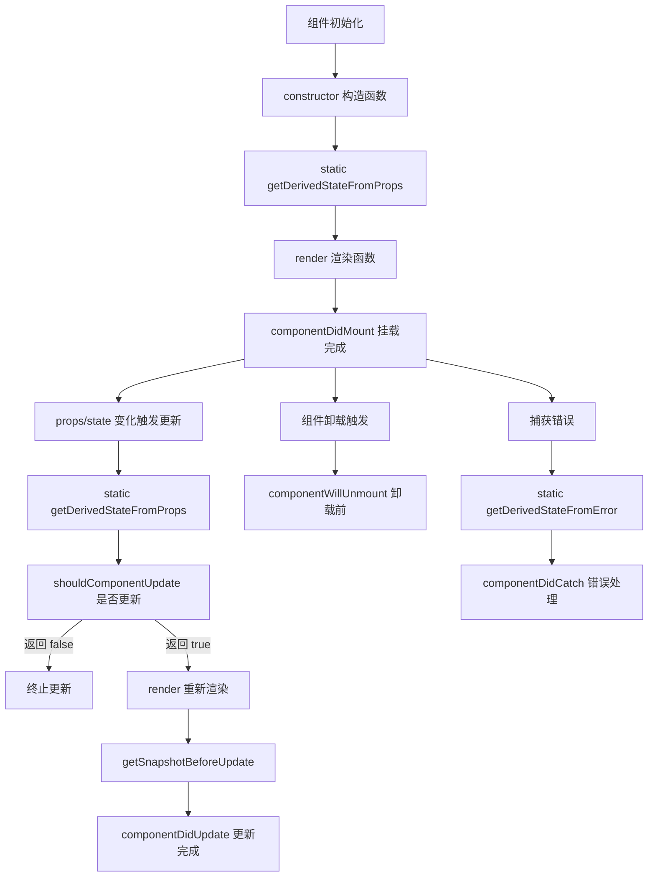
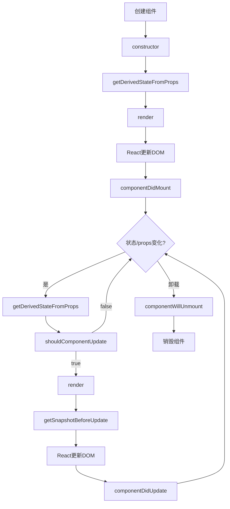

# 谈谈react的生命周期

## 一、生命周期概述

React组件从创建到销毁会经历多个阶段，每个阶段都有对应的生命周期方法。



## 二、挂载阶段（Mounting）

### 1. constructor

```javascript
class MyComponent extends React.Component {
  constructor(props) {
    super(props);
    
    this.state = {
      count: 0,
      data: null
    };
    
    this.handleClick = this.handleClick.bind(this);
  }
  
  handleClick() {
    this.setState({ count: this.state.count + 1 });
  }
}
```

**注意事项：**
- 必须先调用super(props)
- 避免在constructor中调用setState
- 避免将props复制到state

### 2. getDerivedStateFromProps

```javascript
class MyComponent extends React.Component {
  static getDerivedStateFromProps(props, state) {
    if (props.userId !== state.prevUserId) {
      return {
        userId: props.userId,
        prevUserId: props.userId,
        data: null
      };
    }
    return null;
  }
}
```

**使用场景：**
- 根据props更新state
- 返回对象更新state，返回null不更新
- 每次渲染前都会调用

### 3. render

```javascript
class MyComponent extends React.Component {
  render() {
    const { count } = this.state;
    const { name } = this.props;
    
    return (
      <div>
        <h1>Hello, {name}</h1>
        <p>Count: {count}</p>
        <button onClick={this.handleClick}>Increment</button>
      </div>
    );
  }
}
```

**注意事项：**
- 必须是纯函数
- 不能在此调用setState
- 不能与浏览器交互

### 4. componentDidMount

```javascript
class MyComponent extends React.Component {
  componentDidMount() {
    this.fetchData();
    this.initEventListeners();
    this.initThirdPartyLib();
  }
  
  fetchData = async () => {
    const response = await fetch('/api/data');
    const data = await response.json();
    this.setState({ data });
  };
  
  initEventListeners = () => {
    window.addEventListener('resize', this.handleResize);
  };
  
  initThirdPartyLib = () => {
    this.chart = new Chart(this.chartRef.current, {
      type: 'line',
      data: this.props.chartData
    });
  };
}
```

**使用场景：**
- 发起网络请求
- 添加事件监听
- 初始化第三方库
- 操作DOM

## 三、更新阶段（Updating）

### 1. shouldComponentUpdate

```javascript
class MyComponent extends React.Component {
  shouldComponentUpdate(nextProps, nextState) {
    if (nextProps.id !== this.props.id) {
      return true;
    }
    if (nextState.count !== this.state.count) {
      return true;
    }
    return false;
  }
}

// 使用React.PureComponent自动浅比较
class MyComponent extends React.PureComponent {
  // 自动实现shouldComponentUpdate
}
```

**使用场景：**
- 性能优化
- 控制组件是否重新渲染
- 返回false不会阻止子组件更新

### 2. getSnapshotBeforeUpdate

```javascript
class ChatList extends React.Component {
  getSnapshotBeforeUpdate(prevProps, prevState) {
    if (prevProps.messages.length < this.props.messages.length) {
      const list = this.listRef.current;
      return list.scrollHeight - list.scrollTop;
    }
    return null;
  }
  
  componentDidUpdate(prevProps, prevState, snapshot) {
    if (snapshot !== null) {
      const list = this.listRef.current;
      list.scrollTop = list.scrollHeight - snapshot;
    }
  }
  
  listRef = React.createRef();
}
```

**使用场景：**
- 获取更新前的DOM信息
- 保持滚动位置
- 返回值传递给componentDidUpdate

### 3. componentDidUpdate

```javascript
class MyComponent extends React.Component {
  componentDidUpdate(prevProps, prevState) {
    if (this.props.userId !== prevProps.userId) {
      this.fetchUserData(this.props.userId);
    }
    
    if (this.state.count !== prevState.count) {
      document.title = `Count: ${this.state.count}`;
    }
  }
  
  fetchUserData = async (userId) => {
    const response = await fetch(`/api/users/${userId}`);
    const data = await response.json();
    this.setState({ data });
  };
}
```

**注意事项：**
- 必须有条件判断，避免无限循环
- 可以在此调用setState
- 可以进行DOM操作

## 四、卸载阶段（Unmounting）

### componentWillUnmount

```javascript
class MyComponent extends React.Component {
  componentWillUnmount() {
    this.cleanup();
    this.removeEventListeners();
    this.cancelPendingRequests();
  }
  
  cleanup = () => {
    if (this.chart) {
      this.chart.destroy();
    }
    if (this.timer) {
      clearTimeout(this.timer);
    }
  };
  
  removeEventListeners = () => {
    window.removeEventListener('resize', this.handleResize);
    document.removeEventListener('click', this.handleClickOutside);
  };
  
  cancelPendingRequests = () => {
    if (this.abortController) {
      this.abortController.abort();
    }
  };
}
```

**使用场景：**
- 清除定时器
- 取消网络请求
- 移除事件监听
- 清理第三方库实例

## 五、错误处理（Error Handling）

### 1. getDerivedStateFromError

```javascript
class ErrorBoundary extends React.Component {
  constructor(props) {
    super(props);
    this.state = { hasError: false };
  }
  
  static getDerivedStateFromError(error) {
    return { hasError: true };
  }
  
  render() {
    if (this.state.hasError) {
      return <h1>Something went wrong.</h1>;
    }
    return this.props.children;
  }
}
```

### 2. componentDidCatch

```javascript
class ErrorBoundary extends React.Component {
  constructor(props) {
    super(props);
    this.state = { hasError: false, error: null };
  }
  
  static getDerivedStateFromError(error) {
    return { hasError: true };
  }
  
  componentDidCatch(error, errorInfo) {
    console.error('Error caught:', error);
    console.error('Error info:', errorInfo.componentStack);
    
    logErrorToService(error, errorInfo);
  }
  
  render() {
    if (this.state.hasError) {
      return <ErrorFallback error={this.state.error} />;
    }
    return this.props.children;
  }
}
```

## 六、函数组件的生命周期

### 使用Hooks实现

```javascript
const MyComponent = ({ userId }) => {
  const [data, setData] = useState(null);
  const [count, setCount] = useState(0);
  
  // componentDidMount
  useEffect(() => {
    console.log('Component mounted');
    fetchData(userId);
    
    // componentWillUnmount
    return () => {
      console.log('Component will unmount');
      cleanup();
    };
  }, []);
  
  // componentDidUpdate (userId变化时)
  useEffect(() => {
    console.log('userId changed:', userId);
    fetchData(userId);
  }, [userId]);
  
  // componentDidUpdate (count变化时)
  useEffect(() => {
    console.log('count changed:', count);
    document.title = `Count: ${count}`;
  }, [count]);
  
  const fetchData = async (id) => {
    const response = await fetch(`/api/data/${id}`);
    const result = await response.json();
    setData(result);
  };
  
  return (
    <div>
      <p>Count: {count}</p>
      <button onClick={() => setCount(c => c + 1)}>Increment</button>
    </div>
  );
};
```

### useLayoutEffect

```javascript
const MyComponent = () => {
  const boxRef = useRef(null);
  
  useLayoutEffect(() => {
    // 在DOM更新后同步执行
    // 类似于componentDidMount/componentDidUpdate
    const box = boxRef.current;
    const { width } = box.getBoundingClientRect();
    box.style.left = `${(window.innerWidth - width) / 2}px`;
  }, []);
  
  return <div ref={boxRef}>Centered Box</div>;
};
```

## 七、生命周期流程图



## 八、新旧生命周期对比

| 旧版生命周期 | 新版生命周期 | 状态 |
|-------------|-------------|------|
| componentWillMount | getDerivedStateFromProps | 废弃 |
| componentWillReceiveProps | getDerivedStateFromProps | 废弃 |
| componentWillUpdate | getSnapshotBeforeUpdate | 废弃 |
| componentDidMount | componentDidMount | 保留 |
| shouldComponentUpdate | shouldComponentUpdate | 保留 |
| componentDidUpdate | componentDidUpdate | 保留 |
| componentWillUnmount | componentWillUnmount | 保留 |

## 九、总结

| 阶段 | 方法 | 用途 |
|-----|------|------|
| 挂载 | constructor | 初始化state、绑定方法 |
| 挂载 | getDerivedStateFromProps | 根据props更新state |
| 挂载 | render | 渲染UI |
| 挂载 | componentDidMount | 网络请求、DOM操作 |
| 更新 | shouldComponentUpdate | 性能优化 |
| 更新 | getSnapshotBeforeUpdate | 获取更新前DOM信息 |
| 更新 | componentDidUpdate | 响应更新 |
| 卸载 | componentWillUnmount | 清理工作 |

**核心要点：**
1. 挂载阶段：constructor → getDerivedStateFromProps → render → componentDidMount
2. 更新阶段：getDerivedStateFromProps → shouldComponentUpdate → render → getSnapshotBeforeUpdate → componentDidUpdate
3. 卸载阶段：componentWillUnmount
4. 函数组件使用useEffect模拟生命周期
5. 避免使用废弃的生命周期方法
