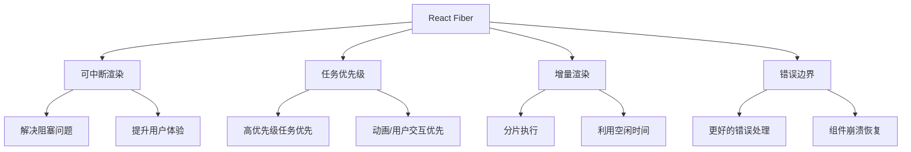
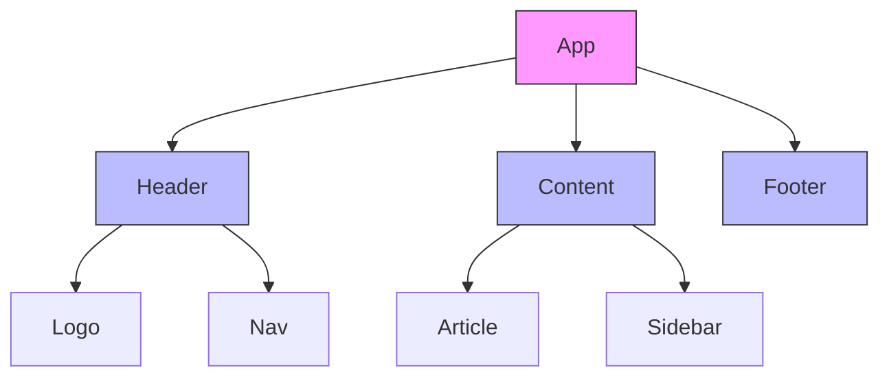
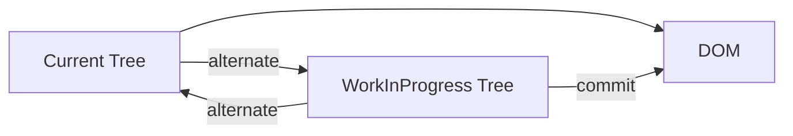
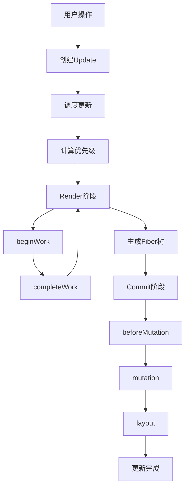

# 什么是React Fiber

## 一、Fiber概述

React Fiber是React 16引入的新协调算法，是对React核心算法的重写。它的目标是提高React在动画、布局和交互等领域的表现。



## 二、为什么需要Fiber

### 旧版Stack Reconciler的问题

```javascript
// 旧版React：同步递归遍历
function reconcile(children) {
  children.forEach(child => {
    reconcile(child.children);  // 递归调用，无法中断
  });
}

// 问题：大量组件更新时，主线程被长时间阻塞
// 导致：动画卡顿、输入无响应、用户体验差
```

### Fiber的解决方案

```javascript
// Fiber：可中断的链表遍历
function workLoop(deadline) {
  while (nextUnitOfWork && deadline.timeRemaining() > 0) {
    nextUnitOfWork = performUnitOfWork(nextUnitOfWork);
  }
  
  if (nextUnitOfWork) {
    requestIdleCallback(workLoop);
  }
}

// 优势：可以暂停、恢复、优先级调度
```

## 三、Fiber结构

### Fiber节点

```javascript
const fiber = {
  type: 'div',                    // 元素类型
  key: null,                      // key
  props: {                        // 属性
    children: []
  },
  
  stateNode: document.createElement('div'),  // DOM节点或组件实例
  
  // Fiber链表结构
  return: parentFiber,            // 父节点
  child: firstChildFiber,         // 第一个子节点
  sibling: nextSiblingFiber,      // 下一个兄弟节点
  
  // 状态
  memoizedState: null,            // Hook链表
  memoizedProps: null,            // 上一次的props
  pendingProps: {},               // 新的props
  
  // 副作用
  flags: 0,                       // 副作用标记
  lanes: 0,                       // 优先级
  
  // 双缓存
  alternate: oldFiber             // 指向另一棵树的对应节点
};
```

### Fiber树结构



```javascript
// 链表遍历方式
const traverseFiber = (fiber) => {
  if (fiber.child) {
    traverseFiber(fiber.child);
  }
  if (fiber.sibling) {
    traverseFiber(fiber.sibling);
  }
};
```

## 四、Fiber工作流程

### 双缓存机制



```javascript
// 双缓存：current和workInProgress
const current = fiber;
const workInProgress = fiber.alternate;

// 渲染完成后交换
function commitRoot() {
  root.current = finishedWork;  // 切换指针
}
```

### 工作循环

```javascript
function workLoopConcurrent() {
  while (workInProgress !== null && !shouldYield()) {
    workInProgress = performUnitOfWork(workInProgress);
  }
}

function performUnitOfWork(unitOfWork) {
  const current = unitOfWork.alternate;
  
  // 1. beginWork: 处理当前节点
  let next = beginWork(current, unitOfWork);
  
  if (next === null) {
    // 2. completeWork: 完成当前节点，处理兄弟节点
    next = completeUnitOfWork(unitOfWork);
  }
  
  return next;
}
```

### 渲染阶段和提交阶段

```javascript
// 渲染阶段（可中断）
function renderPhase() {
  while (workInProgress) {
    workInProgress = performUnitOfWork(workInProgress);
    if (shouldYield()) {
      // 让出控制权，稍后继续
      return;
    }
  }
}

// 提交阶段（不可中断）
function commitPhase() {
  commitMutationEffects(root, finishedWork);
  root.current = finishedWork;
}
```

## 五、优先级调度

### Lane模型

```javascript
// 优先级车道
const SyncLane = 1;              // 同步优先级
const InputContinuousLane = 2;   // 连续输入优先级
const DefaultLane = 4;           // 默认优先级
const IdleLane = 8;              // 空闲优先级

// 获取最高优先级
function getHighestPriorityLane(lanes) {
  return lanes & -lanes;
}
```

### 优先级使用示例

```javascript
// 高优先级：用户输入
inputElement.addEventListener('input', (e) => {
  ReactDOM.flushSync(() => {
    setState(e.target.value);
  });
});

// 低优先级：数据预取
startTransition(() => {
  fetchSuggestions(input);
});
```

### useTransition

```javascript
const App = () => {
  const [isPending, startTransition] = useTransition();
  const [query, setQuery] = useState('');
  const [results, setResults] = useState([]);
  
  const handleChange = (e) => {
    // 高优先级：立即更新输入框
    setQuery(e.target.value);
    
    // 低优先级：延迟更新搜索结果
    startTransition(() => {
      setResults(filterResults(e.target.value));
    });
  };
  
  return (
    <div>
      <input value={query} onChange={handleChange} />
      {isPending ? <Spinner /> : <ResultList results={results} />}
    </div>
  );
};
```

### useDeferredValue

```javascript
const App = () => {
  const [query, setQuery] = useState('');
  const deferredQuery = useDeferredValue(query);
  
  return (
    <div>
      <input value={query} onChange={e => setQuery(e.target.value)} />
      <SearchResults query={deferredQuery} />
    </div>
  );
};
```

## 六、Fiber与Hooks

### Hook链表

```javascript
// Fiber节点中的Hook链表
fiber.memoizedState = {
  memoizedState: null,    // 状态值
  queue: null,            // 更新队列
  next: {                 // 下一个Hook
    memoizedState: null,
    queue: null,
    next: null
  }
};
```

### useState实现

```javascript
const useState = (initialState) => {
  const fiber = currentlyRenderingFiber;
  const hook = updateWorkInProgressHook();
  
  if (fiber.alternate === null) {
    // 首次渲染
    hook.memoizedState = initialState;
  }
  
  const dispatch = (action) => {
    const update = { action, next: null };
    const queue = hook.queue;
    
    if (queue.pending === null) {
      update.next = update;
    } else {
      update.next = queue.pending.next;
      queue.pending.next = update;
    }
    queue.pending = update;
    
    scheduleUpdateOnFiber(fiber);
  };
  
  return [hook.memoizedState, dispatch];
};
```

## 七、Fiber的优势

### 1. 可中断渲染

```javascript
// 旧版：阻塞主线程
function oldReconcile() {
  // 大量计算...
  // 用户无法交互
}

// Fiber：可中断
function fiberReconcile() {
  while (work && !shouldYield()) {
    work = performWork(work);
  }
  if (work) {
    requestIdleCallback(fiberReconcile);
  }
}
```

### 2. 优先级调度

```javascript
// 用户输入优先于数据加载
ReactDOM.flushSync(() => {
  setUserInput(value);  // 高优先级
});

startTransition(() => {
  updateBigList(value);  // 低优先级
});
```

### 3. 渐进式渲染

```javascript
// 大列表分批渲染
const LargeList = ({ items }) => {
  const [visibleItems, setVisibleItems] = useState([]);
  
  useEffect(() => {
    let index = 0;
    const renderBatch = () => {
      setVisibleItems(prev => [...prev, ...items.slice(index, index + 10)]);
      index += 10;
      if (index < items.length) {
        requestIdleCallback(renderBatch);
      }
    };
    renderBatch();
  }, [items]);
  
  return visibleItems.map(item => <Item key={item.id} {...item} />);
};
```

## 八、Fiber架构总结



## 九、总结

| 特性 | 说明 |
|-----|------|
| 可中断渲染 | 解决主线程阻塞问题 |
| 优先级调度 | 高优先级任务优先执行 |
| 双缓存 | current树和workInProgress树 |
| 增量渲染 | 分片执行，利用空闲时间 |
| Lane模型 | 新的优先级管理机制 |

**核心要点：**
1. Fiber是React 16引入的新协调算法
2. 解决了旧版Stack Reconciler的阻塞问题
3. 采用链表结构，支持可中断遍历
4. 双缓存机制提高渲染效率
5. Lane模型实现优先级调度
6. useTransition和useDeferredValue用于处理低优先级更新
