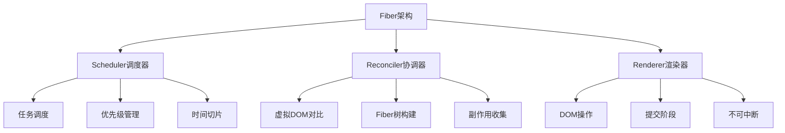
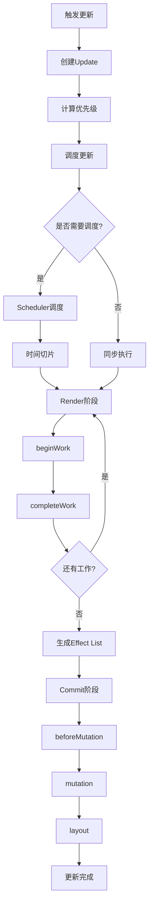

# React Fiber是什么样的架构

## 一、Fiber架构概述

React Fiber架构是一个基于链表的可中断、可恢复的协调架构，它将同步的递归更新改为异步的可中断更新。



## 二、架构分层

### 1. Scheduler（调度器）

```javascript
// 调度器核心实现
const Scheduler = {
  workInProgressRoot: null,
  workInProgress: null,
  
  scheduleCallback(priorityLevel, callback) {
    const newTask = {
      id: taskIdCounter++,
      callback,
      priorityLevel,
      startTime: currentTime,
      expirationTime: currentTime + timeout
    };
    
    push(taskQueue, newTask);
    requestHostCallback(flushWork);
  },
  
  workLoop(initialTime) {
    let currentTime = initialTime;
    
    while (taskQueue.length > 0) {
      const currentTask = peek(taskQueue);
      
      if (currentTask.expirationTime <= currentTime) {
        const callback = currentTask.callback;
        const continuation = callback(didUserCallbackTimeout);
        
        if (typeof continuation === 'function') {
          currentTask.callback = continuation;
        } else {
          pop(taskQueue);
        }
      }
      
      currentTime = getCurrentTime();
      
      if (shouldYieldToHost()) {
        break;
      }
    }
  }
};
```

### 2. Reconciler（协调器）

```javascript
// 协调器核心实现
const Reconciler = {
  beginWork(current, workInProgress, renderLanes) {
    switch (workInProgress.tag) {
      case FunctionComponent:
        return updateFunctionComponent(current, workInProgress, renderLanes);
      case ClassComponent:
        return updateClassComponent(current, workInProgress, renderLanes);
      case HostComponent:
        return updateHostComponent(current, workInProgress, renderLanes);
      case HostText:
        return updateHostText(current, workInProgress);
    }
  },
  
  completeWork(current, workInProgress, renderLanes) {
    const newProps = workInProgress.pendingProps;
    
    switch (workInProgress.tag) {
      case HostComponent: {
        const type = workInProgress.type;
        
        if (current !== null && workInProgress.stateNode != null) {
          updateHostComponent(current, workInProgress, type, newProps);
        } else {
          const instance = createInstance(type, newProps);
          appendAllChildren(instance, workInProgress);
          workInProgress.stateNode = instance;
        }
        break;
      }
    }
  }
};
```

### 3. Renderer（渲染器）

```javascript
// 渲染器核心实现
const Renderer = {
  commitRoot(root) {
    const finishedWork = root.finishedWork;
    
    // beforeMutation阶段
    commitBeforeMutationEffects(finishedWork);
    
    // mutation阶段
    commitMutationEffects(finishedWork);
    
    // layout阶段
    commitLayoutEffects(finishedWork);
    
    root.current = finishedWork;
  },
  
  commitMutationEffects(finishedWork) {
    const flags = finishedWork.flags;
    
    if (flags & Placement) {
      commitPlacement(finishedWork);
    }
    if (flags & Update) {
      commitUpdate(finishedWork);
    }
    if (flags & ChildDeletion) {
      commitDeletion(finishedWork);
    }
  }
};
```

## 三、Fiber节点架构

### 节点类型

```javascript
// 工作标签
const WorkTag = {
  FunctionComponent: 0,
  ClassComponent: 1,
  IndeterminateComponent: 2,
  HostRoot: 3,
  HostPortal: 4,
  HostComponent: 5,
  HostText: 6,
  Fragment: 7,
  Mode: 8,
  ContextConsumer: 9,
  ContextProvider: 10,
  ForwardRef: 11,
  Profiler: 12,
  SuspenseComponent: 13,
  MemoComponent: 14,
  SimpleMemoComponent: 15,
  LazyComponent: 16
};
```

### 副作用标记

```javascript
// 副作用标志
const Flags = {
  NoFlags: 0b000000000000000000,
  PerformedWork: 0b000000000000000001,
  Placement: 0b000000000000000010,
  Update: 0b000000000000000100,
  ChildDeletion: 0b000000000000001000,
  ContentReset: 0b000000000000010000,
  Callback: 0b000000000000100000,
  DidCapture: 0b000000000001000000,
  Ref: 0b000000000010000000,
  Snapshot: 0b000000000100000000,
  Passive: 0b000000001000000000,
  Hydrating: 0b000000010000000000
};
```

### 完整Fiber结构

```javascript
const createFiber = (tag, pendingProps, key) => {
  return {
    tag,                              // 组件类型
    key,                              // key
    elementType: null,                // 元素类型
    type: null,                       // 异步组件resolved后的类型
    stateNode: null,                  // DOM节点或组件实例
    
    // Fiber树结构
    return: null,                     // 父节点
    child: null,                      // 第一个子节点
    sibling: null,                    // 下一个兄弟节点
    index: 0,                         // 在父节点中的索引
    
    // 状态
    pendingProps,                     // 新的props
    memoizedProps: null,              // 上一次的props
    updateQueue: null,                // 更新队列
    memoizedState: null,              // 上一次的state/Hook链表
    dependencies: null,               // 依赖
    
    // 副作用
    flags: NoFlags,                   // 副作用标记
    subtreeFlags: NoFlags,            // 子树副作用
    deletions: null,                  // 要删除的子节点
    
    // 优先级
    lanes: NoLanes,                   // 优先级
    childLanes: NoLanes,              // 子节点优先级
    
    // 双缓存
    alternate: null                   // 指向另一棵树的对应节点
  };
};
```

## 四、更新队列架构

### 更新结构

```javascript
const createUpdate = (eventTime, lane) => {
  return {
    eventTime,                        // 事件时间
    lane,                             // 优先级
    tag: UpdateState,                 // 更新类型
    payload: null,                    // 更新内容
    callback: null,                   // 回调函数
    next: null                        // 下一个更新
  };
};
```

### 更新队列

```javascript
const createUpdateQueue = (initialState) => {
  return {
    baseState: initialState,          // 基础状态
    firstBaseUpdate: null,            // 第一个基础更新
    lastBaseUpdate: null,             // 最后一个基础更新
    shared: {
      pending: null                   // 待处理的更新（环形链表）
    },
    effects: null                     // 有回调的更新
  };
};

// 添加更新到队列
const enqueueUpdate = (fiber, update) => {
  const updateQueue = fiber.updateQueue;
  const sharedQueue = updateQueue.shared;
  const pending = sharedQueue.pending;
  
  if (pending === null) {
    update.next = update;
  } else {
    update.next = pending.next;
    pending.next = update;
  }
  
  sharedQueue.pending = update;
};
```

### 处理更新队列

```javascript
const processUpdateQueue = (workInProgress, props, instance, renderLanes) => {
  const queue = workInProgress.updateQueue;
  
  let firstBaseUpdate = queue.firstBaseUpdate;
  let lastBaseUpdate = queue.lastBaseUpdate;
  let pendingQueue = queue.shared.pending;
  
  if (pendingQueue !== null) {
    queue.shared.pending = null;
    
    const lastPendingUpdate = pendingQueue;
    const firstPendingUpdate = lastPendingUpdate.next;
    lastPendingUpdate.next = null;
    
    if (lastBaseUpdate === null) {
      firstBaseUpdate = firstPendingUpdate;
    } else {
      lastBaseUpdate.next = firstPendingUpdate;
    }
    lastBaseUpdate = lastPendingUpdate;
  }
  
  if (firstBaseUpdate !== null) {
    let newState = queue.baseState;
    let newLanes = NoLanes;
    let newBaseState = null;
    let newFirstBaseUpdate = null;
    let newLastBaseUpdate = null;
    let update = firstBaseUpdate;
    
    do {
      const updateLane = update.lane;
      
      if (!isSubsetOfLanes(renderLanes, updateLane)) {
        const clone = {
          lane: updateLane,
          payload: update.payload,
          callback: update.callback,
          next: null
        };
        
        if (newLastBaseUpdate === null) {
          newFirstBaseUpdate = newLastBaseUpdate = clone;
          newBaseState = newState;
        } else {
          newLastBaseUpdate = newLastBaseUpdate.next = clone;
        }
        newLanes = mergeLanes(newLanes, updateLane);
      } else {
        if (newLastBaseUpdate !== null) {
          const clone = {
            lane: NoLane,
            payload: update.payload,
            callback: update.callback,
            next: null
          };
          newLastBaseUpdate = newLastBaseUpdate.next = clone;
        }
        
        newState = getStateFromUpdate(
          workInProgress,
          queue,
          update,
          newState,
          props,
          instance
        );
      }
      
      update = update.next;
    } while (update !== null);
    
    queue.baseState = newBaseState;
    queue.firstBaseUpdate = newFirstBaseUpdate;
    queue.lastBaseUpdate = newLastBaseUpdate;
    workInProgress.lanes = newLanes;
    workInProgress.memoizedState = newState;
  }
};
```

## 五、调度架构

### Lane优先级模型

```javascript
// 优先级车道
const TotalLanes = 31;

const NoLanes = 0b0000000000000000000000000000000;
const SyncLane = 0b0000000000000000000000000000001;
const InputContinuousHydrationLane = 0b0000000000000000000000000000010;
const InputContinuousLane = 0b0000000000000000000000000000100;
const DefaultHydrationLane = 0b0000000000000000000000000001000;
const DefaultLane = 0b0000000000000000000000000010000;
const TransitionHydrationLane = 0b0000000000000000000000000100000;
const TransitionLanes = 0b0000000001111111111111111000000;
const RetryLanes = 0b0000011110000000000000000000000;
const SomeRetryLane = 0b0000010000000000000000000000000;
const SelectiveHydrationLane = 0b0000100000000000000000000000000;
const IdleHydrationLane = 0b0001000000000000000000000000000;
const IdleLane = 0b0010000000000000000000000000000;
const OffscreenLane = 0b0100000000000000000000000000000;
```

### 优先级计算

```javascript
// 获取最高优先级车道
const getHighestPriorityLane = (lanes) => {
  return lanes & -lanes;
};

// 合并优先级
const mergeLanes = (a, b) => {
  return a | b;
};

// 判断是否包含优先级
const isSubsetOfLanes = (set, subset) => {
  return (set & subset) === subset;
};

// 移除优先级
const removeLanes = (set, subset) => {
  return set & ~subset;
};
```

## 六、Effect List架构

### 副作用链表

```javascript
// 收集副作用
const collectEffects = (completedWork) => {
  const flags = completedWork.flags;
  
  if (flags !== NoFlags) {
    // 将当前节点添加到副作用链表
    if (returnFiber.firstEffect === null) {
      returnFiber.firstEffect = completedWork;
    } else {
      returnFiber.lastEffect.nextEffect = completedWork;
    }
    returnFiber.lastEffect = completedWork;
  }
  
  // 合并子节点的副作用
  if (childHasEffects) {
    if (returnFiber.firstEffect === null) {
      returnFiber.firstEffect = completedWork.firstEffect;
    } else {
      returnFiber.lastEffect.nextEffect = completedWork.firstEffect;
    }
    returnFiber.lastEffect = completedWork.lastEffect;
  }
};
```

## 七、架构流程图



## 八、总结

| 层次 | 职责 | 特点 |
|-----|------|------|
| Scheduler | 任务调度 | 可中断、优先级管理 |
| Reconciler | 协调更新 | 可中断、生成副作用 |
| Renderer | 渲染DOM | 不可中断、原子操作 |

**核心要点：**
1. Fiber架构分为三层：Scheduler、Reconciler、Renderer
2. 采用链表结构实现可中断遍历
3. Lane模型实现优先级调度
4. 双缓存机制提高渲染效率
5. 更新队列采用环形链表
6. Effect List收集副作用，批量提交
