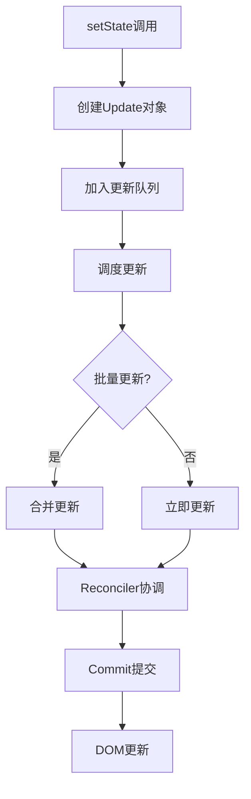
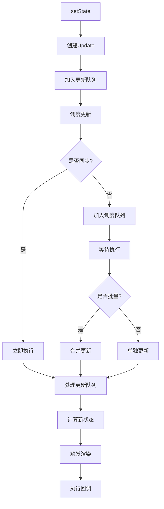

# setState原理分析

## 一、setState概述

setState是React组件更新状态的核心方法，它触发组件的重新渲染。理解setState的工作原理对于优化React应用性能至关重要。



## 二、setState使用方式

### 1. 对象式更新

```javascript
class Counter extends React.Component {
  state = { count: 0 };
  
  handleClick = () => {
    this.setState({ count: this.state.count + 1 });
  };
}
```

### 2. 函数式更新

```javascript
class Counter extends React.Component {
  state = { count: 0 };
  
  handleClick = () => {
    this.setState((prevState, props) => ({
      count: prevState.count + 1
    }));
  };
}
```

### 3. 回调函数

```javascript
class Counter extends React.Component {
  state = { count: 0 };
  
  handleClick = () => {
    this.setState(
      { count: this.state.count + 1 },
      () => {
        console.log('更新完成:', this.state.count);
      }
    );
  };
}
```

## 三、setState实现原理

### 1. 基本实现

```javascript
Component.prototype.setState = function(partialState, callback) {
  this.updater.enqueueSetState(this, partialState, callback, 'setState');
};

// updater实现
const classComponentUpdater = {
  enqueueSetState(inst, payload, callback) {
    const fiber = ReactInstanceMap.get(inst);
    const currentTime = requestCurrentTime();
    const lane = requestUpdateLane(fiber);
    
    const update = createUpdate(currentTime, lane);
    update.payload = payload;
    
    if (callback !== undefined && callback !== null) {
      update.callback = callback;
    }
    
    enqueueUpdate(fiber, update);
    scheduleUpdateOnFiber(fiber, lane);
  }
};
```

### 2. 创建Update对象

```javascript
const createUpdate = (eventTime, lane) => {
  return {
    eventTime,
    lane,
    tag: UpdateState,
    payload: null,
    callback: null,
    next: null
  };
};

const UpdateState = 0;
const ReplaceState = 1;
const ForceUpdate = 2;
const CaptureUpdate = 3;
```

### 3. 更新队列

```javascript
const enqueueUpdate = (fiber, update) => {
  const updateQueue = fiber.updateQueue;
  
  if (updateQueue === null) {
    return;
  }
  
  const sharedQueue = updateQueue.shared;
  const pending = sharedQueue.pending;
  
  if (pending === null) {
    update.next = update;
  } else {
    update.next = pending.next;
    pending.next = update;
  }
  
  sharedQueue.pending = update;
};
```

## 四、批量更新机制

### 1. 批量更新原理

```javascript
let isBatchingUpdates = false;
let isUnbatchingUpdates = false;
let batchedUpdates = null;
let executionContext = NoContext;

const NoContext = 0b000;
const BatchedContext = 0b001;
const LegacyUnbatchedContext = 0b010;

const batchedUpdatesImpl = (fn, a) => {
  const prevExecutionContext = executionContext;
  executionContext |= BatchedContext;
  
  try {
    return fn(a);
  } finally {
    executionContext = prevExecutionContext;
    
    if (executionContext === NoContext) {
      flushSyncCallbacks();
    }
  }
};
```

### 2. 批量更新示例

```javascript
class Counter extends React.Component {
  state = { count: 0 };
  
  handleClick = () => {
    console.log('初始:', this.state.count);  // 0
    
    this.setState({ count: this.state.count + 1 });
    console.log('第一次:', this.state.count);  // 0
    
    this.setState({ count: this.state.count + 1 });
    console.log('第二次:', this.state.count);  // 0
    
    this.setState({ count: this.state.count + 1 });
    console.log('第三次:', this.state.count);  // 0
  };
  
  render() {
    return <button onClick={this.handleClick}>{this.state.count}</button>;
  }
}

// 最终渲染: 1（而不是3）
```

### 3. 函数式更新解决批量问题

```javascript
class Counter extends React.Component {
  state = { count: 0 };
  
  handleClick = () => {
    this.setState(prev => ({ count: prev.count + 1 }));
    this.setState(prev => ({ count: prev.count + 1 }));
    this.setState(prev => ({ count: prev.count + 1 }));
  };
  
  render() {
    return <button onClick={this.handleClick}>{this.state.count}</button>;
  }
}

// 最终渲染: 3
```

## 五、更新队列处理

### 1. 处理更新

```javascript
const processUpdateQueue = (workInProgress, props, instance, renderLanes) => {
  const queue = workInProgress.updateQueue;
  let firstBaseUpdate = queue.firstBaseUpdate;
  let lastBaseUpdate = queue.lastBaseUpdate;
  
  let pendingQueue = queue.shared.pending;
  
  if (pendingQueue !== null) {
    queue.shared.pending = null;
    
    const lastPendingUpdate = pendingQueue;
    const firstPendingUpdate = lastPendingUpdate.next;
    lastPendingUpdate.next = null;
    
    if (lastBaseUpdate === null) {
      firstBaseUpdate = firstPendingUpdate;
    } else {
      lastBaseUpdate.next = firstPendingUpdate;
    }
    lastBaseUpdate = lastPendingUpdate;
  }
  
  if (firstBaseUpdate !== null) {
    let newState = queue.baseState;
    let update = firstBaseUpdate;
    
    do {
      const updateLane = update.lane;
      
      if (isSubsetOfLanes(renderLanes, updateLane)) {
        if (update.tag === UpdateState) {
          const payload = update.payload;
          let partialState;
          
          if (typeof payload === 'function') {
            partialState = payload.call(instance, newState, props);
          } else {
            partialState = payload;
          }
          
          if (partialState !== null && partialState !== undefined) {
            newState = Object.assign({}, newState, partialState);
          }
        }
      }
      
      update = update.next;
    } while (update !== null);
    
    workInProgress.memoizedState = newState;
  }
};
```

### 2. 计算新状态

```javascript
const getStateFromUpdate = (workInProgress, queue, update, prevState, nextProps, instance) => {
  switch (update.tag) {
    case UpdateState: {
      const payload = update.payload;
      let partialState;
      
      if (typeof payload === 'function') {
        partialState = payload.call(instance, prevState, nextProps);
      } else {
        partialState = payload;
      }
      
      if (partialState === null || partialState === undefined) {
        return prevState;
      }
      
      return Object.assign({}, prevState, partialState);
    }
    
    case ReplaceState: {
      const payload = update.payload;
      
      if (typeof payload === 'function') {
        return payload.call(instance, prevState, nextProps);
      }
      
      return payload;
    }
    
    case ForceUpdate: {
      return prevState;
    }
  }
  
  return prevState;
};
```

## 六、同步与异步更新

### 1. 异步更新（默认）

```javascript
// React 18之前：在React事件和生命周期中自动批量更新
class Example extends React.Component {
  state = { count: 0 };
  
  handleClick = () => {
    // 批量更新
    this.setState({ count: 1 });
    this.setState({ count: 2 });
    console.log(this.state.count);  // 0
  };
}

// React 18：所有更新都自动批量处理
setTimeout(() => {
  this.setState({ count: 1 });
  this.setState({ count: 2 });
  console.log(this.state.count);  // React 18之前: 2, React 18: 2
}, 0);
```

### 2. 同步更新（flushSync）

```javascript
import { flushSync } from 'react-dom';

class Example extends React.Component {
  state = { count: 0 };
  
  handleClick = () => {
    flushSync(() => {
      this.setState({ count: 1 });
    });
    console.log(this.state.count);  // 1
    
    flushSync(() => {
      this.setState({ count: 2 });
    });
    console.log(this.state.count);  // 2
  };
}
```

### 3. flushSync实现

```javascript
const flushSync = (fn) => {
  const previousPriority = getCurrentUpdatePriority();
  const prevExecutionContext = executionContext;
  
  executionContext |= BatchedContext;
  setCurrentUpdatePriority(DiscreteEventPriority);
  
  try {
    return fn();
  } finally {
    setCurrentUpdatePriority(previousPriority);
    executionContext = prevExecutionContext;
    flushSyncCallbacks();
  }
};
```

## 七、优先级与中断

### 1. 不同优先级的更新

```javascript
class Example extends React.Component {
  state = { count: 0, text: '' };
  
  handleInput = (e) => {
    // 高优先级：用户输入
    this.setState({ text: e.target.value });
    
    // 低优先级：搜索结果
    startTransition(() => {
      this.setState({ results: filterResults(e.target.value) });
    });
  };
}
```

### 2. 更新中断与恢复

```javascript
// 高优先级更新可以中断低优先级更新
const scheduleUpdateOnFiber = (fiber, lane) => {
  const root = markUpdateLaneFromFiberToRoot(fiber, lane);
  
  if (lane === SyncLane) {
    // 同步更新，立即执行
    ensureRootIsScheduled(root);
  } else {
    // 异步更新，调度执行
    ensureRootIsScheduled(root);
  }
};
```

## 八、setState流程图



## 九、最佳实践

### 1. 使用函数式更新

```javascript
// 不推荐
this.setState({ count: this.state.count + 1 });

// 推荐
this.setState(prev => ({ count: prev.count + 1 }));
```

### 2. 避免不必要的setState

```javascript
shouldComponentUpdate(nextProps, nextState) {
  if (this.state.count === nextState.count) {
    return false;
  }
  return true;
}

// 或使用PureComponent
class Counter extends React.PureComponent {
  // 自动浅比较
}
```

### 3. 状态下沉

```javascript
// 不推荐：状态提升过高
class App extends React.Component {
  state = {
    user: {},
    settings: {},
    modalOpen: false
  };
}

// 推荐：状态就近管理
const Modal = () => {
  const [isOpen, setIsOpen] = useState(false);
  // ...
};
```

## 十、总结

| 特性 | 说明 |
|-----|------|
| 批量更新 | 多个setState合并为一次更新 |
| 异步更新 | 默认异步，不立即更新状态 |
| 函数式更新 | 基于前一个状态计算新状态 |
| flushSync | 强制同步更新 |
| 优先级 | 高优先级更新可中断低优先级 |

**核心要点：**
1. setState创建Update对象加入更新队列
2. React通过批量更新机制优化性能
3. 函数式更新可以避免批量更新的问题
4. React 18默认对所有更新进行批处理
5. flushSync可以强制同步更新
6. 优先级调度实现更好的用户体验
