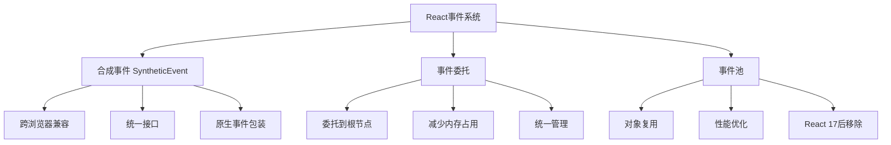
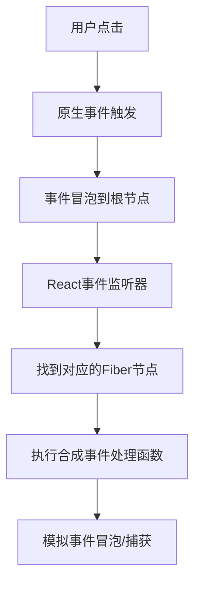
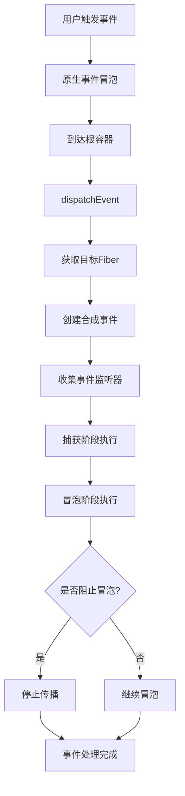

# 谈谈你对React事件的理解，合成事件原理

## 一、React事件概述

React事件是React对浏览器原生事件的跨浏览器封装，它实现了统一的事件接口，解决了浏览器兼容性问题。



## 二、合成事件（SyntheticEvent）

### 1. 什么是合成事件

```javascript
const handleClick = (e) => {
  console.log(e);  // SyntheticBaseEvent
  
  console.log(e.type);        // 'click'
  console.log(e.target);      // 实际触发元素
  console.log(e.currentTarget); // 绑定事件的元素
  
  e.preventDefault();  // 阻止默认行为
  e.stopPropagation(); // 阻止冒泡
};
```

### 2. 合成事件结构

```javascript
const SyntheticEvent = {
  type: 'click',
  target: element,
  currentTarget: element,
  nativeEvent: nativeEvent,  // 原生事件对象
  isDefaultPrevented: false,
  isPropagationStopped: false,
  
  preventDefault() {
    const event = this.nativeEvent;
    if (event.preventDefault) {
      event.preventDefault();
    } else {
      event.returnValue = false;
    }
    this.isDefaultPrevented = true;
  },
  
  stopPropagation() {
    const event = this.nativeEvent;
    if (event.stopPropagation) {
      event.stopPropagation();
    } else {
      event.cancelBubble = true;
    }
    this.isPropagationStopped = true;
  },
  
  persist() {
    this.isPersistent = true;
  }
};
```

### 3. 事件属性

```javascript
const EventInterface = {
  type: null,
  target: null,
  currentTarget: () => null,
  eventPhase: null,
  bubbles: null,
  cancelable: null,
  timeStamp: null,
  defaultPrevented: null,
  isTrusted: null
};

const MouseEventInterface = {
  ...EventInterface,
  screenX: null,
  screenY: null,
  clientX: null,
  clientY: null,
  ctrlKey: null,
  shiftKey: null,
  altKey: null,
  metaKey: null,
  button: null,
  buttons: null,
  relatedTarget: null
};
```

## 三、事件委托机制

### 1. 事件委托原理



### 2. React 17之前

```javascript
// 事件委托到document
document.addEventListener('click', dispatchEvent);
document.addEventListener('change', dispatchEvent);
// ...

// 问题：多个React应用共存时事件冲突
```

### 3. React 17及之后

```javascript
// 事件委托到根容器
const root = document.getElementById('root');
root.addEventListener('click', dispatchEvent);

// 优势：支持多个React应用共存
```

### 4. 事件监听注册

```javascript
const allNativeEvents = new Set([
  'abort', 'animationend', 'animationiteration', 'animationstart',
  'blur', 'canplay', 'canplaythrough', 'change', 'click',
  'contextmenu', 'copy', 'cut', 'dblclick', 'drag', 'dragend',
  'dragenter', 'dragexit', 'dragleave', 'dragover', 'dragstart',
  'drop', 'durationchange', 'emptied', 'encrypted', 'ended',
  'error', 'focus', 'gotpointercapture', 'input', 'invalid',
  'keydown', 'keypress', 'keyup', 'load', 'loadeddata',
  'loadedmetadata', 'loadstart', 'lostpointercapture', 'mousedown',
  'mouseenter', 'mouseleave', 'mousemove', 'mouseout', 'mouseover',
  'mouseup', 'paste', 'pause', 'play', 'playing', 'pointercancel',
  'pointerdown', 'pointerenter', 'pointerleave', 'pointermove',
  'pointerout', 'pointerover', 'pointerup', 'progress', 'ratechange',
  'reset', 'scroll', 'seeked', 'seeking', 'select', 'stalled',
  'submit', 'suspend', 'timeupdate', 'toggle', 'touchcancel',
  'touchend', 'touchmove', 'touchstart', 'transitionend', 'volumechange',
  'waiting', 'wheel'
]);

const listenToNativeEvent = (domEventName, rootContainerElement) => {
  const listener = dispatchEvent.bind(null, domEventName);
  rootContainerElement.addEventListener(domEventName, listener, false);
};
```

## 四、事件分发流程

### 1. dispatchEvent

```javascript
const dispatchEvent = (domEventName, eventSystemFlags, nativeEvent) => {
  const nativeEventTarget = getEventTarget(nativeEvent);
  const targetInst = getClosestInstanceFromNode(nativeEventTarget);
  
  const dispatchQueue = [];
  const event = createSyntheticEvent(domEventName, nativeEvent);
  
  extractEvents(
    dispatchQueue,
    domEventName,
    targetInst,
    nativeEvent,
    nativeEventTarget,
    eventSystemFlags
  );
  
  processDispatchQueue(dispatchQueue, eventSystemFlags);
};
```

### 2. 提取事件

```javascript
const extractEvents = (
  dispatchQueue,
  domEventName,
  targetInst,
  nativeEvent,
  nativeEventTarget,
  eventSystemFlags
) => {
  const reactName = topLevelEventsToReactNames.get(domEventName);
  
  let capture = false;
  if ((eventSystemFlags & IS_CAPTURE_PHASE) !== 0) {
    capture = true;
  }
  
  accumulateTwoPhaseListeners(targetInst, dispatchQueue, reactName, capture);
};

const accumulateTwoPhaseListeners = (targetInst, dispatchQueue, reactName, capture) => {
  const listeners = [];
  
  let instance = targetInst;
  while (instance !== null) {
    const { stateNode, return: parent } = instance;
    
    if (stateNode && reactName) {
      const listener = getListener(instance, reactName, capture);
      if (listener) {
        listeners.push({
          instance,
          listener,
          currentTarget: stateNode
        });
      }
    }
    
    instance = parent;
  }
  
  if (capture) {
    listeners.reverse();
  }
  
  dispatchQueue.push({
    event: syntheticEvent,
    listeners
  });
};
```

### 3. 执行事件

```javascript
const processDispatchQueue = (dispatchQueue, eventSystemFlags) => {
  const inCapturePhase = (eventSystemFlags & IS_CAPTURE_PHASE) !== 0;
  
  for (let i = 0; i < dispatchQueue.length; i++) {
    const { event, listeners } = dispatchQueue[i];
    
    for (let j = 0; j < listeners.length; j++) {
      const { instance, listener, currentTarget } = listeners[j];
      
      if (event.isPropagationStopped()) {
        break;
      }
      
      invokeGuardedCallbackAndCatchFirstError(
        event.type,
        listener,
        instance,
        event,
        currentTarget
      );
    }
  }
};
```

## 五、事件处理示例

### 1. 基本使用

```jsx
const Button = () => {
  const handleClick = (e) => {
    console.log('点击事件', e);
    e.preventDefault();
  };
  
  return (
    <button onClick={handleClick}>
      点击我
    </button>
  );
};
```

### 2. 事件冒泡

```jsx
const Parent = () => {
  const handleParentClick = () => {
    console.log('父元素点击');
  };
  
  const handleChildClick = (e) => {
    console.log('子元素点击');
    e.stopPropagation();  // 阻止冒泡
  };
  
  return (
    <div onClick={handleParentClick}>
      <button onClick={handleChildClick}>子元素</button>
    </div>
  );
};
```

### 3. 事件捕获

```jsx
const CaptureExample = () => {
  const handleParentCapture = () => {
    console.log('父元素捕获');
  };
  
  const handleChildCapture = () => {
    console.log('子元素捕获');
  };
  
  const handleParentBubble = () => {
    console.log('父元素冒泡');
  };
  
  const handleChildBubble = () => {
    console.log('子元素冒泡');
  };
  
  return (
    <div 
      onClickCapture={handleParentCapture}
      onClick={handleParentBubble}
    >
      <button 
        onClickCapture={handleChildCapture}
        onClick={handleChildBubble}
      >
        点击
      </button>
    </div>
  );
};

// 点击输出顺序：
// 父元素捕获 -> 子元素捕获 -> 子元素冒泡 -> 父元素冒泡
```

## 六、原生事件与React事件

### 1. 执行顺序

```jsx
class Example extends React.Component {
  componentDidMount() {
    document.addEventListener('click', () => {
      console.log('原生document事件');
    });
    
    this.button.addEventListener('click', () => {
      console.log('原生button事件');
    });
  }
  
  handleClick = () => {
    console.log('React事件');
  };
  
  render() {
    return (
      <button 
        ref={el => this.button = el}
        onClick={this.handleClick}
      >
        点击
      </button>
    );
  }
}

// 点击输出顺序：
// 原生button事件 -> React事件 -> 原生document事件
```

### 2. 阻止冒泡

```jsx
class Example extends React.Component {
  componentDidMount() {
    document.addEventListener('click', () => {
      console.log('document事件');
    });
  }
  
  handleClick = (e) => {
    console.log('React事件');
    e.stopPropagation();  // 只阻止React事件冒泡
    // 原生document事件仍会触发
  };
  
  render() {
    return <button onClick={this.handleClick}>点击</button>;
  }
}

// 输出：React事件 -> document事件
```

### 3. 阻止所有冒泡

```jsx
class Example extends React.Component {
  componentDidMount() {
    document.addEventListener('click', (e) => {
      console.log('document事件');
    });
  }
  
  handleClick = (e) => {
    e.stopPropagation();
    e.nativeEvent.stopImmediatePropagation();  // 阻止所有监听器
    console.log('React事件');
  };
  
  render() {
    return <button onClick={this.handleClick}>点击</button>;
  }
}

// 输出：React事件（document事件被阻止）
```

## 七、事件池（React 17前）

### 1. 事件池机制

```javascript
const eventPool = [];
const EVENT_POOL_SIZE = 10;

const getPooledEvent = (eventType, nativeEvent) => {
  if (eventPool.length > 0) {
    const event = eventPool.pop();
    event.type = eventType;
    event.nativeEvent = nativeEvent;
    return event;
  }
  return createSyntheticEvent(eventType, nativeEvent);
};

const releaseEvent = (event) => {
  if (eventPool.length < EVENT_POOL_SIZE) {
    eventPool.push(event);
  }
};
```

### 2. 异步访问事件

```javascript
// React 17前：事件会被回收
const handleClick = (e) => {
  setTimeout(() => {
    console.log(e.type);  // null，事件已被回收
  }, 0);
};

// 解决方案：使用persist
const handleClick = (e) => {
  e.persist();  // 保留事件引用
  setTimeout(() => {
    console.log(e.type);  // 'click'
  }, 0);
};

// React 17后：不再使用事件池，无需persist
```

## 八、事件优先级

### 1. 优先级分类

```javascript
const DiscreteEventPriority = 1;    // 离散事件：click, keydown
const ContinuousEventPriority = 2;  // 连续事件：mousemove, scroll
const DefaultEventPriority = 3;     // 默认优先级
```

### 2. 优先级调度

```javascript
const getEventPriority = (domEventName) => {
  switch (domEventName) {
    case 'click':
    case 'keydown':
    case 'keyup':
    case 'keypress':
      return DiscreteEventPriority;
    
    case 'drag':
    case 'dragmove':
    case 'mousemove':
    case 'touchmove':
    case 'wheel':
      return ContinuousEventPriority;
    
    default:
      return DefaultEventPriority;
  }
};
```

## 九、React事件流程图



## 十、总结

| 特性 | 说明 |
|-----|------|
| 合成事件 | 跨浏览器的事件包装器 |
| 事件委托 | 所有事件委托到根容器 |
| 事件池 | React 17前复用事件对象 |
| 优先级 | 不同事件有不同优先级 |
| 兼容性 | 统一处理浏览器差异 |

**核心要点：**
1. React使用合成事件实现跨浏览器兼容
2. 事件委托到根容器（React 17前是document）
3. 原生事件先于React事件执行
4. React 17移除了事件池机制
5. 不同事件类型有不同优先级
6. stopPropagation只阻止React事件冒泡
